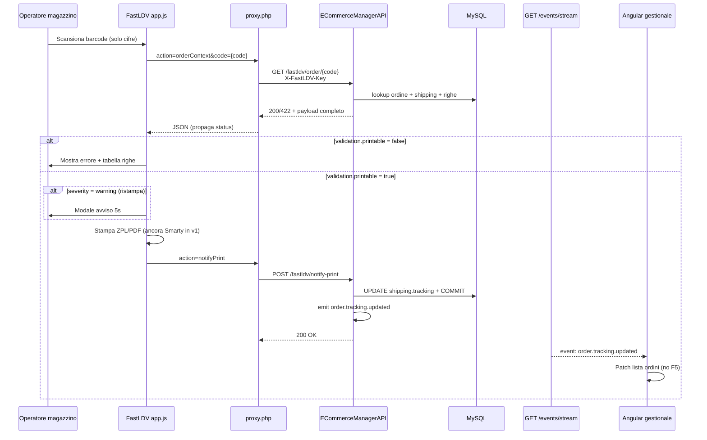
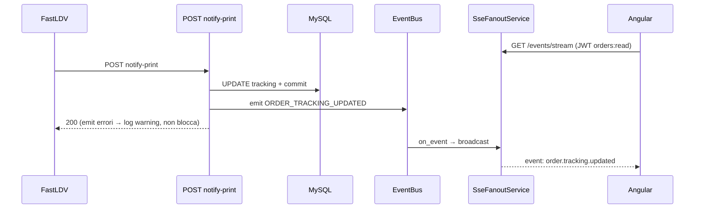

# FastLDV — Implementazione tecnica e flussi (traccia BE)

> **Scopo:** documento di riferimento interno su **cosa è implementato** nel backend ECommerceManagerAPI per l’integrazione con l’app magazzino FastLDV.  
> **Ultimo aggiornamento:** 2026-06-18  
> **Stato BE core:** ✅ implementato · **Cutover app PHP:** ❌ pending · **BE-FASTLDV-3 (PATCH params):** ❌ non implementato

---

## 1. Contesto

**FastLDV** è un’app browser usata in magazzino: scansione barcode ordine → validazione → stampa etichetta (ZPL/PDF via BrowserPrint) → aggiornamento tracking.

**Prima (Smarty):** due chiamate HTTP sequenziali (`checkOrderData` + `validate.php`), tracking scritto lato Smarty, prefisso barcode `SM…`.

**Ora (ECommerceManagerAPI):** il gestionale espone API dedicate sotto `/api/v1/fastldv/…` con autenticazione API key. Una sola GET unifica dati ordine, righe e validazione. Dopo la stampa, `POST notify-print` persiste il tracking e notifica Angular via SSE.

| Task backlog | Descrizione | Stato |
|--------------|-------------|-------|
| **BE-FASTLDV-1** | GET ordine unificato (dati + validation + lines) | ✅ |
| **BE-FASTLDV-2** | POST notify-print → `shipping.tracking` | ✅ |
| **BE-FASTLDV-EVT** | Emit `order.tracking.updated` + SSE stream | ✅ |
| **BE-FASTLDV-3** | PATCH shipping-params (modalità Verifica) | ❌ |
| **Fase 4** | Generazione ZPL/PDF via API corrieri gestionale | ❌ |
| **Cutover app** | Migrazione `app.js` / `proxy.php` | ❌ |

---

## 2. Architettura nel gestionale

Stack standard del progetto:

```
FastLDV app (PHP proxy) → Router → Service → Repository → SQLAlchemy → MySQL
                              ↓
                         EventBus → SseFanoutService → Angular (JWT SSE)
```

### 2.1 File coinvolti

| Layer | File | Ruolo |
|-------|------|-------|
| Router | `src/routers/fastldv.py` | Endpoint HTTP, emit evento post notify-print |
| Service | `src/services/routers/fastldv_order_service.py` | Business logic: lookup, validazione, mapping payload |
| Interface | `src/services/interfaces/fastldv_order_service_interface.py` | Contratto DI |
| Schemi | `src/schemas/fastldv_schema.py` | DTO Pydantic request/response |
| Auth | `src/core/fastldv_auth.py` | Dependency `verify_fastldv_api_key` |
| Settings | `src/core/settings.py` → `FastLdvSettings` | `FASTLDV_API_KEY`, `FASTLDV_BYPASS_VALIDATE_IDS` |
| Repository | `src/repository/order_repository.py` | `get_by_fastldv_code()` — dual lookup |
| DI | `src/core/container_config.py` | Registrazione `IFastLdvOrderService` |
| Bootstrap | `src/main.py` | `app.include_router(fastldv.router)` + init `SseFanoutService` |
| Eventi | `src/events/core/event.py` | `EventType.ORDER_TRACKING_UPDATED` |
| SSE | `src/events/sse/sse_fanout_service.py` | Fan-out in-memory verso client connessi |
| SSE router | `src/routers/events.py` | `GET /api/v1/events/stream` (JWT) |
| Test unit | `tests/unit/services/test_fastldv_order_service.py` | Regole validazione |
| Test unit | `tests/unit/repository/test_order_repository_fastldv.py` | Dual lookup repository |
| Test integration | `tests/integration/api/v1/test_fastldv.py` | API end-to-end |
| Test integration | `tests/integration/api/v1/test_events_sse.py` | notify-print → evento SSE |

### 2.2 Documentazione correlata

| Documento | Contenuto |
|-----------|-----------|
| [docs/BE_FASTLDV_INTEGRATION.md](../../../docs/BE_FASTLDV_INTEGRATION.md) | Contratto API, decisioni prodotto, checklist |
| [docs/PROMPT_FASTLDV_APP_CUTOVER.md](../../../docs/PROMPT_FASTLDV_APP_CUTOVER.md) | Handoff team app magazzino (cutover) |
| [prompt_FE_fastldv_migration.md](./prompt_FE_fastldv_migration.md) | Prompt Cursor per repo FastLDV |
| [docs/FE_HANDOFF_SSE_TRACKING.md](../../../docs/FE_HANDOFF_SSE_TRACKING.md) | Handoff Angular SSE |

---

## 3. Identificatori ordine

Tre concetti distinti — **non intercambiabili**:

| Nome | Colonna DB | Significato | Esempio |
|------|------------|-------------|---------|
| `id_order` | `orders.id_order` | PK interna gestionale | `48564` |
| `id_origin` | `orders.id_origin` | ID PrestaShop dopo sync; **`0`** se ordine nato in app | `457300` o `0` |
| `code` (barcode) | — | Numero scansionato in magazzino (path GET, body notify) | PS: `457300` · gestionale: `69100` |

### 3.1 Dual lookup (`OrderRepository.get_by_fastldv_code`)

```python
# 1) Cerca orders.id_origin = {code}  → ordine PrestaShop
# 2) Se assente → orders.id_order = {code} AND (id_origin IS NULL OR id_origin = 0)  → ordine gestionale
# Opzionale: filtro id_store per multi-negozio
```

Implementazione: `src/repository/order_repository.py` righe ~1742–1761.

### 3.2 Campi in risposta API

| Campo JSON | Valore | Uso |
|------------|--------|-----|
| `data.id_order` | PK interna | Angular, SSE, `GET /orders/{id}` |
| `data.id_origin` | Valore DB reale (`0` se gestionale) | FE gestionale |
| `data.document.num_doc` | `id_origin` PS oppure `id_order` | Footer etichetta ZPL |

**Attenzione notify-print:** il campo body `id_origin` mantiene il nome legacy Smarty ma il valore è il **`code` scansionato**, non necessariamente `data.id_origin` dalla GET (per ordini gestionale `data.id_origin=0` ma body deve portare `id_order`).

---

## 4. Flussi end-to-end

### 4.1 Flusso principale (modalità Diretta)



### 4.2 Modalità app (tre modalità invariato lato UX)

| Modalità | Sequenza API | Note |
|----------|--------------|------|
| **Diretta** | GET ordine → stampa → notify-print | Flusso standard |
| **Verifica** | GET → (opz. PATCH params **se BE-FASTLDV-3**) → stampa → notify | PATCH non ancora implementato |
| **Cerca** | GET ordine (solo lettura) | Nessuna stampa |

### 4.3 Flusso SSE (BE-FASTLDV-EVT)



**Payload SSE:**

```
event: order.tracking.updated
data: {"id_order":48564,"tracking":"BRT123","awb":"BRT123","source":"fastldv","timestamp":"2026-06-09T14:30:00Z"}
```

Keepalive ogni 30s (`: keepalive`). Fan-out **in-memory** (singola istanza API in v1).

---

## 5. Endpoint implementati

### 5.1 `GET /api/v1/fastldv/order/{code}`

**Auth:** header obbligatorio `X-FastLDV-Key` (dependency a livello router).

**Query params:**

| Param | Obbligatorio | Uso |
|-------|--------------|-----|
| `carrier` | no (consigliato) | Safety-net: log warning se diverso da corriere ordine |
| `printer` | no | Audit log server |
| `id_store` | no | Disambiguazione multi-negozio |
| `skip_log` | no | `1` = anteprima senza log stampante |

**Flusso service (`get_order_context`):**

1. `_resolve_order(code)` → dual lookup
2. Carica `shipping` da `orders.id_shipping`
3. Carica `carrier_api` (+ `brt_configuration` per layout)
4. Se corriere assente → `400` `CARRIER_NOT_ASSIGNED`
5. `_build_lines(id_order)` — esclude righe documento e buoni sconto
6. `_build_shipping_data` — colli, peso, contrassegno, tracking, country ISO
7. `_validate_order` — regole priorità (vedi §6)
8. Opzionale `data.legacy` — alias campi Smarty per transizione adapter PHP

**HTTP response:**

| Status | Condizione |
|--------|------------|
| `200` | `validation.printable = true` (ok o warning ristampa) |
| `422` | `validation.printable = false` — payload completo in `data` (`error_code: FASTLDV_NOT_PRINTABLE`) |
| `404` | Ordine non trovato |
| `400` | Corriere non assegnato |
| `401` | API key errata |
| `503` | `FASTLDV_API_KEY` non configurata |

### 5.2 `POST /api/v1/fastldv/notify-print`

**Body (`FastLdvNotifyPrintRequestSchema`):**

```json
{
  "id_origin": 69099,
  "tracking": "BRT123456789",
  "colli": 2,
  "carrier": "BRT NAPOLI",
  "operatore": "mario",
  "stampante": "ZDesigner ZT410",
  "id_store": null
}
```

**Comportamento (`notify_print`):**

1. Dual lookup su `id_origin` (campo = code scansionato)
2. Risolve `id_shipping` da `orders.id_shipping` (fallback `get_id_shipping_by_order_id`)
3. `ShippingRepository.update_tracking(id_shipping, tracking)`
4. `session.commit()`
5. Ritorna `{ id_order, id_origin (DB), id_shipping, tracking, awb }`
6. Router emette `ORDER_TRACKING_UPDATED` (try/except — errori emit non falliscono la risposta)

**Non fa:** cambio `id_order_state`, gestione multispedizione, update colli/peso.

---

## 6. Regole di validazione

Implementate in `FastLdvOrderService._validate_order` — priorità allineata a `validate.php` legacy:

| # | Controllo | `validation.code` | `printable` | Fonte |
|---|-----------|-------------------|-------------|-------|
| 1 | Whitelist env | `BYPASS` | true | `FASTLDV_BYPASS_VALIDATE_IDS` |
| 2 | Annullato | `ORDER_CANCELED` | false | `id_order_state == 5` |
| 3 | Bloccato | `ORDER_LOCKED` | false | `id_order_state == 6` (In Attesa) |
| 4 | Non pagato | `ORDER_NOT_PAID` | false | `order.is_payed == False` |
| 5 | Già spedito | `ORDER_ALREADY_SHIPPED` | false | stato `3` o `4` |
| 6 | Non pronto magazzino | `ORDER_NOT_READY` | false | vedi `_is_ready_for_warehouse` |
| 7 | Tracking già presente | `LABEL_ALREADY_PRINTED` | true (warning) | `shipping.tracking` non vuoto |
| 8 | OK | `OK` | true | — |

### 6.1 Pronto per magazzino (`_is_ready_for_warehouse`)

Equivalente Smarty `ready==1 AND shipped==1`:

- **in_processing:** stato ∈ {1 Preparazione, 2 Pronti, 7 Multispedizione}
- **is_ready:** stato ∈ {2, 7} **oppure** storico `orders_history` contiene stato 2

Stati ordine (da `scripts/setup_initial.py`):

| ID | Nome |
|----|------|
| 1 | Preparazione |
| 2 | Pronti |
| 3 | Spedito |
| 4 | Spedizione confermata |
| 5 | Annullato |
| 6 | In attesa |
| 7 | Multispedizione |

---

## 7. Mapping dati payload

### 7.1 Righe ordine (`lines`)

Da `order_details` via `IOrderDetailRepository.get_by_order_id`:

| Campo API | Colonna DB | Trasformazione |
|-----------|------------|----------------|
| `quantity` | `product_qty` | `int` |
| `sku` | `product_reference` | trim |
| `name` | `product_name` | trim |

**Esclusi:** righe con `id_order_document` valorizzato; righe il cui nome inizia con `"buono sconto"`.

### 7.2 Spedizione (`shipping`)

| Campo | Fonte |
|-------|-------|
| `colli` | `COUNT(order_packages)` min 1 |
| `peso` | `shipping.weight`, fallback `order.total_weight` |
| `contrassegno` | `order.cash_on_delivery` formattato `"0.00"` |
| `tracking` | `shipping.tracking` |
| `country_iso` | join `address` → `country.iso_code`, default `"IT"` |

### 7.3 Corriere (`carrier`)

| Campo | Fonte |
|-------|-------|
| `id_carrier_api` | `carrier_api.id_carrier_api` |
| `name` | `carrier_api.name` |
| `layout_type` | `"zebra"` se BRT/ZPL, altrimenti `"pdf"` (da `brt_configuration.label_format` o `carrier_type`) |

### 7.4 Blocco legacy (transizione Smarty)

Se `include_legacy=True` (default), la risposta include:

```json
"legacy": {
  "id_doc": 69099,
  "corrieri_id_carrier": 5,
  "corrieri_carrier": "BRT NAPOLI",
  "corrieri_tracking": "",
  "corrieri_layout_type": "zebra",
  "intDoc": { "num_doc": "69099" }
}
```

---

## 8. Autenticazione e configurazione

### 8.1 Variabili ambiente

```env
FASTLDV_API_KEY=change-me-fastldv-key
# FASTLDV_BYPASS_VALIDATE_IDS=69099,69100
```

Definite in `env.example` e `FastLdvSettings`.

### 8.2 Meccanismo auth

- Router FastLDV: `dependencies=[Depends(verify_fastldv_api_key)]` su tutte le route
- Header: `X-FastLDV-Key: <valore>`
- Nessun JWT / RBAC — pensato per chiamate server-side da `proxy.php`
- Key assente in env → `503`; key errata → `401`

---

## 9. Fuori scope v1 (esplicitamente accantonato)

| Tema | Comportamento attuale |
|------|----------------------|
| **Multispedizione** | Solo `orders.id_shipping` principale |
| **PATCH shipping-params** | Non implementato (BE-FASTLDV-3) |
| **Generazione etichetta ZPL/PDF** | Resta su Smarty / `fastldvGetPdfPrint` |
| **Cambio stato ordine post-stampa** | Solo tracking, no update `id_order_state` |
| **Prefisso barcode `SM`** | Rimosso nel nuovo stack — solo cifre |

---

## 10. Test

```bash
# Unit validazione + repository lookup
pytest tests/unit/services/test_fastldv_order_service.py \
       tests/unit/repository/test_order_repository_fastldv.py -v

# Integration API + SSE
pytest tests/integration/api/v1/test_fastldv.py \
       tests/integration/api/v1/test_events_sse.py -v
```

**Scenari integration coperti:**

- GET 200 ordine stampabile (PS `id_origin`)
- GET 422 ordine non pagato (payload completo)
- GET 404 ordine inesistente
- GET 401 key errata
- GET ordine gestionale (`id_origin=0`, lookup per `id_order`)
- GET warning ristampa (`LABEL_ALREADY_PRINTED`)
- POST notify-print → tracking persistito in DB
- notify-print → client SSE riceve `order.tracking.updated`

**Smoke manuale:**

```bash
curl -s -H "X-FastLDV-Key: $FASTLDV_API_KEY" \
  "http://localhost:8000/api/v1/fastldv/order/69099?carrier=BRT+NAPOLI"

curl -s -X POST -H "Content-Type: application/json" \
  -H "X-FastLDV-Key: $FASTLDV_API_KEY" \
  -d '{"id_origin":69099,"tracking":"BRT123456789"}' \
  "http://localhost:8000/api/v1/fastldv/notify-print"
```

Swagger: tag **FastLDV** su `/docs`.

---

## 11. Prossimi passi

| Step | Owner | Dipendenze |
|------|-------|------------|
| Cutover app FastLDV (`USE_GESTIONALE_API`) | Team magazzino | BE deployato |
| QA congiunto SSE BE + Angular | BE + FE | Deploy entrambi |
| BE-FASTLDV-3 PATCH params (se serve Verifica) | BE | Cutover parziale |
| Fase 4 — etichette via API corrieri | BE | `POST /shippings/{id_order}/create` |
| Multispedizione dedicata | BE | Analisi ordini multi-shipping |

---

## 12. Timeline implementazione

| Data | Milestone |
|------|-----------|
| 2026-06-09 | BE-FASTLDV-1/2 — router, service, auth, test |
| 2026-06-11 | BE-FASTLDV-EVT — EventBus + SSE + test |
| 2026-06-18 | Documentazione tecnica traccia (questo file) |
