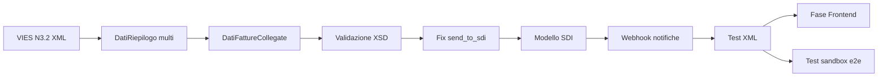

# FatturaPA — Backlog implementazione

**Progetto:** Elettronew (ECommerceManagerAPI)  
**Creato:** 2026-06-18  
**Aggiornato:** 2026-07-17  
**Riferimenti:** [fatturapa_riassunto_piano.md](./fatturapa_riassunto_piano.md) · [BACKLOG_UNIFICATO.md](../BACKLOG_UNIFICATO.md)

Documento operativo: cosa **sviluppare ancora**, partendo da ciò che esiste già nel backend (`FatturaPAService`, `FatturaPAValidator`, `fiscal_documents`, integrazione FatturaPA.com).

**Guida operativa unificata:** [`docs/FATTURAPA.md`](../../docs/FATTURAPA.md) — workflow end-to-end, API, configurazione, troubleshooting.

---

## Changelog rispetto al backlog iniziale (2026-06-18)

| Data | ID / area | Stato | Note |
|------|-----------|-------|------|
| 2026-06-22 | Tax → `<Natura>` step 1 | ✅ Completato | `fatturapa_natura.py`, `tax_electronic_code` + `tax_note`, fix bug `.2f`, test natura |
| 2026-06 | `payment_due_date` in XML | ✅ Completato | `resolve_payment_due_date()` → `DataScadenzaPagamento` |
| 2026-06–07 | VIES su **ordini** | ✅ Completato | `apply-vies-exemption`, bulk, filtro `vies_status`, ricalcolo righe/spedizione |
| 2026-06–07 | VIES → **XML FatturaPA N3.2** | ✅ Completato | BE-PA-P0-05 — `fatturapa_tax_line.py`, riepilogo multi-aliquota |
| 2026-07-16 | Fattura GET/POST v3 | ✅ Completato | `InvoiceResponseSchema` arricchito, test mapper, prompt FE v3 |
| — | `send_to_sdi`, XSD, webhook SDI, `DatiFattureCollegate` | ❌ Invariato | Restano P0 aperti |

---

## Legenda priorità

| Priorità | Significato |
|----------|-------------|
| **P0** | Bloccante go-live SDI (ciclo attivo B2B/B2C) |
| **P1** | Importante per correttezza fiscale / affidabilità |
| **P2** | Miglioramento o feature secondaria |
| **P3** | Opzionale / futuro |

| Stato base | Significato |
|------------|-------------|
| ✅ Completato | Implementato e coperto da test (dove previsto) |
| ✅ Parziale | Codice presente ma incompleto o con bug |
| ❌ Assente | Da implementare da zero |

---

## Riepilogo rapido

| Area | Copertura (2026-07-17) | Effort residuo stimato |
|------|------------------------|------------------------|
| Prerequisiti / DB | ~85% | 0,5 gg |
| Generazione XML | ~85% | 1–2 gg |
| Invio SDI + notifiche | ~40% | 3–4 gg |
| Frontend | 0% (repo separato) | 2–3 gg |
| Ciclo passivo | ~30% | 2–3 gg |
| Test / go-live | ~25% | 2–3 gg |

---

## Completato dal backlog iniziale (non più da fare)

### BE-PA-DONE-01 — Tax `electronic_code` / `note` → XML (step 1 Natura)

**Completato:** 2026-06-22  
**File:** `src/services/external/fatturapa_natura.py`, `fatturapa_service.py`, `fatturapa_validator.py`

- Helper `normalize_natura_code()` per tag `<Natura>` (solo codice breve `N3.1`, `N3.2`, …).
- `_prepare_order_data_from_fiscal_document` passa `tax_electronic_code` e `tax_note` da `Tax`.
- `<RiferimentoNormativo>` da `tax.note` in `DatiRiepilogo`.
- Rimosso bug `{tax_electronic_code:.2f}` (crash su stringhe).
- Handoff FE: [`docs/FE_HANDOFF_TAX_ELECTRONIC_CODE.md`](../../docs/FE_HANDOFF_TAX_ELECTRONIC_CODE.md).
- Test: `tests/unit/services/external/test_fatturapa_natura.py`.

**Resta fuori scope di questo task (vedi P0-05 / P1-05):** natura per singola riga ordine, ramo esplicito `vies_status=eligible` → N3.2, riepilogo multi-aliquota.

---

### BE-PA-DONE-02 — `payment_due_date` → `DataScadenzaPagamento`

**Completato:** 2026-06  
**File:** `src/services/external/fatturapa_service.py` (`resolve_payment_due_date`)

- Se `order.payment_due_date` presente → usata in XML.
- Altrimenti fallback `date_add + 30 giorni`.
- Test: `tests/unit/services/external/test_fatturapa_payment_due_date.py`.

---

### BE-PA-DONE-03 — Fattura GET/POST response v3 (allineamento ricevuta)

**Completato:** 2026-07-16  
**File:** `src/schemas/fiscal_document_schema.py`, `src/services/routers/fiscal_document_service.py`, `src/routers/fiscal_documents.py`

- `InvoiceResponseSchema` arricchito: embed `customer`, indirizzi, `payment`, `shipping`, `order_details[]` snapshot, totali documento.
- Endpoint: `GET .../invoices/order/{id}`, `GET .../{id}`, `POST .../invoices`.
- Test: `tests/unit/services/test_fiscal_document_invoice_response.py`.
- Handoff FE: [`.cursor/tasks_claude/fatturazione/prompt_FE_fatture_V3_ALIGN.md`](../fatturazione/prompt_FE_fatture_V3_ALIGN.md).

---

### Correlato — VIES su ordini (BE-VIES-1..3, non XML)

**Completato:** 2026-06–07 (fuori dal perimetro XML ma prerequisito fatturazione VIES)

- `PATCH /api/v1/orders/{id}/apply-vies-exemption`, bulk, filtro `?vies_status=`.
- Ricalcolo righe e spedizione a IVA 0% con `id_tax` esenzione (`reverse_charge_id_tax` o fallback).
- Sync PrestaShop: snapshot `vies_status` via `vies_status_resolver`.
- **Non collegato** alla generazione XML: vedi BE-PA-P0-05 / BE-VIES-4.

---

## P0 — Go-live ciclo attivo

### BE-PA-P0-01 — Fix invio SDI (`send_to_sdi`)

**Stato:** ✅ Parziale — bug aperto  
**Scope:** Backend  
**File:** `src/services/external/fatturapa_service.py`, `src/routers/fiscal_documents.py`

Il router propaga `send_to_sdi` a `upload_stop(name, send_to_sdi=...)` e imposta `status` `uploaded` vs `sent`, ma **`upload_stop()` ignora ancora il parametro** e chiama sempre `UploadStop1` senza variante SDI.

**Task:**
- Verificare endpoint API FatturaPA.com per invio effettivo a SDI (es. variante `UploadStop` con flag o endpoint dedicato).
- Propagare `send_to_sdi` fino alla chiamata HTTP reale.
- Test manuale in sandbox.

**Acceptance criteria:**
- Con `send_to_sdi=false` → documento caricato, non trasmesso.
- Con `send_to_sdi=true` → documento trasmesso; risposta intermediario salvata in `upload_result`.

---

### BE-PA-P0-02 — Validazione XSD ufficiale pre-invio

**Stato:** ❌ Assente (esiste solo validazione business custom)  
**Scope:** Backend  
**File nuovo/modificati:** `src/services/external/fatturapa_xsd_validator.py`, `fatturapa_service.py`, cartella schemi XSD

**Task:**
- Scaricare XSD ufficiale v1.2 da [fatturapa.gov.it](https://www.fatturapa.gov.it/it/norme-e-regole/documentazione-fattura-elettronica/formato-fatturapa/).
- Aggiungere dipendenza `lxml` (se non presente) e validare XML generato prima di salvare/inviare.
- Integrare in `generate_xml_from_fiscal_document()` dopo generazione e prima del persist.
- Restituire errori XSD strutturati (come già fatto per `FatturaPAValidator`).

**Acceptance criteria:**
- XML non conforme → HTTP 422 con dettaglio righe XSD.
- XML conforme → passa a upload.

---

### BE-PA-P0-03 — Webhook / polling notifiche SDI

**Stato:** ❌ Assente (`get_events()` esiste ma non è esposto)  
**Scope:** Backend  
**File:** nuovo router + service notifiche

**Task:**
- Endpoint `POST /api/v1/fatturapa/webhook` (o polling schedulato su POOL/eventi intermediario).
- Parsare notifiche: RC, NS, NE, MC, AT.
- Aggiornare `fiscal_documents.status` e storico notifiche.
- Fallback polling se webhook non disponibile (job periodico).

**Acceptance criteria:**
- Scarto SDI → status `scartata` + motivo in storico.
- Consegna → status `consegnata`.
- Notifica persa recuperabile via polling.

---

### BE-PA-P0-04 — Estensione modello dati SDI

**Stato:** ✅ Parziale  
**Scope:** Backend + DB (Alembic)  
**File:** `src/models/fiscal_document.py`, migration Alembic

**Task:**
- Aggiungere campi (o tabella figlia `fiscal_document_sdi_notifications`):
  - `protocollo_sdi` (String)
  - `sdi_status` (enum-like: bozza, inviata, consegnata, scartata, rifiutata)
  - storico notifiche JSON o tabella normalizzata
- Allineare schema Pydantic `FiscalDocumentResponseSchema`.
- Migrare logica status: separare `status` workflow interno da `sdi_status`.

**Acceptance criteria:**
- Ogni notifica SDI tracciata con timestamp e tipo.
- Consultabile via API dettaglio fattura.

---

### BE-PA-P0-05 — Collegamento VIES → Natura FatturaPA

**Stato:** ✅ Completato (2026-07-17)  
**Correlato:** **BE-VIES-4** in [BACKLOG_UNIFICATO.md](../BACKLOG_UNIFICATO.md)  
**Scope:** Backend  
**File:** `fatturapa_tax_line.py`, `fatturapa_service.py`

**Implementato:**
- `order.vies_status == eligible` → righe prodotto con `AliquotaIVA=0.00` + `Natura=N3.2` (+ `RiferimentoNormativo` da `Tax.note` o default art. 41).
- Aliquota/natura **per riga** da `order_detail.id_tax` (non più solo tax paese delivery).
- Spedizione con aliquota propria (`shipping_id_tax` / `shipping_tax_percentage`) — può restare 22% con prodotti VIES 0%.
- `DatiRiepilogo` multi-blocco raggruppato per `(AliquotaIVA, Natura)`.
- Test: `tests/unit/services/external/test_fatturapa_tax_line.py`.

**Acceptance criteria:**
- [x] Ordine VIES eligible → XML con `AliquotaIVA=0.00` + `Natura=N3.2` su righe prodotto.
- [x] Test unitari: IVA ordinaria, esente, VIES, riepilogo multi-aliquota.

---

### BE-PA-P0-06 — `DatiFattureCollegate` per note di credito TD04

**Stato:** ❌ Assente  
**Scope:** Backend  
**File:** `fatturapa_service.py` (`_generate_xml`)

**Task:**
- Per `tipo_documento_fe=TD04`, aggiungere blocco `DatiGenerali/DatiFattureCollegate` con riferimento alla fattura originale (`id_fiscal_document_ref` → numero/data fattura collegata).
- Validare presenza fattura di riferimento in `FatturaPAValidator`.

**Acceptance criteria:**
- NC elettronica contiene riferimento obbligatorio alla fattura TD01 originale.

---

### BE-PA-P0-07 — Unit test generazione XML

**Stato:** ✅ Parziale  
**Scope:** Backend

**Presenti:**
- `tests/unit/services/external/test_fatturapa_natura.py`
- `tests/unit/services/external/test_fatturapa_payment_due_date.py`
- `tests/unit/services/external/test_fatturapa_tax_line.py` (VIES N3.2 + riepilogo multi-aliquota + XML)
- `tests/unit/services/test_fiscal_document_invoice_response.py` (response v3, non XML)

**Mancante:** `tests/unit/services/external/test_fatturapa_xml_generation.py`

**Casistica minima da coprire:**
- Fattura TD01 IVA 22% (IT)
- Fattura con spedizione
- Nota credito TD04 totale e parziale
- Ordine VIES eligible (N3.2)
- Validazione XSD su fixture generate (dopo P0-02)

---

## P1 — Affidabilità e API

### BE-PA-P1-01 — Endpoint stato SDI dedicato

**Stato:** ✅ Parziale (stato nel GET generico / `upload_result`)  
**Scope:** Backend

**Task:**
- `GET /api/v1/fiscal_documents/{id}/sdi-status` → `{ sdi_status, protocollo_sdi, notifiche[], last_update }`.
- Opzionale: `POST .../retry-send` per reinvio dopo scarto.

---

### BE-PA-P1-02 — Download XML strutturato

**Stato:** ✅ Parziale (`xml_content` nel response schema dettaglio)  
**Scope:** Backend

**Task:**
- `GET /api/v1/fiscal_documents/{id}/xml` → `Content-Disposition: attachment; filename=IT{PIVA}_{progressivo}.xml`.
- Non esporre XML enorme nel JSON lista.

---

### BE-PA-P1-03 — Macchina a stati documento

**Stato:** ✅ Parziale  
**Scope:** Backend

**Stati target:**

```
pending → generated → uploaded → sent → consegnata
                              ↘ scartata → (retry) → sent
                              ↘ rifiutata (solo B2G)
```

**Task:**
- Transizioni validate nel repository (no `sent` senza XML).
- Documentare stati in OpenAPI.

---

### BE-PA-P1-04 — Rifattorizzazione builder XML

**Stato:** ✅ Parziale (tutto in `fatturapa_service.py`)  
**Scope:** Backend — refactor non bloccante

**Task:**
- Estrarre `src/services/external/fatturapa_builder.py` (Header, Body, DettaglioLinee, DatiRiepilogo).
- Ridurre `print()` di debug → `logger`.
- Allineare namespace/schemaLocation alla versione XSD in repo.

---

### BE-PA-P1-05 — DatiRiepilogo multi-aliquota

**Stato:** ✅ Completato (2026-07-17, con P0-05)  
**Scope:** Backend  
**File:** `fatturapa_tax_line.py` (`build_riepilogo_groups`), `fatturapa_service.py`

Raggruppamento righe per `(AliquotaIVA, Natura)` con N blocchi `DatiRiepilogo`. Caso VIES: prodotti 0% N3.2 + spedizione 22%.

---

### BE-PA-P1-06 — Configurazione sandbox / produzione

**Stato:** ✅ Parziale  
**Scope:** Ops + Backend

**Task:**
- Documentare in README variabili `fatturapa.api_key`, `fatturapa.base_url`.
- Flag ambiente `FATTURAPA_SANDBOX=true` in settings (opzionale).
- Checklist go-live in fondo a questo file.

---

## P2 — Ciclo passivo e integrazioni

### BE-PA-P2-01 — Esposizione API ciclo passivo

**Stato:** ✅ Parziale (`FatturaPAPoolSyncService` senza router)  
**Scope:** Backend  
**File:** `src/services/sync/fatturapa_pool_sync_service.py`, nuovo router

**Task:**
- `POST /api/v1/fatturapa/sync-pool` (manuale o protetto admin).
- `GET /api/v1/purchase-invoices` — lista da `fatture_acquisto_sync`.
- `GET /api/v1/purchase-invoices/{id}/xml` — download XML ricevuto.
- Job schedulato (APScheduler / task sync) ogni N minuti.

---

### BE-PA-P2-02 — UI consultazione fatture passive

**Stato:** ❌ Assente  
**Scope:** Frontend (repo Angular, PC webmarke26)

**Task:** lista con filtri data/fornitore/tipo; dettaglio XML; link download.

---

## P3 — Opzionale / futuro

### BE-PA-P3-01 — Fatturazione B2G (FPA12)

**Stato:** ❌ Assente nel generator (validator ok)  
**Task:** rilevare cliente PA → `FormatoTrasmissione=FPA12`, `CodiceDestinatario` 6 char, CUU, CIG/CUP in `DatiOrdineAcquisto`.

---

### BE-PA-P3-02 — Altri TipoDocumento (TD05, TD29, …)

**Stato:** ❌ Solo TD01/TD04 nel flusso business  
**Task:** estendere repository + UI selezione tipo.

---

### BE-PA-P3-03 — Invio batch ZIP

**Stato:** ❌ Assente  
**Task:** compressione multipla XML + upload SFTP/API batch (se richiesto da volumi).

---

### BE-PA-P3-04 — Firma digitale B2G

**Stato:** ❌ Assente  
**Task:** integrazione HSM/firma remota per fatture verso PA (obbligatoria B2G).

---

### BE-PA-P3-05 — Controlli SDI 1.9.1 (gruppi IVA, ecc.)

**Stato:** ❌ Assente  
**Task:** validazione CF partecipante gruppo IVA (errore 00327); monitoraggio aggiornamenti AdE.

---

### BE-PA-P3-06 — Conservazione sostitutiva

**Stato:** ❌ Operativo/contrattuale  
**Task:** verificare se intermediario copre 10 anni; eventuale export periodico XML+notifiche.

---

## Frontend — repo separato (Fase 3 piano)

| ID | Task | Priorità | Note 2026-07-17 |
|----|------|----------|-----------------|
| FE-PA-3.0 | Allineamento `InvoiceDetail` v3 (GET/POST) | P0 | Prompt pronto: [prompt_FE_fatture_V3_ALIGN.md](../fatturazione/prompt_FE_fatture_V3_ALIGN.md) |
| FE-PA-3.1 | Colonna "Stato SDI" in lista fatture | P0 | |
| FE-PA-3.2 | Azione "Invia a SDI" da dettaglio | P0 | |
| FE-PA-3.3 | Badge stato (bozza/inviata/consegnata/scartata) | P0 | |
| FE-PA-3.4 | Timeline notifiche SDI | P1 | Dipende da P0-03/P0-04 BE |
| FE-PA-3.5 | Download XML e PDF | P1 | PDF BE ok; XML download dedicato mancante (P1-02) |

**API backend da consumare:**  
`POST .../invoices` · `POST .../generate-xml` · `POST .../send-to-sdi` · `GET .../sdi-status` (da creare) · `GET .../pdf` · `GET .../xml` (da creare)

---

## Prerequisiti operativi (non codice)

| ID | Task | Owner |
|----|------|-------|
| OPS-PA-01 | Account sandbox FatturaPA.com attivo | Ops |
| OPS-PA-02 | Popolare `company_info` e `electronic_invoicing.tax_regime` in DB | Ops |
| OPS-PA-03 | API key produzione solo dopo test e2e | Ops |
| OPS-PA-04 | Iscrizione newsletter AdE / monitoraggio fatturapa.gov.it | Ops |
| OPS-PA-05 | Tax VIES con `electronic_code=N3.2` + `note` normativa (workaround fino a P0-05) | Ops |

---

## Ordine di implementazione consigliato (aggiornato 2026-07-17)



1. **Prossima iterazione BE:** P0-05 (ramo VIES + natura per riga) → P1-05 → P0-06
2. **Poi:** P0-02, P0-01 (XML valido e inviabile)
3. **Ciclo SDI:** P0-04, P0-03, P1-01, P1-02
4. **Parallelo FE:** FE-PA-3.0 (v3) appena BE stabile; FE-PA-3.1–3.3 dopo fix `send_to_sdi`
5. **Backlog:** P2 ciclo passivo, P3 B2G/batch

---

## Checklist go-live

- [x] Codice natura Tax separato da descrizione (`electronic_code` / `note`)
- [x] `DataScadenzaPagamento` da `payment_due_date` ordine
- [x] Response fattura v3 per FE (GET/POST arricchiti)
- [x] XML con ramo VIES `eligible` → N3.2 verificato su casi reali (unit test)
- [ ] XML validato XSD su casi reali (fattura, NC, VIES)
- [ ] Invio sandbox con P.IVA collaudo → RC ricevuta
- [ ] Gestione scarto NS test → retry funzionante
- [ ] `company_info` completo e verificato
- [ ] API key produzione configurata
- [ ] Monitoraggio errori (log + alert su status `error`/`scartata`)
- [ ] FE: contratto v3 + invio e visualizzazione stato SDI

---

## Codice già riusabile (non riscrivere)

| Componente | Path |
|------------|------|
| Service XML + upload | `src/services/external/fatturapa_service.py` |
| Validatore business | `src/services/external/fatturapa_validator.py` |
| Normalizzazione Natura | `src/services/external/fatturapa_natura.py` |
| Tax per riga + VIES N3.2 | `src/services/external/fatturapa_tax_line.py` |
| Scadenza pagamento XML | `resolve_payment_due_date()` in `fatturapa_service.py` |
| Modello documenti | `src/models/fiscal_document.py` |
| Repository fatture/NC/resi | `src/repository/fiscal_document_repository.py` |
| Mapper response v3 | `src/services/routers/fiscal_document_service.py` |
| Router API | `src/routers/fiscal_documents.py` |
| PDF fattura | `src/services/pdf/fiscal_document_pdf_service.py` |
| Sync POOL passive | `src/services/sync/fatturapa_pool_sync_service.py` |
| VIES ordini | `src/services/vies/`, `src/vies/tax_resolution.py`, `src/vies/exemption_calculation.py` |
| Config azienda/API | `app_configurations` (`company_info`, `fatturapa`, `electronic_invoicing`) |

---

## Note tecniche

- **Formato file XML:** v1.2 / FPR12 (namespace AgE) — corretto per B2B/B2C.
- **Specifiche SDI 1.9.1:** regole trasmissione e controlli post-invio; complementari allo XSD.
- **Intermediario attuale:** FatturaPA.com REST (`UploadStart1` / Blob / `UploadStop1` / `Pool`).
- **VIES ordini vs XML:** l'esenzione ordine modifica prezzi e `id_tax` righe; l'XML legge ancora il tax del **paese delivery** in `_prepare_order_data_from_fiscal_document` — allineamento esplicito con `order.vies_status` è il gap P0-05.
- **POST creazione fattura:** body minimale `{ id_order, is_electronic? }` — vedi `InvoiceCreateSchema` e handoff [prompt_FE_fatture_V3_ALIGN.md](../fatturazione/prompt_FE_fatture_V3_ALIGN.md).
