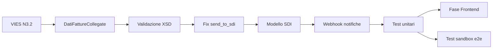

# FatturaPA — Backlog implementazione

**Progetto:** Elettronew (ECommerceManagerAPI)  
**Creato:** 2026-06-18  
**Riferimenti:** [fatturapa_riassunto_piano.md](./fatturapa_riassunto_piano.md) · [BACKLOG_UNIFICATO.md](./BACKLOG_UNIFICATO.md)

Documento operativo: cosa **sviluppare ancora**, partendo da ciò che esiste già nel backend (`FatturaPAService`, `FatturaPAValidator`, `fiscal_documents`, integrazione FatturaPA.com).

---

## Legenda priorità

| Priorità | Significato |
|----------|-------------|
| **P0** | Bloccante go-live SDI (ciclo attivo B2B/B2C) |
| **P1** | Importante per correttezza fiscale / affidabilità |
| **P2** | Miglioramento o feature secondaria |
| **P3** | Opzionale / futuro |

| Stato base | File / componente esistente |
|------------|----------------------------|
| ✅ Parziale | Codice presente ma incompleto o con bug |
| ❌ Assente | Da implementare da zero |

---

## Riepilogo rapido

| Area | Copertura attuale | Effort stimato |
|------|-------------------|----------------|
| Prerequisiti / DB | ~80% | 0,5–1 gg |
| Generazione XML | ~65% | 3–4 gg |
| Invio SDI + notifiche | ~40% | 3–4 gg |
| Frontend | 0% (repo separato) | 2–3 gg |
| Ciclo passivo | ~30% | 2–3 gg |
| Test / go-live | 0% | 2–3 gg |

---

## P0 — Go-live ciclo attivo

### BE-PA-P0-01 — Fix invio SDI (`send_to_sdi`)

**Stato:** ✅ Parziale — bug  
**Scope:** Backend  
**File:** `src/services/external/fatturapa_service.py`, `src/routers/fiscal_documents.py`

Il router accetta `send_to_sdi: bool` ma `upload_stop()` ignora il parametro e chiama sempre `UploadStop1`.

**Task:**
- Verificare endpoint API FatturaPA.com per invio effettivo a SDI (es. variante `UploadStop` con flag o endpoint dedicato).
- Propagare `send_to_sdi` fino alla chiamata HTTP.
- Aggiornare stati: `uploaded` (solo upload) vs `sent` (inviato a SDI).
- Test manuale in sandbox.

**Acceptance criteria:**
- Con `send_to_sdi=false` → documento caricato, non trasmesso.
- Con `send_to_sdi=true` → documento trasmesso; risposta intermediario salvata in `upload_result`.

---

### BE-PA-P0-02 — Validazione XSD ufficiale pre-invio

**Stato:** ❌ Assente (esiste solo validazione business custom)  
**Scope:** Backend  
**File nuovo/modificati:** `src/services/external/fatturapa_xsd_validator.py`, `fatturapa_service.py`, cartella schemi XSD

**Task:**
- Scaricare XSD ufficiale v1.2 da [fatturapa.gov.it](https://www.fatturapa.gov.it/it/norme-e-regole/documentazione-fattura-elettronica/formato-fatturapa/).
- Aggiungere dipendenza `lxml` (se non presente) e validare XML generato prima di salvare/inviare.
- Integrare in `generate_xml_from_fiscal_document()` dopo generazione e prima del persist.
- Restituire errori XSD strutturati (come già fatto per `FatturaPAValidator`).

**Acceptance criteria:**
- XML non conforme → HTTP 422 con dettaglio righe XSD.
- XML conforme → passa a upload.

---

### BE-PA-P0-03 — Webhook / polling notifiche SDI

**Stato:** ❌ Assente (`get_events()` esiste ma non è esposto)  
**Scope:** Backend  
**File:** nuovo router + service notifiche

**Task:**
- Endpoint `POST /api/v1/fatturapa/webhook` (o polling schedulato su POOL/eventi intermediario).
- Parsare notifiche: RC, NS, NE, MC, AT.
- Aggiornare `fiscal_documents.status` e storico notifiche.
- Fallback polling se webhook non disponibile (job periodico).

**Acceptance criteria:**
- Scarto SDI → status `scartata` + motivo in storico.
- Consegna → status `consegnata`.
- Notifica persa recuperabile via polling.

---

### BE-PA-P0-04 — Estensione modello dati SDI

**Stato:** ✅ Parziale  
**Scope:** Backend + DB (Alembic)  
**File:** `src/models/fiscal_document.py`, migration Alembic

**Task:**
- Aggiungere campi (o tabella figlia `fiscal_document_sdi_notifications`):
  - `protocollo_sdi` (String)
  - `sdi_status` (enum-like: bozza, inviata, consegnata, scartata, rifiutata)
  - storico notifiche JSON o tabella normalizzata
- Allineare schema Pydantic `FiscalDocumentResponseSchema`.
- Migrare logica status: separare `status` workflow interno da `sdi_status`.

**Acceptance criteria:**
- Ogni notifica SDI tracciata con timestamp e tipo.
- Consultabile via API dettaglio fattura.

---

### BE-PA-P0-05 — Collegamento VIES → Natura FatturaPA

**Stato:** ❌ Assente (VIES ordini ok, XML no) — correlato **BE-VIES-4**  
**Scope:** Backend  
**File:** `fatturapa_service.py`, `_prepare_order_data_from_fiscal_document`, eventuale `tax_resolution.py`

**Task:**
- Se `order.vies_status == 'eligible'` → impostare `Natura` = `N3.2` (art. 41 DL 331/93) e aliquota 0%.
- Verificare mapping per altre esenzioni via `Tax.electronic_code` (N1–N7).
- Fix bug riga 527: `{tax_electronic_code:.2f}` → codice testuale (`N3.2`, non numero).
- `RiferimentoNormativo` da `Tax.note` quando presente.
- DatiRiepilogo multi-aliquota se righe con IVA diverse (spedizione vs prodotti VIES).

**Acceptance criteria:**
- Ordine VIES eligible → XML con `AliquotaIVA=0.00` + `Natura=N3.2`.
- Test unitari: IVA ordinaria, esente, VIES.

---

### BE-PA-P0-06 — `DatiFattureCollegate` per note di credito TD04

**Stato:** ❌ Assente  
**Scope:** Backend  
**File:** `fatturapa_service.py` (`_generate_xml`)

**Task:**
- Per `tipo_documento_fe=TD04`, aggiungere blocco `DatiGenerali/DatiFattureCollegate` con riferimento alla fattura originale (`id_fiscal_document_ref` → numero/data fattura collegata).
- Validare presenza fattura di riferimento in `FatturaPAValidator`.

**Acceptance criteria:**
- NC elettronica contiene riferimento obbligatorio alla fattura TD01 originale.

---

### BE-PA-P0-07 — Unit test generazione XML

**Stato:** ❌ Assente  
**Scope:** Backend  
**File:** `tests/unit/services/external/test_fatturapa_xml_generation.py`

**Casistica minima:**
- Fattura TD01 IVA 22% (IT)
- Fattura con spedizione
- Nota credito TD04 totale e parziale
- Ordine VIES eligible (N3.2)
- Validazione XSD su fixture generate

---

## P1 — Affidabilità e API

### BE-PA-P1-01 — Endpoint stato SDI dedicato

**Stato:** ✅ Parziale (stato nel GET generico)  
**Scope:** Backend

**Task:**
- `GET /api/v1/fiscal_documents/{id}/sdi-status` → `{ sdi_status, protocollo_sdi, notifiche[], last_update }`.
- Opzionale: `POST .../retry-send` per reinvio dopo scarto.

---

### BE-PA-P1-02 — Download XML strutturato

**Stato:** ✅ Parziale (`xml_content` nel response schema)  
**Scope:** Backend

**Task:**
- `GET /api/v1/fiscal_documents/{id}/xml` → `Content-Disposition: attachment; filename=IT{PIVA}_{progressivo}.xml`.
- Non esporre XML enorme nel JSON lista.

---

### BE-PA-P1-03 — Macchina a stati documento

**Stato:** ✅ Parziale  
**Scope:** Backend

**Stati target:**

```
pending → generated → uploaded → sent → consegnata
                              ↘ scartata → (retry) → sent
                              ↘ rifiutata (solo B2G)
```

**Task:**
- Transizioni validate nel repository (no `sent` senza XML).
- Documentare stati in OpenAPI.

---

### BE-PA-P1-04 — Rifattorizzazione builder XML

**Stato:** ✅ Parziale (tutto in `fatturapa_service.py`)  
**Scope:** Backend — refactor non bloccante

**Task:**
- Estrarre `src/services/external/fatturapa_builder.py` (Header, Body, DettaglioLinee, DatiRiepilogo).
- Ridurre `print()` di debug → `logger`.
- Allineare namespace/schemaLocation alla versione XSD in repo.

---

### BE-PA-P1-05 — DatiRiepilogo multi-aliquota

**Stato:** ❌ Assente (oggi un solo blocco riepilogo)  
**Scope:** Backend

**Task:**
- Raggruppare righe per `(AliquotaIVA, Natura)` e generare N blocchi `DatiRiepilogo`.
- Caso tipico: prodotti 22% + spedizione 22% ok; prodotti 0% VIES + spedizione 22% → 2 riepiloghi.

---

### BE-PA-P1-06 — Configurazione sandbox / produzione

**Stato:** ✅ Parziale  
**Scope:** Ops + Backend

**Task:**
- Documentare in README variabili `fatturapa.api_key`, `fatturapa.base_url`.
- Flag ambiente `FATTURAPA_SANDBOX=true` in settings (opzionale).
- Checklist go-live in fondo a questo file.

---

## P2 — Ciclo passivo e integrazioni

### BE-PA-P2-01 — Esposizione API ciclo passivo

**Stato:** ✅ Parziale (`FatturaPAPoolSyncService` senza router)  
**Scope:** Backend  
**File:** `src/services/sync/fatturapa_pool_sync_service.py`, nuovo router

**Task:**
- `POST /api/v1/fatturapa/sync-pool` (manuale o protetto admin).
- `GET /api/v1/purchase-invoices` — lista da `fatture_acquisto_sync`.
- `GET /api/v1/purchase-invoices/{id}/xml` — download XML ricevuto.
- Job schedulato (APScheduler / task sync) ogni N minuti.

---

### BE-PA-P2-02 — UI consultazione fatture passive

**Stato:** ❌ Assente  
**Scope:** Frontend (repo Angular, PC webmarke26)

**Task:** lista con filtri data/fornitore/tipo; dettaglio XML; link download.

---

## P3 — Opzionale / futuro

### BE-PA-P3-01 — Fatturazione B2G (FPA12)

**Stato:** ❌ Assente nel generator (validator ok)  
**Task:** rilevare cliente PA → `FormatoTrasmissione=FPA12`, `CodiceDestinatario` 6 char, CUU, CIG/CUP in `DatiOrdineAcquisto`.

---

### BE-PA-P3-02 — Altri TipoDocumento (TD05, TD29, …)

**Stato:** ❌ Solo TD01/TD04 nel flusso business  
**Task:** estendere repository + UI selezione tipo.

---

### BE-PA-P3-03 — Invio batch ZIP

**Stato:** ❌ Assente  
**Task:** compressione multipla XML + upload SFTP/API batch (se richiesto da volumi).

---

### BE-PA-P3-04 — Firma digitale B2G

**Stato:** ❌ Assente  
**Task:** integrazione HSM/firma remota per fatture verso PA (obbligatoria B2G).

---

### BE-PA-P3-05 — Controlli SDI 1.9.1 (gruppi IVA, ecc.)

**Stato:** ❌ Assente  
**Task:** validazione CF partecipante gruppo IVA (errore 00327); monitoraggio aggiornamenti AdE.

---

### BE-PA-P3-06 — Conservazione sostitutiva

**Stato:** ❌ Operativo/contrattuale  
**Task:** verificare se intermediario copre 10 anni; eventuale export periodico XML+notifiche.

---

## Frontend — repo separato (Fase 3 piano)

| ID | Task | Priorità |
|----|------|----------|
| FE-PA-3.1 | Colonna "Stato SDI" in lista fatture | P0 |
| FE-PA-3.2 | Azione "Invia a SDI" da dettaglio | P0 |
| FE-PA-3.3 | Badge stato (bozza/inviata/consegnata/scartata) | P0 |
| FE-PA-3.4 | Timeline notifiche SDI | P1 |
| FE-PA-3.5 | Download XML e PDF | P1 |

**API backend da consumare:**  
`POST .../generate-xml` · `POST .../send-to-sdi` · `GET .../sdi-status` (da creare) · `GET .../pdf` · `GET .../xml` (da creare)

---

## Prerequisiti operativi (non codice)

| ID | Task | Owner |
|----|------|-------|
| OPS-PA-01 | Account sandbox FatturaPA.com attivo | Ops |
| OPS-PA-02 | Popolare `company_info` e `electronic_invoicing.tax_regime` in DB | Ops |
| OPS-PA-03 | API key produzione solo dopo test e2e | Ops |
| OPS-PA-04 | Iscrizione newsletter AdE / monitoraggio fatturapa.gov.it | Ops |

---

## Ordine di implementazione consigliato



1. **Settimana 1:** P0-05, P0-06, P0-02, P0-01 (XML corretto e inviabile)
2. **Settimana 2:** P0-04, P0-03, P1-01, P1-02 (ciclo chiuso con notifiche)
3. **Settimana 3:** P0-07, test e2e sandbox, FE-PA-3.1–3.3
4. **Backlog:** P2 ciclo passivo, P3 B2G/batch

---

## Checklist go-live

- [ ] XML validato XSD su casi reali (fattura, NC, VIES)
- [ ] Invio sandbox con P.IVA collaudo → RC ricevuta
- [ ] Gestione scarto NS test → retry funzionante
- [ ] `company_info` completo e verificato
- [ ] API key produzione configurata
- [ ] Monitoraggio errori (log + alert su status `error`/`scartata`)
- [ ] FE: invio e visualizzazione stato SDI

---

## Codice già riusabile (non riscrivere)

| Componente | Path |
|------------|------|
| Service XML + upload | `src/services/external/fatturapa_service.py` |
| Validatore business | `src/services/external/fatturapa_validator.py` |
| Modello documenti | `src/models/fiscal_document.py` |
| Repository fatture/NC/resi | `src/repository/fiscal_document_repository.py` |
| Router API | `src/routers/fiscal_documents.py` |
| PDF fattura | `src/services/pdf/fiscal_document_pdf_service.py` |
| Sync POOL passive | `src/services/sync/fatturapa_pool_sync_service.py` |
| VIES ordini | `src/services/vies/`, `src/vies/tax_resolution.py` |
| Config azienda/API | `app_configurations` (`company_info`, `fatturapa`, `electronic_invoicing`) |

---

## Note tecniche

- **Formato file XML:** v1.2 / FPR12 (namespace AgE) — corretto per B2B/B2C.
- **Specifiche SDI 1.9.1:** regole trasmissione e controlli post-invio; complementari allo XSD.
- **Intermediario attuale:** FatturaPA.com REST (`UploadStart1` / Blob / `UploadStop1` / `Pool`).
- **Bug noto:** `Natura` formattata con `.2f` su stringa codice natura (linea ~527 `fatturapa_service.py`).
