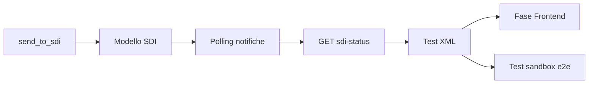

# FatturaPA — Backlog implementazione

**Progetto:** Elettronew (ECommerceManagerAPI)  
**Creato:** 2026-06-18  
**Aggiornato:** 2026-09-10  
**Riferimenti:** [fatturapa_riassunto_piano.md](./fatturapa_riassunto_piano.md) · [BACKLOG_UNIFICATO.md](../BACKLOG_UNIFICATO.md)

Documento operativo: cosa **sviluppare ancora**, partendo da ciò che esiste già nel backend (`FatturaPAService`, `FatturaPAValidator`, `fiscal_documents`, integrazione FatturaPA.com).

**Guida operativa unificata:** [`docs/FATTURAPA.md`](../../docs/FATTURAPA.md) — workflow end-to-end, API, configurazione, troubleshooting.

---

## Changelog rispetto al backlog iniziale (2026-06-18)

| Data | ID / area | Stato | Note |
|------|-----------|-------|------|
| 2026-06-22 | Tax → `<Natura>` step 1 | ✅ Completato | `fatturapa_natura.py`, `tax_electronic_code` + `tax_note`, fix bug `.2f`, test natura |
| 2026-06 | `payment_due_date` in XML | ✅ Completato | `resolve_payment_due_date()` → `DataScadenzaPagamento` |
| 2026-06–07 | VIES su **ordini** | ✅ Completato | `apply-vies-exemption`, bulk, filtro `vies_status`, ricalcolo righe/spedizione |
| 2026-06–07 | VIES → **XML FatturaPA N3.2** | ✅ Completato | BE-PA-P0-05 — `fatturapa_tax_line.py`, riepilogo multi-aliquota |
| 2026-07-16 | Fattura GET/POST v3 | ✅ Completato | `InvoiceResponseSchema` arricchito, test mapper, prompt FE v3 |
| — | `send_to_sdi`, webhook SDI | ❌ Parziale / aperto | P0-01, P0-03; **XSD e DatiFattureCollegate completati** |
| 2026-08-21 | P0-01 `send_to_sdi` | ✅ Completato | `UploadStop` vs `UploadStop1`; body `{ send_to_sdi }` + boolean grezzo |
| 2026-08-21 | ProgressivoInvio | ✅ Completato | Colonna UNIQUE `progressivo_invio`; serie SDI distinta da `document_number` |
| 2026-08-21 | P0-03 / P0-04 / P1-01 | ✅ Completato | Polling Pool Vendita, storico `fiscal_document_sdi_notifications`, `GET .../sdi-status` |
| 2026-08-21 | P1 retry-send / PEC / HTTP | ✅ Completato | `POST .../retry-send`, gate PEC XXXXXXX, retry 3x; mail cortesia **non** fatta |
| 2026-08-21 | Invio SDI via API | ✅ Completato | `UploadStop` / `retry-send` (flag poi acceso di default il 2026-09-10) |
| 2026-09-10 | Loop KO + overlay lista | ✅ Completato | PATCH se non evaso SdI; `POST .../reset-xml`; `fatturapa_status` da `sdi_status` |
| 2026-09-10 | Invio SDI automatico | ✅ Operativo | `FATTURAPA_SDI_API_SEND_ENABLED=true`: gestionale → FatturaPA.com → SdI |

---

## Legenda priorità

| Priorità | Significato |
|----------|-------------|
| **P0** | Bloccante go-live SDI (ciclo attivo B2B/B2C) |
| **P1** | Importante per correttezza fiscale / affidabilità |
| **P2** | Miglioramento o feature secondaria |
| **P3** | Opzionale / futuro |

| Stato base | Significato |
|------------|-------------|
| ✅ Completato | Implementato e coperto da test (dove previsto) |
| ✅ Parziale | Codice presente ma incompleto o con bug |
| ❌ Assente | Da implementare da zero |

---

## Riepilogo rapido

| Area | Copertura (2026-08-21) | Effort residuo stimato |
|------|------------------------|------------------------|
| Prerequisiti / DB | ~95% | 0 |
| Generazione XML | ~90% | 0,5–1 gg (P0-07 test XML) |
| Invio SDI + notifiche | ~95% | mail cortesia (rimandata) |
| Frontend | 0% (repo separato) | 2–3 gg |
| Ciclo passivo | ~30% | 2–3 gg |
| Test / go-live | ~25% | 2–3 gg |

---

## Completato dal backlog iniziale (non più da fare)

### BE-PA-DONE-01 — Tax `electronic_code` / `note` → XML (step 1 Natura)

**Completato:** 2026-06-22  
**File:** `src/services/external/fatturapa_natura.py`, `fatturapa_service.py`, `fatturapa_validator.py`

- Helper `normalize_natura_code()` per tag `<Natura>` (solo codice breve `N3.1`, `N3.2`, …).
- `_prepare_order_data_from_fiscal_document` passa `tax_electronic_code` e `tax_note` da `Tax`.
- `<RiferimentoNormativo>` da `tax.note` in `DatiRiepilogo`.
- Rimosso bug `{tax_electronic_code:.2f}` (crash su stringhe).
- Handoff FE: [`docs/FE_HANDOFF_TAX_ELECTRONIC_CODE.md`](../../docs/FE_HANDOFF_TAX_ELECTRONIC_CODE.md).
- Test: `tests/unit/services/external/test_fatturapa_natura.py`.

**Resta fuori scope di questo task (vedi P0-05 / P1-05):** natura per singola riga ordine, ramo esplicito `vies_status=eligible` → N3.2, riepilogo multi-aliquota.

---

### BE-PA-DONE-02 — `payment_due_date` → `DataScadenzaPagamento`

**Completato:** 2026-06  
**File:** `src/services/external/fatturapa_service.py` (`resolve_payment_due_date`)

- Se `order.payment_due_date` presente → usata in XML.
- Altrimenti fallback `date_add + 30 giorni`.
- Test: `tests/unit/services/external/test_fatturapa_payment_due_date.py`.

---

### BE-PA-DONE-03 — Fattura GET/POST response v3 (allineamento ricevuta)

**Completato:** 2026-07-16  
**File:** `src/schemas/fiscal_document_schema.py`, `src/services/routers/fiscal_document_service.py`, `src/routers/fiscal_documents.py`

- `InvoiceResponseSchema` arricchito: embed `customer`, indirizzi, `payment`, `shipping`, `order_details[]` snapshot, totali documento.
- Endpoint: `GET .../invoices/order/{id}`, `GET .../{id}`, `POST .../invoices`.
- Test: `tests/unit/services/test_fiscal_document_invoice_response.py`.
- Handoff FE: [`.cursor/tasks_claude/fatturazione/prompt_FE_fatture_V3_ALIGN.md`](../fatturazione/prompt_FE_fatture_V3_ALIGN.md).

---

### Correlato — VIES su ordini (BE-VIES-1..3, non XML)

**Completato:** 2026-06–07 (fuori dal perimetro XML ma prerequisito fatturazione VIES)

- `PATCH /api/v1/orders/{id}/apply-vies-exemption`, bulk, filtro `?vies_status=`.
- Ricalcolo righe e spedizione a IVA 0% con `id_tax` esenzione (`reverse_charge_id_tax` o fallback).
- Sync PrestaShop: snapshot `vies_status` via `vies_status_resolver`.
- **Non collegato** alla generazione XML: vedi BE-PA-P0-05 / BE-VIES-4.

---

## P0 — Go-live ciclo attivo

### BE-PA-P0-01 — Fix invio SDI (`send_to_sdi`)

**Stato:** ✅ Completato (2026-08-21)  
**Scope:** Backend  
**File:** `src/services/external/fatturapa_service.py`, `src/schemas/fiscal_document_schema.py`, `src/routers/fiscal_documents.py`

`upload_stop_endpoint(send_to_sdi)` chiama **`UploadStop1`** (solo upload) o **`UploadStop`** (upload + SDI). Body ufficiale `{ "send_to_sdi": bool }`; accettato anche boolean grezzo.

**Acceptance criteria:**
- [x] Con `send_to_sdi=false` → `UploadStop1`, `status=uploaded`
- [x] Con `send_to_sdi=true` → `UploadStop`, `status=sent`
- [x] Test: `tests/unit/services/external/test_fatturapa_upload_stop.py`, `tests/unit/schemas/test_send_to_sdi_schema.py`

---

### BE-PA-P0-02 — Validazione XSD ufficiale pre-invio

**Stato:** ✅ Completato (2026-07-27)  
**Scope:** Backend  
**File:** `src/services/external/fatturapa_xsd_validator.py`, `fatturapa_service.py`, `resources/fatturapa/xsd/`

**Task:**
- [x] XSD ufficiale v1.2 vendored (+ `xmldsig` locale; `NaturaType` esteso post-2021)
- [x] Dipendenza `lxml`
- [x] Validazione dopo `_generate_xml` in `generate_xml_from_fiscal_document()`
- [x] Errori strutturati `{field, message, rule, value}` → stesso percorso `validation_error` / HTTP 422

**Acceptance criteria:**
- [x] XML non conforme → `status=validation_error` con dettaglio XSD
- [x] XML conforme (TD01 IT, TD04, VIES N3.2) → success
- [x] Test: `tests/unit/services/external/test_fatturapa_xsd_validator.py`

---

### BE-PA-P0-03 — Webhook / polling notifiche SDI

**Stato:** ✅ Completato (2026-08-21) — polling (FatturaPA.com **non** espone webhook)  
**Scope:** Backend  
**File:** `fatturapa_sdi_notification_parser.py`, `fatturapa_sdi_events_sync_service.py`, job in `main.py`

**Implementato:**
- [x] Polling Pool Vendita (`Direzione != Acquisto`) — ciclo passivo POOL **non toccato**
- [x] Parser RC / MC / NS / NE / DT (alias AT→DT)
- [x] Job `fatturapa_sdi_events_sync` + `POST /api/v1/fiscal_documents/sdi-events/sync`
- [x] `sdi_status` su documento **senza** sovrascrivere `status` workflow

**Acceptance criteria:**
- [x] Scarto NS → `sdi_status=scartata` + motivo in storico
- [x] Consegna RC → `sdi_status=consegnata`
- [x] Idempotenza `(id_fiscal_document, notification_type, nome_file)`

---

### BE-PA-P0-04 — Estensione modello dati SDI

**Stato:** ✅ Completato (2026-08-21)  
**Scope:** Backend + DB (Alembic `20260821_0002`)  
**File:** `src/models/fiscal_document.py`, `src/models/fiscal_document_sdi_notification.py`

**Implementato:**
- [x] `fiscal_documents.identificativo_sdi`, `fiscal_documents.sdi_status`
- [x] Tabella `fiscal_document_sdi_notifications`
- [x] `status` workflow distinto da `sdi_status`
- [x] Consultazione: `GET /api/v1/fiscal_documents/{id}/sdi-status` (non mescolato in lista)

`protocollo_sdi` non è un campo separato: l'ID SDI è `identificativo_sdi`.

---

### BE-PA-P0-05 — Collegamento VIES → Natura FatturaPA

**Stato:** ✅ Completato (2026-07-17)  
**Correlato:** **BE-VIES-4** in [BACKLOG_UNIFICATO.md](../BACKLOG_UNIFICATO.md)  
**Scope:** Backend  
**File:** `fatturapa_tax_line.py`, `fatturapa_service.py`

**Implementato:**
- `order.vies_status == eligible` → righe prodotto con `AliquotaIVA=0.00` + `Natura=N3.2` (+ `RiferimentoNormativo` da `Tax.note` o default art. 41).
- Aliquota/natura **per riga** da `order_detail.id_tax` (non più solo tax paese delivery).
- Spedizione con aliquota propria (`shipping_id_tax` / `shipping_tax_percentage`) — può restare 22% con prodotti VIES 0%.
- `DatiRiepilogo` multi-blocco raggruppato per `(AliquotaIVA, Natura)`.
- Test: `tests/unit/services/external/test_fatturapa_tax_line.py`.

**Acceptance criteria:**
- [x] Ordine VIES eligible → XML con `AliquotaIVA=0.00` + `Natura=N3.2` su righe prodotto.
- [x] Test unitari: IVA ordinaria, esente, VIES, riepilogo multi-aliquota.

---

### BE-PA-P0-06 — `DatiFattureCollegate` per note di credito TD04

**Stato:** ✅ Completato (2026-07-27)  
**Scope:** Backend  
**File:** `fatturapa_service.py` (`_generate_xml`, `_prepare_order_data_from_fiscal_document`), `fatturapa_validator.py`

**Task:**
- Per `tipo_documento_fe=TD04`, aggiungere blocco `DatiGenerali/DatiFattureCollegate` con riferimento alla fattura originale (`id_fiscal_document_ref` → numero/data fattura collegata).
- Validare presenza fattura di riferimento in `FatturaPAValidator`.

**Acceptance criteria:**
- [x] NC elettronica contiene riferimento obbligatorio alla fattura TD01 originale (`IdDocumento` + `Data`).
- [x] Validatore rifiuta TD04 senza `linked_invoice_number`.
- [x] Test: `test_fatturapa_tax_line.py`, `test_fatturapa_dati_fatture_collegate.py`

---

### BE-PA-P0-07 — Unit test generazione XML

**Stato:** ✅ Parziale  
**Scope:** Backend

**Presenti:**
- `tests/unit/services/external/test_fatturapa_natura.py`
- `tests/unit/services/external/test_fatturapa_payment_due_date.py`
- `tests/unit/services/external/test_fatturapa_tax_line.py` (VIES N3.2 + riepilogo multi-aliquota + XML)
- `tests/unit/services/test_fiscal_document_invoice_response.py` (response v3, non XML)

**Mancante:** `tests/unit/services/external/test_fatturapa_xml_generation.py`

**Casistica minima da coprire:**
- Fattura TD01 IVA 22% (IT)
- Fattura con spedizione
- Nota credito TD04 totale e parziale
- Ordine VIES eligible (N3.2)
- Validazione XSD su fixture generate (dopo P0-02)

---

## P1 — Affidabilità e API

### BE-PA-P1-01 — Endpoint stato SDI dedicato

**Stato:** ✅ Completato (2026-08-21) — GET + retry-send  
**Scope:** Backend

**Implementato:**
- [x] `GET /api/v1/fiscal_documents/{id}/sdi-status` → `{ id_fiscal_document, sdi_status, identificativo_sdi, notifications[] }`
- [x] `POST /api/v1/fiscal_documents/{id}/retry-send` dopo NS: nuovo `progressivo_invio`, XML, `UploadStop`

---

### BE-PA-P1-02 — Download XML singolo (attachment)

**Stato:** ⏸ Opzionale — coperto da percorsi esistenti  
**Scope:** Backend

**Situazione attuale (2026-07-22):**

| Esigenza | Endpoint già disponibile |
|----------|--------------------------|
| Generare + persistere XML (workflow SDI) | `POST /api/v1/fiscal_documents/{id}/generate-xml` |
| Export bulk contabilità | `GET /api/v1/fiscal_documents/invoices/export?fmt=xml` |
| Leggere XML in JSON | `GET /api/v1/fiscal_documents/{id}` → `xml_content` |

**Task residuo (nice-to-have):**

- `GET /api/v1/fiscal_documents/{id}/xml` → `Content-Disposition: attachment; filename=IT{PIVA}_{progressivo}.xml` (solo download del blob già in DB, senza logica nuova).
- Non esporre XML enorme nel JSON **lista** (già rispettato: lista minimal).

Vedi matrice completa in [docs/FATTURAPA.md §6](../../docs/FATTURAPA.md).

---

### BE-PA-P1-03 — Macchina a stati documento

**Stato:** ✅ Completato (2026-08-21) per il ciclo attivo SDI  
**Scope:** Backend  
**File:** `src/services/external/fatturapa_sdi_resend.py`

```
pending → generated → uploaded → sent → (sdi_status consegnata/…)
                              ↘ error → send-to-sdi
                              ↘ scartata → POST .../retry-send → sent
```

**Implementato:**
- [x] `send-to-sdi` solo da `generated|uploaded|error` e senza esito SDI chiuso
- [x] Dopo NS: solo `retry-send` (nuovo ProgressivoInvio)
- [x] MC/consegnata/NE/DT: reinvio bloccato

Resta fuori: mail cortesia; OpenAPI enum esaustivo.

---

### BE-PA-P1-04 — Rifattorizzazione builder XML

**Stato:** ✅ Parziale (tutto in `fatturapa_service.py`)  
**Scope:** Backend — refactor non bloccante

**Task:**
- Estrarre `src/services/external/fatturapa_builder.py` (Header, Body, DettaglioLinee, DatiRiepilogo).
- Ridurre `print()` di debug → `logger`.
- Allineare namespace/schemaLocation alla versione XSD in repo.

---

### BE-PA-P1-05 — DatiRiepilogo multi-aliquota

**Stato:** ✅ Completato (2026-07-17, con P0-05)  
**Scope:** Backend  
**File:** `fatturapa_tax_line.py` (`build_riepilogo_groups`), `fatturapa_service.py`

Raggruppamento righe per `(AliquotaIVA, Natura)` con N blocchi `DatiRiepilogo`. Caso VIES: prodotti 0% N3.2 + spedizione 22%.

---

### BE-PA-P1-06 — Configurazione sandbox / produzione

**Stato:** ✅ Parziale  
**Scope:** Ops + Backend

**Task:**
- Documentare in README variabili `fatturapa.api_key`, `fatturapa.base_url`.
- Flag ambiente `FATTURAPA_SANDBOX=true` in settings (opzionale).
- Checklist go-live in fondo a questo file.

---

## P2 — Ciclo passivo e integrazioni

### BE-PA-P2-01 — Esposizione API ciclo passivo

**Stato:** ✅ Completato (2026-07-29)  
**Scope:** Backend  
**File:** `src/routers/purchase_invoices.py`, `purchase_invoice_service.py`, `fatturapa_inbound_parser.py`, sync + scheduler in `main.py`

**Delivered:**
- `GET/PATCH/POST /api/v1/purchase-invoices` (lista, dettaglio+righe, XML, payment, sync)
- Parser header + `DettaglioLinee`; tabella `fatture_acquisto_sync_details`
- Flag `is_paid` + `id_payment`; scheduler ogni 15 min (`FATTURAPA_POOL_SYNC_*`)
- Handoff: `docs/FE_HANDOFF_PURCHASE_INVOICES.md`

---

### BE-PA-P2-02 — UI consultazione fatture passive

**Stato:** ❌ Assente (BE pronto)  
**Scope:** Frontend (repo Angular, PC webmarke26)

**Task:** lista con filtri data/fornitore/tipo/pagato; dettaglio con righe; XML; mark paid + metodo pagamento. Vedi handoff BE.

---

## P3 — Opzionale / futuro

### BE-PA-P3-01 — Fatturazione B2G (FPA12)

**Stato:** ❌ Assente nel generator (validator ok)  
**Task:** rilevare cliente PA → `FormatoTrasmissione=FPA12`, `CodiceDestinatario` 6 char, CUU, CIG/CUP in `DatiOrdineAcquisto`.

---

### BE-PA-P3-02 — Altri TipoDocumento (TD05, TD29, …)

**Stato:** ❌ Solo TD01/TD04 nel flusso business  
**Task:** estendere repository + UI selezione tipo.

---

### BE-PA-P3-03 — Invio batch ZIP

**Stato:** ❌ Assente  
**Task:** compressione multipla XML + upload SFTP/API batch (se richiesto da volumi).

---

### BE-PA-P3-04 — Firma digitale B2G

**Stato:** ❌ Assente  
**Task:** integrazione HSM/firma remota per fatture verso PA (obbligatoria B2G).

---

### BE-PA-P3-05 — Controlli SDI 1.9.1 (gruppi IVA, ecc.)

**Stato:** ❌ Assente  
**Task:** validazione CF partecipante gruppo IVA (errore 00327); monitoraggio aggiornamenti AdE.

---

### BE-PA-P3-06 — Conservazione sostitutiva

**Stato:** ❌ Operativo/contrattuale  
**Task:** verificare se intermediario copre 10 anni; eventuale export periodico XML+notifiche.

---

## Frontend — repo separato (Fase 3 piano)

| ID | Task | Priorità | Note 2026-07-17 |
|----|------|----------|-----------------|
| FE-PA-3.0 | Allineamento `InvoiceDetail` v3 (GET/POST) | P0 | Prompt pronto: [prompt_FE_fatture_V3_ALIGN.md](../fatturazione/prompt_FE_fatture_V3_ALIGN.md) |
| FE-PA-3.1 | Colonna "Stato SDI" in lista fatture | P0 | |
| FE-PA-3.2 | Azione "Invia a SDI" da dettaglio | P0 | |
| FE-PA-3.3 | Badge stato (bozza/inviata/consegnata/scartata) | P0 | |
| FE-PA-3.4 | Timeline notifiche SDI | P1 | BE pronto: `GET .../sdi-status` |
| FE-PA-3.5 | Download XML e PDF | P1 | PDF: `GET .../pdf`. XML singolo: export bulk, `generate-xml`, o `xml_content` in dettaglio; attachment dedicato opzionale (P1-02) |

**API backend da consumare (output fiscale):**  
Vedi matrice in [docs/FATTURAPA.md §6](../../../docs/FATTURAPA.md).

| Caso d'uso | Endpoint |
|------------|----------|
| Ciclo SDI singolo | `POST .../generate-xml` · `POST .../send-to-sdi` |
| Reinvio dopo NS | `POST .../retry-send` |
| PDF cortesia singola | `GET .../pdf` |
| Export bulk Excel/XML | `GET .../invoices/export?fmt=xlsx\|xml` |
| Stato SDI + storico | `GET .../sdi-status` |
| Download XML attachment (opzionale) | `GET .../xml` (P1-02, non implementato) |

---

## Prerequisiti operativi (non codice)

| ID | Task | Owner |
|----|------|-------|
| OPS-PA-01 | Account sandbox FatturaPA.com attivo | Ops |
| OPS-PA-02 | Popolare `company_info` e `electronic_invoicing.tax_regime` in DB | Ops |
| OPS-PA-03 | API key produzione solo dopo test e2e | Ops |
| OPS-PA-04 | Iscrizione newsletter AdE / monitoraggio fatturapa.gov.it | Ops |
| OPS-PA-05 | Tax VIES con `electronic_code=N3.2` + `note` normativa (workaround fino a P0-05) | Ops |

---

## Ordine di implementazione consigliato (aggiornato 2026-08-21)


```mermaid
flowchart LR
  P0_01[send_to_sdi] --> P0_04[Modello SDI]
  P0_04 --> P0_03[Polling notifiche]
  P0_03 --> P1_01[GET sdi-status]
  P1_01 --> P0_07[Test XML]
  P0_07 --> FE[Fase Frontend]
  P0_07 --> E2E[Test sandbox e2e]
```

1. **Ciclo SDI P0 (fatto 2026-08-21):** P0-01, ProgressivoInvio, P0-03, P0-04, P1-01 GET
2. **P1 BE (fatto 2026-08-21, senza mail):** retry-send, gate PEC, retry HTTP
3. **Prossima iterazione:** mail cortesia (campi `mail_*` già in lista); FE-PA-3.1–3.4 su `sdi-status` + `retry-send`
4. **Backlog:** P0-07 test XML e2e, P2 ciclo passivo (già POOL), P3 B2G/batch

---

## Checklist go-live

- [x] Codice natura Tax separato da descrizione (`electronic_code` / `note`)
- [x] `DataScadenzaPagamento` da `payment_due_date` ordine
- [x] Response fattura v3 per FE (GET/POST arricchiti)
- [x] XML con ramo VIES `eligible` → N3.2 verificato su casi reali (unit test)
- [ ] XML validato XSD su casi reali (fattura, NC, VIES)
- [ ] Invio sandbox con P.IVA collaudo → RC ricevuta
- [x] Gestione scarto NS → `POST .../retry-send` (test unitari; e2e sandbox da fare)
- [ ] `company_info` completo e verificato
- [ ] API key produzione configurata
- [ ] Monitoraggio errori (log + alert su status `error`/`scartata`)
- [ ] FE: contratto v3 + invio e visualizzazione stato SDI

---

## Codice già riusabile (non riscrivere)

| Componente | Path |
|------------|------|
| Service XML + upload | `src/services/external/fatturapa_service.py` |
| Validatore business | `src/services/external/fatturapa_validator.py` |
| Normalizzazione Natura | `src/services/external/fatturapa_natura.py` |
| Tax per riga + VIES N3.2 | `src/services/external/fatturapa_tax_line.py` |
| Scadenza pagamento XML | `resolve_payment_due_date()` in `fatturapa_service.py` |
| Modello documenti | `src/models/fiscal_document.py` |
| Repository fatture/NC/resi | `src/repository/fiscal_document_repository.py` |
| Mapper response v3 | `src/services/routers/fiscal_document_service.py` |
| Router API | `src/routers/fiscal_documents.py` |
| PDF fattura | `src/services/pdf/fiscal_document_pdf_service.py` |
| Sync POOL passive | `src/services/sync/fatturapa_pool_sync_service.py` |
| Sync notifiche SDI attive | `src/services/sync/fatturapa_sdi_events_sync_service.py` |
| Parser notifiche SDI | `src/services/external/fatturapa_sdi_notification_parser.py` |
| VIES ordini | `src/services/vies/`, `src/vies/tax_resolution.py`, `src/vies/exemption_calculation.py` |
| Config azienda/API | `app_configurations` (`company_info`, `fatturapa`, `electronic_invoicing`) |

---

## Note tecniche

- **Formato file XML:** v1.2 / FPR12 (namespace AgE) — corretto per B2B/B2C.
- **Specifiche SDI 1.9.1:** regole trasmissione e controlli post-invio; complementari allo XSD.
- **Intermediario attuale:** FatturaPA.com REST (`UploadStart1` / Blob / `UploadStop1` solo upload / `UploadStop` + SDI / `Pool`).
- **VIES ordini vs XML:** l'esenzione ordine modifica prezzi e `id_tax` righe; l'XML legge ancora il tax del **paese delivery** in `_prepare_order_data_from_fiscal_document` — allineamento esplicito con `order.vies_status` è il gap P0-05.
- **POST creazione fattura:** body minimale `{ id_order, is_electronic? }` — vedi `InvoiceCreateSchema` e handoff [prompt_FE_fatture_V3_ALIGN.md](../fatturazione/prompt_FE_fatture_V3_ALIGN.md).
