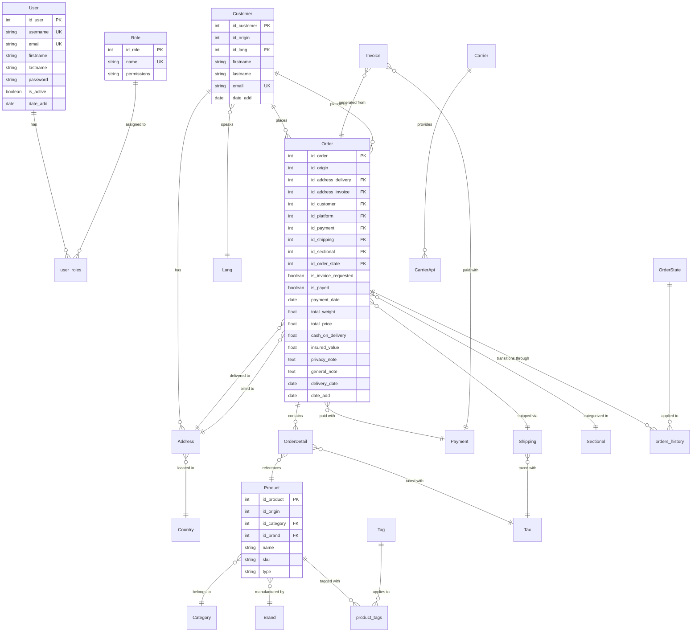
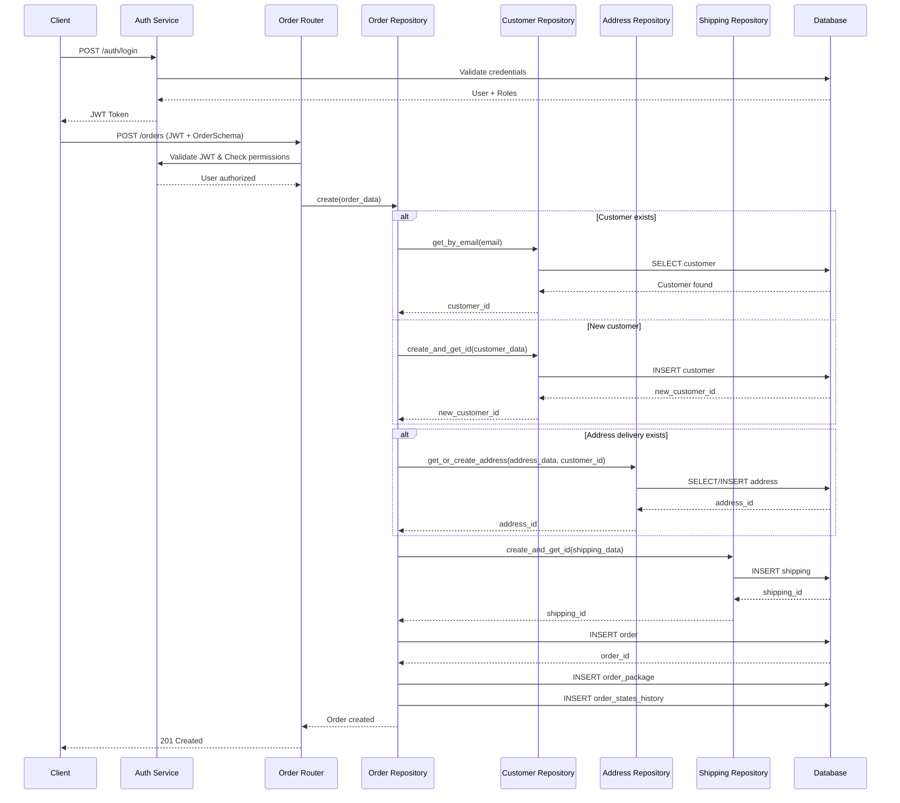
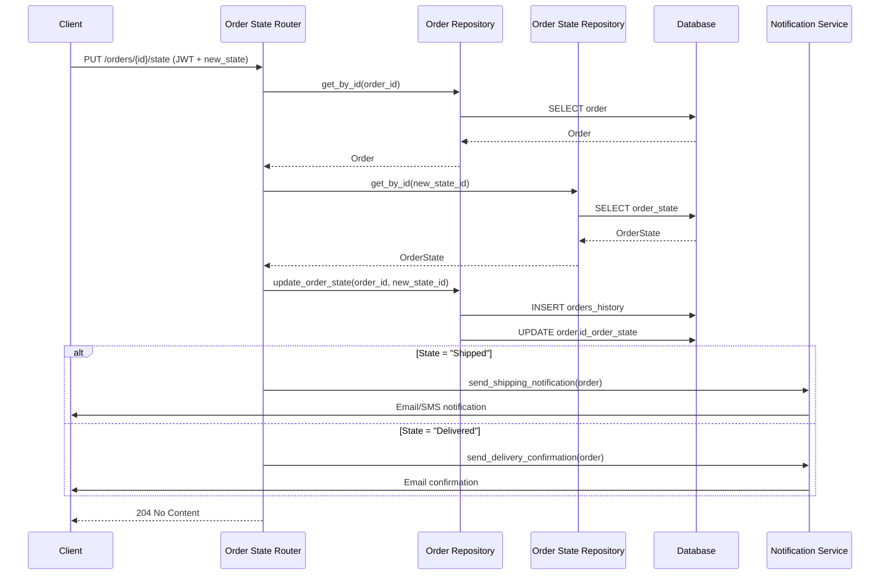
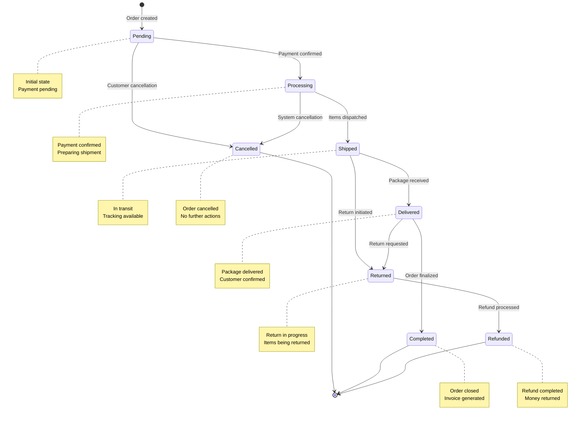

# Analisi Architetturale Completa - ECommerceManagerAPI

## Indice
1. [Mappa Repository](#1-mappa-repository)
2. [Stack Tecnologico](#2-stack-tecnologico)
3. [Tabella Modelli/Tabelle](#3-tabella-modellitabelle)
4. [Diagramma ER](#4-diagramma-er-mermaid)
5. [Tabella Endpoints](#5-tabella-endpoints)
6. [Sequence Diagram - Creazione Ordine](#6-sequence-diagram---creazione-ordine)
7. [Sequence Diagram - Aggiornamento Stato Ordine](#7-sequence-diagram---aggiornamento-stato-ordine)
8. [State Machine Ordine](#8-state-machine-ordine)
9. [Tabella Gap Analysis vs Smarty](#9-tabella-gap-analysis-vs-smarty)
10. [Priorità Interventi](#10-priorità-interventi)
11. [Raccomandazioni Architetturali](#11-raccomandazioni-architetturali)

---

## 1. Mappa Repository

```
ECommerceManagerAPI/
├── src/
│   ├── main.py                    # Entry point FastAPI
│   ├── database.py               # Configurazione DB MySQL
│   ├── models/                   # Modelli SQLAlchemy (25 entità)
│   │   ├── user.py, role.py     # Autenticazione/autorizzazione
│   │   ├── customer.py, address.py # Gestione clienti
│   │   ├── product.py, category.py, brand.py, tag.py # Catalogo
│   │   ├── order.py, order_detail.py, order_state.py # Ordini
│   │   ├── payment.py, invoice.py # Pagamenti/fatturazione
│   │   ├── shipping.py, carrier.py # Spedizioni
│   │   └── relations/relations.py # Tabelle di associazione
│   ├── routers/                  # API Endpoints (25 router)
│   │   ├── auth.py              # Autenticazione JWT
│   │   ├── customer.py, product.py, order.py # CRUD principali
│   │   └── [altri 22 router]    # Gestione entità specifiche
│   ├── repository/               # Pattern Repository (25 classi)
│   │   ├── customer_repository.py, order_repository.py
│   │   └── [altri 23 repository]
│   ├── services/                 # Logica di business
│   │   ├── auth.py              # JWT, autorizzazione
│   │   ├── ecommerce_api_service.py # Integrazione Prestashop
│   │   └── model_services/      # Servizi specifici
│   ├── schemas/                  # Pydantic schemas (25 file)
│   └── errors/                   # Gestione errori
├── test/                        # Test suite pytest
├── scripts/                     # Script di inizializzazione
├── alembic/                     # Migrazioni DB
└── requirements.txt             # Dipendenze Python
```

---

## 2. Stack Tecnologico

### Backend
- **FastAPI 0.110.1** - Framework web asincrono
- **SQLAlchemy 2.0.29** - ORM con MySQL
- **Pydantic 2.6.4** - Validazione dati
- **Alembic 1.13.1** - Migrazioni database
- **Uvicorn 0.29.0** - Server ASGI

### Database
- **MySQL** con PyMySQL 1.1.0
- **Redis** per cache (fastapi-cache)

### Sicurezza
- **JWT** (python-jose 3.3.0)
- **bcrypt** per hash password
- **OAuth2PasswordBearer** per autenticazione

### Testing
- **pytest 8.1.1** con pytest-asyncio

---

## 3. Tabella Modelli/Tabelle

| Modello | Tabella | Chiavi | Relazioni Principali |
|---------|---------|--------|---------------------|
| **User** | users | id_user (PK) | N:N con Role |
| **Role** | roles | id_role (PK) | N:N con User |
| **Customer** | customers | id_customer (PK) | 1:N con Address, Order |
| **Address** | addresses | id_address (PK) | N:1 con Customer, Country |
| **Product** | products | id_product (PK) | N:1 con Category, Brand; N:N con Tag |
| **Category** | categories | id_category (PK) | 1:N con Product |
| **Brand** | brands | id_brand (PK) | 1:N con Product |
| **Tag** | tags | id_tag (PK) | N:N con Product |
| **Order** | orders | id_order (PK) | N:1 con Customer, Address, Payment, Shipping |
| **OrderDetail** | order_details | id_order_detail (PK) | N:1 con Order, Product |
| **OrderState** | order_states | id_order_state (PK) | N:N con Order (storico) |
| **Payment** | payments | id_payment (PK) | 1:N con Order, Invoice |
| **Invoice** | invoices | id_invoice (PK) | N:1 con Order, Payment |
| **Shipping** | shipments | id_shipping (PK) | 1:N con Order |
| **Carrier** | carriers | id_carrier (PK) | 1:N con CarrierApi |
| **Country** | countries | id_country (PK) | 1:N con Address |
| **Platform** | platforms | id_platform (PK) | - |
| **Sectional** | sectionals | id_sectional (PK) | N:1 con Order |
| **Tax** | taxes | id_tax (PK) | N:1 con Order, Shipping |
| **Lang** | langs | id_lang (PK) | N:1 con Customer |
| **Message** | messages | id_message (PK) | N:1 con User |
| **Configuration** | configurations | id_configuration (PK) | - |

---

## 4. Diagramma ER (Mermaid)



---

## 5. Tabella Endpoints

| Metodo | Path | Autenticazione | Ruoli | Input | Output | Errori |
|--------|------|----------------|-------|-------|--------|--------|
| **POST** | `/api/v1/auth/login` | ❌ | - | OAuth2PasswordRequestForm | Token JWT | 401 |
| **POST** | `/api/v1/auth/register` | ❌ | - | UserSchema | User | 400, 500 |
| **GET** | `/api/v1/customers/` | ✅ | ADMIN,USER,ORDINI,FATTURAZIONE,PREVENTIVI | Query params | AllCustomerResponseSchema | 404 |
| **POST** | `/api/v1/customers/` | ✅ | ADMIN,ORDINI,FATTURAZIONE,PREVENTIVI | CustomerSchema | Customer | 409 |
| **GET** | `/api/v1/customers/{id}` | ✅ | ADMIN,USER,ORDINI,FATTURAZIONE,PREVENTIVI | Path param | CustomerResponseSchema | 404 |
| **PUT** | `/api/v1/customers/{id}` | ✅ | ADMIN,ORDINI,FATTURAZIONE,PREVENTIVI | CustomerSchema | 204 | 404 |
| **DELETE** | `/api/v1/customers/{id}` | ✅ | ADMIN,ORDINI,FATTURAZIONE,PREVENTIVI | Path param | 204 | 404 |
| **GET** | `/api/v1/products/` | ✅ | ADMIN,USER,ORDINI,FATTURAZIONE,PREVENTIVI | Query filters | AllProductsResponseSchema | 404 |
| **POST** | `/api/v1/products/` | ✅ | ADMIN,ORDINI,FATTURAZIONE,PREVENTIVI | ProductSchema | 201 | - |
| **GET** | `/api/v1/products/{id}` | ✅ | ADMIN,USER,ORDINI,FATTURAZIONE,PREVENTIVI | Path param | ProductResponseSchema | 404 |
| **PUT** | `/api/v1/products/{id}` | ✅ | ADMIN,ORDINI,FATTURAZIONE,PREVENTIVI | ProductSchema | 204 | 404 |
| **DELETE** | `/api/v1/products/{id}` | ✅ | ADMIN,ORDINI,FATTURAZIONE,PREVENTIVI | Path param | 204 | 404 |
| **POST** | `/api/v1/orders/` | ✅ | ADMIN,ORDINI,FATTURAZIONE,PREVENTIVI | OrderSchema | 201 | - |
| **GET** | `/api/v1/sectional/` | ✅ | ADMIN,ORDINI,FATTURAZIONE,PREVENTIVI | Query params | AllSectionalsResponseSchema | - |
| **GET** | `/api/v1/carriers/` | ✅ | ADMIN,USER,ORDINI,FATTURAZIONE,PREVENTIVI | Query params | AllCarriersResponseSchema | - |
| **GET** | `/api/v1/shipping_state/` | ✅ | ADMIN,ORDINI | - | List[ShippingState] | - |

---

## 6. Sequence Diagram - Creazione Ordine



---

## 7. Sequence Diagram - Aggiornamento Stato Ordine



---

## 8. State Machine Ordine



---

## 9. Tabella Gap Analysis vs Smarty

| Funzionalità | Stato | Note |
|--------------|-------|------|
| **Gestione Ordini** | ✅ Coperto | CRUD completo, stati, storico |
| **Gestione Clienti** | ✅ Coperto | CRUD, indirizzi, multi-lingua |
| **Catalogo Prodotti** | ✅ Coperto | Categorie, brand, tag, SKU |
| **Sistema Pagamenti** | ⚠️ Parziale | Modello base, manca integrazione gateway |
| **Fatturazione** | ⚠️ Parziale | Modello presente, manca generazione PDF |
| **Spedizioni** | ⚠️ Parziale | Modello base, manca integrazione corrieri |
| **Multi-piattaforma** | ✅ Coperto | Integrazione Prestashop presente |
| **Gestione Utenti/Ruoli** | ✅ Coperto | JWT, RBAC, permessi granulari |
| **Report/Analytics** | ❌ Mancante | Nessun sistema di reportistica |
| **Notifiche** | ❌ Mancante | Manca sistema email/SMS |
| **Backup/Restore** | ❌ Mancante | Nessuna strategia di backup |
| **API Rate Limiting** | ❌ Mancante | Nessun rate limiting implementato |
| **Audit Log** | ❌ Mancante | Nessun tracciamento operazioni |
| **Multi-tenant** | ❌ Mancante | Architettura single-tenant |
| **Workflow Approvazione** | ❌ Mancante | Nessun sistema di approvazione |
| **Integrazione ERP** | ❌ Mancante | Solo Prestashop supportato |
| **Mobile API** | ⚠️ Parziale | API REST base, manca ottimizzazione mobile |

---

## 10. Priorità Interventi

### 🔴 **ALTA PRIORITÀ**
1. **Sistema Notifiche** - Email/SMS per stati ordine
2. **Integrazione Gateway Pagamenti** - Stripe/PayPal
3. **Generazione Fatture PDF** - Template personalizzabili
4. **Rate Limiting** - Protezione API da abusi
5. **Audit Logging** - Tracciamento operazioni critiche

### 🟡 **MEDIA PRIORITÀ**
6. **Integrazione Corrieri** - API tracking automatico
7. **Sistema Reportistica** - Dashboard analytics
8. **Backup Strategy** - Backup automatici DB
9. **Health Checks** - Monitoring applicazione
10. **Ottimizzazione Query** - Indici database

### 🟢 **BASSA PRIORITÀ**
11. **Multi-tenant Architecture** - Separazione clienti
12. **Workflow Approvazione** - Processi business complessi
13. **Integrazione ERP** - SAP/Oracle
14. **Mobile API Optimization** - Endpoint specifici mobile
15. **Caching Avanzato** - Redis per query pesanti

---

## 11. Raccomandazioni Architetturali

### **1. Implementare Event-Driven Architecture**
```python
# Eventi per notifiche asincrone
class OrderStateChangedEvent:
    order_id: int
    old_state: str
    new_state: str
    timestamp: datetime
```

### **2. Aggiungere Middleware di Logging**
```python
# Tracciamento request/response
@app.middleware("http")
async def log_requests(request: Request, call_next):
    # Log structured per observability
```

### **3. Implementare Circuit Breaker Pattern**
```python
# Per chiamate API esterne (Prestashop)
@circuit_breaker(failure_threshold=5, timeout=60)
async def call_external_api():
    # Resilienza alle chiamate esterne
```

### **4. Separare Business Logic dai Repository**
```python
# Service layer per logica complessa
class OrderService:
    def create_order_with_validation(self, order_data):
        # Validazioni business, calcoli, side effects
```

### **5. Implementare CQRS per Query Complesse**
```python
# Separazione command/query per performance
class OrderQueryService:
    def get_orders_with_analytics(self):
        # Query ottimizzate per reporting
```

### **6. Aggiungere Validazione Input Avanzata**
```python
# Validatori custom per business rules
class OrderValidator:
    def validate_order_totals(self, order_details):
        # Validazioni specifiche dominio
```

### **7. Implementare Retry Policy**
```python
# Retry automatico per operazioni critiche
@retry(max_attempts=3, backoff_factor=2)
async def process_payment():
    # Resilienza pagamenti
```

### **8. Aggiungere Monitoring e Metrics**
```python
# Prometheus metrics per observability
from prometheus_client import Counter, Histogram
order_created = Counter('orders_created_total')
```

### **9. Implementare Database Migrations Strategy**
```python
# Alembic con versioning e rollback
# Migrazioni incrementali e sicure
```

### **10. Aggiungere API Versioning**
```python
# Versioning API per backward compatibility
router = APIRouter(prefix="/api/v2")
```

---

## Conclusione

Il progetto **ECommerceManagerAPI** presenta una base solida con:

### ✅ **Punti di Forza**
- Architettura FastAPI moderna e scalabile
- Pattern Repository ben implementato
- Gestione completa del dominio e-commerce
- Sistema di autenticazione/autorizzazione robusto
- Integrazione con Prestashop funzionante
- Struttura modulare e manutenibile

### ⚠️ **Aree di Miglioramento**
- Integrazione con servizi esterni (pagamenti, corrieri)
- Sistema di notifiche e comunicazioni
- Observability e monitoring
- Reportistica e analytics
- Resilienza e fault tolerance

### 🎯 **Roadmap Consigliata**
Con gli interventi proposti nelle **Priorità Interventi**, il sistema può evolvere verso un gestionale enterprise-grade comparabile a Smarty, mantenendo la flessibilità e modernità dell'architettura FastAPI.

La struttura attuale fornisce un'ottima base per implementare le funzionalità mancanti senza dover rifattorizzare l'architettura core, garantendo scalabilità e manutenibilità a lungo termine.
