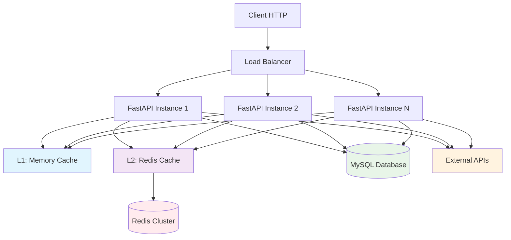
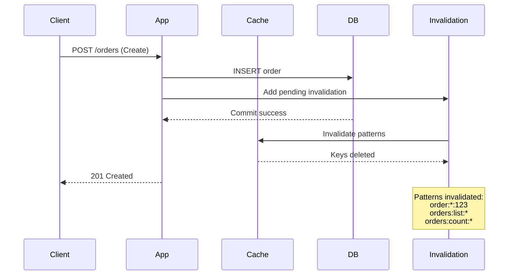

# Architettura Sistema di Caching - ECommerceManagerAPI

## Panoramica

Il sistema di caching multilivello per ECommerceManagerAPI è progettato per ridurre la latenza, il carico sul database e migliorare le performance complessive dell'applicazione. Il sistema supporta cache in-memory, Redis distribuita, invalidazione intelligente e pattern avanzati come stale-while-revalidate e single-flight.

## Architettura del Sistema



### Livelli di Cache

#### L1 - Cache In-Memory (Per Processo)
- **Backend**: `cachetools.TTLCache` (LRU + TTL)
- **Scope**: Singolo processo FastAPI
- **Use Case**: Metadati piccoli, lookup tables
- **TTL**: 5-60 minuti
- **Capacità**: 1000-5000 items (configurabile)

#### L2 - Cache Redis (Distribuita)
- **Backend**: `redis.asyncio`
- **Scope**: Cluster multi-istanza
- **Use Case**: Query results, API responses, deduplication
- **TTL**: 1 minuto - 24 ore
- **Features**: Pub/Sub, Locks, SWR

#### L3 - Application Cache (Business Logic)
- **Backend**: Decorator + Service layer
- **Scope**: Logica business
- **Use Case**: Valori calcolati, dati aggregati
- **TTL**: Variabile per business logic

## Schema Chiavi e TTL

### Lookup Tables (Static/Rare)
```
order_states:{tenant}                    → 24h
categories:{tenant}                      → 24h  
brands:{tenant}                          → 24h
carriers:{tenant}                        → 24h
countries:{tenant}                       → 24h
langs:{tenant}                           → 24h
config:{tenant}:{key}                    → 15m
```

### Entità Singole
```
customer:{tenant}:{id}                   → 1h
product:{tenant}:{id}                    → 6h
order:{tenant}:{id}                      → 2m
quote:{tenant}:{id}                      → 5m
address:{tenant}:{id}                    → 2h
```

### Liste e Query
```
customers:list:{tenant}:{qhash}          → 30s
products:list:{tenant}:{qhash}           → 1m
orders:list:{tenant}:{qhash}             → 30s
quotes:list:{tenant}:{qhash}             → 1m
orders:history:{tenant}:{order_id}       → 5m
```

### API Esterne
```
prestashop:orders:{shop_id}:{page}:{hash} → 2m
prestashop:customers:{shop_id}:{page}    → 5m
prestashop:products:{shop_id}:{page}     → 10m
fatturapa:pool:{tenant}:{page_token}     → 1m
fatturapa:inv:{sdi}:meta                 → 24h
```

### Locks e Deduplication
```
lock:prestashop:sync:{shop_id}           → 60s
lock:fatturapa:download:{sdi}            → 60s
lock:order:process:{order_id}            → 30s
```

## Pattern di Caching

### 1. Read-Through
```python
@cached(ttl=3600, key="customer:{tenant}:{customer_id}")
async def get_customer(customer_id: int, tenant: str):
    return await customer_repo.get_by_id(customer_id)
```

### 2. Stale-While-Revalidate (SWR)
```python
@cached(ttl=60, stale_ttl=300, key="orders:list:{tenant}:{qhash}")
async def get_orders_list(tenant: str, filters: dict):
    # Serve stale se presente, aggiorna in background
    pass
```

### 3. Single-Flight
```python
@cached(ttl=120, single_flight=True, key="prestashop:orders:{shop_id}")
async def fetch_prestashop_orders(shop_id: str):
    # Solo una richiesta per processo/cluster
    pass
```

### 4. Conditional GET (ETag)
```python
# Middleware automatico per endpoint GET
# Calcola ETag da updated_at/versione o hash risposta
# Ritorna 304 se If-None-Match matcha
```

## Flusso di Invalidazione



### Event-Driven Invalidation
```python
# Post-commit hooks
@invalidate_on_commit
def create_order(order_data):
    # Auto-invalidate: order:*, orders:list:*
    pass

@invalidate_on_commit  
def update_customer(customer_id, data):
    # Auto-invalidate: customer:{id}, customers:list:*
    pass
```

### Pattern di Invalidazione
- **Order CRUD** → `order:{id}`, `orders:list:*`
- **Customer CRUD** → `customer:{id}`, `customers:list:*`
- **Product CRUD** → `product:{id}`, `products:list:*`
- **Order State Change** → `order:{id}`, `orders:history:{id}`
- **PrestaShop Sync** → `prestashop:*`

## Configurazione

### Environment Variables
```bash
# Cache abilitazione
CACHE_ENABLED=true
CACHE_BACKEND=redis  # redis, memory, hybrid

# Redis
REDIS_URL=redis://localhost:6379/0
REDIS_MAX_CONNECTIONS=20
REDIS_RETRY_ON_TIMEOUT=true

# TTL Defaults
CACHE_DEFAULT_TTL=300
CACHE_STALE_TTL=900
CACHE_MAX_MEM_ITEMS=1000

# Security
CACHE_KEY_SALT=your-secret-salt
CACHE_MAX_VALUE_SIZE=1048576  # 1MB

# Metrics
CACHE_METRICS_ENABLED=true
CACHE_LOG_LEVEL=INFO
```

### Feature Flags
```python
# Per rollout graduale
CACHE_ORDERS_ENABLED=true
CACHE_PRODUCTS_ENABLED=true
CACHE_CUSTOMERS_ENABLED=false  # Disabilitato per testing
CACHE_EXTERNAL_APIS_ENABLED=true
```

## Esempi di Utilizzo

### 1. Repository con Cache
```python
from src.repository.cached_order_repository import CachedOrderRepository

class OrderService:
    def __init__(self, db: Session):
        self.order_repo = CachedOrderRepository(db)
    
    async def get_order(self, order_id: int, tenant: str):
        # Automaticamente cache-ato
        return await self.order_repo.get_by_id_cached(tenant, order_id)
    
    async def create_order(self, order_data: OrderSchema, tenant: str):
        # Con invalidazione automatica
        return await self.order_repo.create_with_cache_invalidation(
            order_data, tenant
        )
```

### 2. Service con Cache
```python
from src.services.cached_prestashop_service import CachedPrestaShopService

class SyncService:
    def __init__(self, db: Session):
        self.prestashop_service = CachedPrestaShopService(db)
    
    async def sync_orders(self, tenant: str, shop_id: str):
        # Con single-flight per evitare duplicate calls
        return await self.prestashop_service.sync_orders_with_cache(
            tenant, shop_id
        )
```

### 3. Decorator Personalizzato
```python
from src.core.cached import cached

@cached(
    ttl=300,
    key="custom:{tenant}:{param1}:{param2}",
    single_flight=True,
    stale_ttl=600
)
async def custom_expensive_operation(tenant: str, param1: str, param2: int):
    # Operazione costosa che beneficia di caching
    result = await expensive_computation(param1, param2)
    return result
```

### 4. Invalidazione Manuale
```python
from src.core.invalidation import invalidate_entity, invalidate_pattern

# Invalida specifica entità
await invalidate_entity("order", 123, "tenant1")

# Invalida pattern
await invalidate_pattern("orders:list:tenant1:*")

# Invalida cache utente
await invalidate_user_cache("user_456")
```

## Metriche e Monitoring

### Cache Metrics (Prometheus)
```
# Counters
cache_hit_total{cache_layer, key_pattern}
cache_miss_total{cache_layer, key_pattern}  
cache_error_total{cache_layer, error_type}

# Histograms
cache_latency_seconds{cache_layer, operation}

# Gauges
cache_size_bytes{cache_layer}
cache_eviction_total{cache_layer, reason}
```

### Logging Strutturato
```json
{
  "event": "cache_hit",
  "key": "order:tenant1:123", 
  "layer": "redis",
  "ttl_remaining": 1800,
  "correlation_id": "req-123",
  "timestamp": "2024-01-15T10:30:00Z"
}
```

### Health Checks
```bash
# Cache health endpoint
GET /health/cache

{
  "redis": "healthy",
  "memory": "healthy", 
  "hit_rate": 0.85,
  "avg_latency_ms": 2.3,
  "circuit_breaker": "closed"
}
```

## Gestione Cache

### Endpoint Admin (Solo ADMIN)
```bash
# Lista chiavi cache
GET /api/v1/cache/keys?pattern=orders:*

# Invalida pattern
DELETE /api/v1/cache?pattern=orders:tenant1:*

# Statistiche cache
GET /api/v1/cache/stats

# Reset cache (emergenza)
POST /api/v1/cache/reset
```

### Comandi Utilità
```bash
# Invalida tutto
python -c "
import asyncio
from src.core.invalidation import invalidate_all_cache
asyncio.run(invalidate_all_cache())
"

# Invalida tenant specifico
python -c "
import asyncio
from src.core.invalidation import invalidate_tenant_cache
asyncio.run(invalidate_tenant_cache('tenant1'))
"
```

## Resilienza e Fallback

### Circuit Breaker
```python
# Se error rate > 50% → bypass cache temporaneamente
# Auto-recovery dopo 5 minuti
```

### Graceful Degradation
```python
# Se Redis down → fallback a in-memory
# Se cache miss → serve direttamente dal DB
# Se stale data → serve stale + refresh background
```

### Retry e Backoff
```python
# Retry automatico per errori temporanei
# Exponential backoff per evitare thundering herd
```

## Sicurezza

### Tenant Isolation
```python
# Tutte le chiavi includono tenant
key = f"order:{tenant}:{order_id}"
```

### User Context
```python
# Per dati user-specific
key = f"user_orders:{tenant}:{user_id}:{qhash}"
```

### Sensitive Data Protection
```python
# Non cache-are mai:
# - Token JWT
# - Password hash
# - Dati PII sensibili
# - Risposte con errori 4xx/5xx
```

## Performance e Ottimizzazione

### Best Practices
1. **Cache Key Design**: Chiavi consistenti e normalizzate
2. **TTL Strategy**: TTL appropriati per tipo di dato
3. **Invalidation**: Invalidazione granulare e tempestiva
4. **Monitoring**: Metriche continue per ottimizzazione
5. **Testing**: Test di performance e load testing

### Anti-Patterns da Evitare
1. **Cache Stampede**: Usare single-flight per operazioni costose
2. **Thundering Herd**: Implementare backoff e jitter
3. **Cache Pollution**: Validare dati prima di cache-are
4. **Memory Leaks**: Monitorare dimensioni cache
5. **Stale Data**: Invalidazione corretta e tempestiva

## Troubleshooting

### Problemi Comuni

#### 1. Cache Miss Rate Alto
```bash
# Verificare configurazione TTL
# Controllare pattern di invalidazione
# Analizzare hit rate per endpoint
```

#### 2. Memory Usage Elevato
```bash
# Ridurre CACHE_MAX_MEM_ITEMS
# Verificare TTL troppo lunghi
# Controllare dimensioni valori cache-ati
```

#### 3. Redis Connection Issues
```bash
# Verificare configurazione Redis
# Controllare network connectivity
# Monitorare connection pool
```

#### 4. Stale Data
```bash
# Verificare pattern di invalidazione
# Controllare post-commit hooks
# Analizzare timing di invalidazione
```

### Debug Commands
```bash
# Redis CLI
redis-cli MONITOR
redis-cli KEYS "orders:*"
redis-cli TTL "orders:tenant1:123"

# Application logs
grep "cache_" /var/log/app.log
grep "invalidation" /var/log/app.log
```

## Roadmap e Future Enhancements

### Fase 1 (Completata)
- ✅ Cache multilivello (Memory + Redis)
- ✅ Decorator @cached
- ✅ Middleware ETag/Conditional GET
- ✅ Invalidazione post-commit
- ✅ Metriche e monitoring

### Fase 2 (Pianificata)
- 🔄 Cache warming strategies
- 🔄 Distributed cache coordination
- 🔄 Advanced invalidation patterns
- 🔄 Cache compression

### Fase 3 (Future)
- ⏳ Machine learning per TTL optimization
- ⏳ Predictive cache preloading
- ⏳ Advanced analytics dashboard
- ⏳ Multi-region cache replication

## Conclusioni

Il sistema di caching implementato fornisce:

1. **Performance**: Riduzione significativa della latenza
2. **Scalabilità**: Supporto per cluster multi-istanza
3. **Resilienza**: Fallback graceful e circuit breaker
4. **Osservabilità**: Metriche complete e logging strutturato
5. **Sicurezza**: Isolamento tenant e protezione dati sensibili
6. **Manutenibilità**: Configurazione flessibile e feature flags

Il sistema è progettato per essere incrementale e non invasivo, permettendo un rollout graduale e la disabilitazione rapida in caso di problemi.
