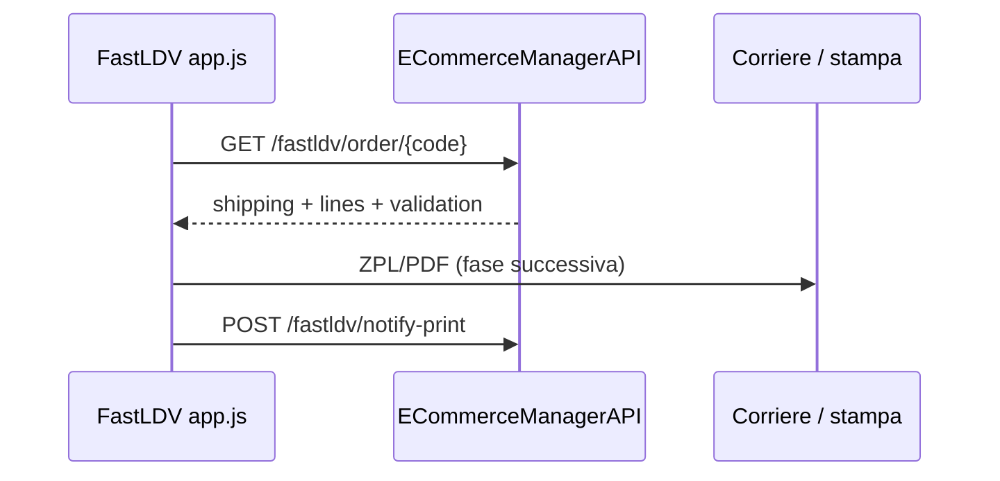
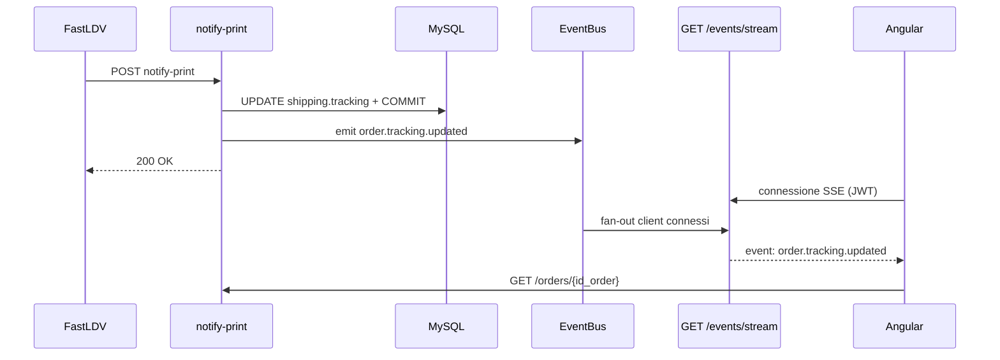

# BE — Integrazione FastLDV custom (magazzino)

Guida per **ECommerceManagerAPI** e per l’app magazzino FastLDV (PHP + `app.js`). Contratto allineato a Smarty (`checkOrderData`, `validate.php`, `updateOrderData`) per integrazione futura.

**Fonti analizzate:** `Downloads/fastldv/assets/app.js`, `Downloads/fastldv/validate.php`, `Downloads/fastldv/proxy.php`.

**Backlog:** [.cursor/tasks_claude/BACKLOG_UNIFICATO.md](../.cursor/tasks_claude/BACKLOG_UNIFICATO.md) — task `BE-FASTLDV-1/2/3`, `BE-FASTLDV-EVT` (SSE tracking).

**Prompt FastLDV:** [.cursor/tasks_claude/prompt_FE_fastldv_migration.md](../.cursor/tasks_claude/prompt_FE_fastldv_migration.md)

---

## Contesto

FastLDV è un’app browser per magazzino: scansione ordine → validazione → stampa etichetta (ZPL/PDF via BrowserPrint). Oggi parla con Smarty tramite `proxy.php` e `validate.php`.

Il gestionale espone API via `/api/v1/fastldv/…`. **Miglioramento rispetto a Smarty:** una sola chiamata unifica dati ordine + validazione + righe (oggi sono `checkOrderData` + `validate.php` in sequenza).

1. **GET ordine** — lookup `{code}`, dati spedizione, righe, blocco `validation` (sostituisce entrambe le chiamate Smarty) — ✅ `BE-FASTLDV-1`
2. **POST notify-print** — tracking post-stampa su `shipping.tracking` — ✅ `BE-FASTLDV-2`
3. **Emit + SSE** — push verso Angular quando il tracking cambia (dopo notify-print) — ✅ `BE-FASTLDV-EVT` + FE creative_light3 (vedi § dedicata, handoff `FE_HANDOFF_SSE_TRACKING.md`)
4. **Opzionale PATCH shipping-params** — colli/peso/contrassegno (modalità Verifica) — `BE-FASTLDV-3`

La **generazione ZPL/PDF** (`fastldvGetPdfPrint`) resta fuori scope iniziale BE — va migrata verso API corrieri (`POST /api/v1/shippings/{id_order}/create`) o adapter dedicato in un secondo step.

### Fuori scope v1 (accantonato)

| Tema | Stato v1 | Nota |
|------|----------|------|
| **Multispedizione** (`is_multishipping`, più documenti shipping) | **Accantonata** | GET e notify-print usano solo `orders.id_shipping` (spedizione principale). Logica “primo shipping senza tracking” rimandata a fase dedicata. |
| PATCH shipping-params (Verifica) | Opzionale (BE-FASTLDV-3) | Dopo cutover se serve |
| Stampa etichetta da gestionale | Fase 4 | ZPL/PDF resta su Smarty |

---

## Identificatori ordine — tre numeri diversi

Nel gestionale convivono **due PK concettuali** più il **codice barcode** usato in magazzino. Non sono intercambiabili.

### I tre identificatori

| Nome | Colonna DB | Cosa rappresenta | Esempio |
|------|------------|------------------|---------|
| **`id_order`** | `orders.id_order` | PK **interna** del gestionale (auto-increment). Usata da Angular, API `/orders/{id}`, SSE, relazioni DB. | `48564` |
| **`id_origin`** | `orders.id_origin` | ID ordine **PrestaShop** dopo sync. `0` o `NULL` se l’ordine è nato nel gestionale (preventivo, manuale, ecc.). | `457300` oppure `0` |
| **`code`** (barcode) | — | Numero **scansionato** in magazzino (path `{code}`, body notify-print). Non è sempre `id_origin`. | vedi sotto |

**Regola fondamentale:** per ordini importati da PrestaShop, `id_order` e `id_origin` sono **numeri diversi** (sequenze indipendenti). Esempio reale: ordine PS `457300` → nel DB `id_origin=457300`, `id_order=48564`.

Per ordini creati solo nel gestionale: `id_origin=0` **resta 0** nel DB e in risposta API — non viene sostituito con `id_order`. Il barcode in magazzino usa invece `id_order` (es. `69100`).

### Quale codice scansiona FastLDV (`{code}`)

L’app passa un **intero numerico** (senza prefisso `SM` legacy).

| Provenienza ordine | Cosa c’è sul barcode / in path `{code}` | `id_order` in DB | `id_origin` in DB |
|--------------------|-------------------------------------------|------------------|-------------------|
| PrestaShop (sync) | ID PrestaShop | es. `48564` (interno) | es. `457300` (= `{code}`) |
| Gestionale (creato in app) | `id_order` interno | es. `69100` (= `{code}`) | `0` |

### Lookup API (`GET /api/v1/fastldv/order/{code}`)

1. Cerca `orders.id_origin = {code}` → ordine PrestaShop
2. Se non trovato → cerca `orders.id_order = {code}` **solo se** `id_origin` è `0` o `NULL` → ordine gestionale

### Campi in risposta API FastLDV

| Campo JSON | Significato | Chi lo usa |
|------------|-------------|------------|
| `data.id_order` | Sempre la **PK interna** gestionale | Angular, SSE `order.tracking.updated`, `GET /api/v1/orders/{id_order}` |
| `data.id_origin` | Valore **reale** `orders.id_origin` (ID PS o **`0`** se gestionale) | FE gestionale, integrazioni — **non** sostituito con `id_order` |
| `data.document.num_doc` | Codice su etichetta: ID PS se sync, altrimenti `id_order` | App magazzino, ZPL footer |

Esempio ordine PrestaShop:

```json
{
  "data": {
    "id_order": 48564,
    "id_origin": 457300
  }
}
```

Esempio ordine gestionale (barcode `69100` = `id_order`):

```json
{
  "data": {
    "id_order": 69100,
    "id_origin": 0,
    "document": { "num_doc": "69100" }
  }
}
```

### POST notify-print — campo `id_origin` nel body

Il body usa il nome `id_origin` per **compatibilità Smarty**, ma il valore è il **`code` scansionato** (stessa semantica del path GET), non necessariamente l’ID PrestaShop:

- ordine PS → inviare `457300` (ID shop)
- ordine gestionale → inviare `69100` (`id_order`)

Il BE risolve l’ordine con `get_by_fastldv_code`. In risposta: `id_order` (PK interna), `id_origin` (valore DB, `0` se gestionale), `document.num_doc` (codice etichetta).

**Legacy Smarty (solo riferimento storico):** prefisso `SM` + cifre — **non replicare** nel nuovo stack.

**Multi-store:** query opzionale `?id_store=1` se più negozi sullo stesso DB (deduplica sync: coppia `(id_origin, id_store)`).

---

## Flusso app (tre modalità)

| Modalità | Sequenza **nuova API** | Oggi (Smarty) |
|----------|------------------------|---------------|
| **Diretta** | 1× GET ordine → stampa | fetch + validate (2 chiamate) |
| **Verifica** | GET ordine → PATCH params → stampa | fetch + validate + updateOrderData |
| **Cerca** | 1× GET ordine (solo lettura) | fetch + validate |



**Miglioramenti rispetto a Smarty:**

| Aspetto | Smarty (2 call) | Gestionale (1 call) |
|---------|-----------------|---------------------|
| Round-trip | 2 richieste HTTP | **1 richiesta** |
| Ordine bloccato | HTTP 500, dati parziali | **422** con payload completo (righe + corriere + messaggio) |
| Ristampa | HTTP 202 separato | `validation.severity: warning`, `printable: true` |
| Codici errore | Solo messaggio IT | `validation.code` machine-readable + messaggio IT |
| Campi | Prefissi `corrieri_*`, `intDoc` | Schema nidificato `carrier`, `shipping`, `document` (+ alias legacy opz.) |
| `quantity` righe | stringa | **numero** (intero) |

---

## Autenticazione (da implementare)

| Opzione | Note |
|---------|------|
| **`X-FastLDV-Key`** (consigliata) | API key in `.env`, bypass RBAC JWT |
| Rete locale trusted | Solo se FastLDV e API sono sulla stessa LAN senza esposizione pubblica |

L’app oggi usa sessione PHP `$_SESSION['magazziniere']` — invariata lato FastLDV; la nuova API è chiamata dal server PHP (proxy) o direttamente da `app.js` se si espone la key solo server-side.

Variabile env proposta: `FASTLDV_API_KEY`.

---

## BE-FASTLDV-1 — Ordine unificato (dati + validazione + righe)

Sostituisce **`checkOrderData`** e **`validate.php`** con **un solo endpoint**.

### Request

```http
GET /api/v1/fastldv/order/{code}?carrier=BRT+NAPOLI&printer=ZDesigner+ZT410
X-FastLDV-Key: <key>
```

| Query | Obbligatorio | Uso |
|-------|--------------|-----|
| `carrier` | consigliato | Confronto safety-net con corriere ordine; audit |
| `printer` | no | Log server |
| `id_store` | no | Disambiguazione multi-negozio |
| `skip_log` | no | `1` = anteprima senza log blocco |

### Response — ordine stampabile (`200`)

```json
{
  "status": "success",
  "data": {
    "id_origin": 69099,
    "id_order": 1234,
    "carrier": {
      "id_carrier_api": 5,
      "name": "BRT NAPOLI",
      "layout_type": "zebra"
    },
    "shipping": {
      "colli": 2,
      "peso": 1.5,
      "contrassegno": "0.00",
      "tracking": "",
      "country_iso": "IT"
    },
    "document": {
      "num_doc": "69099"
    },
    "lines": [
      { "quantity": 2, "sku": "ABC123", "name": "Prodotto X" }
    ],
    "validation": {
      "printable": true,
      "severity": "ok",
      "code": "OK",
      "message": "OK"
    }
  }
}
```

### Response — avviso ristampa (`200`, `severity: warning`)

Tracking già presente: **stampa consentita** (come HTTP 202 Smarty), senza secondo endpoint:

```json
"validation": {
  "printable": true,
  "severity": "warning",
  "code": "LABEL_ALREADY_PRINTED",
  "message": "⚠️ Attenzione: Stai effettuando la ristampa di una etichetta già stampata precedentemente. Fare un ulteriore controllo. ⚠️"
}
```

### Response — ordine non stampabile (`422`)

**Miglioramento:** il client riceve comunque dati completi per UI (tabella righe, corriere, messaggio) in **una sola chiamata**:

```json
{
  "status": "error",
  "error_code": "FASTLDV_NOT_PRINTABLE",
  "message": "Ordine non pagato",
  "data": {
    "id_origin": 69099,
    "id_order": 1234,
    "carrier": { "id_carrier_api": 5, "name": "BRT NAPOLI", "layout_type": "zebra" },
    "shipping": { "colli": 2, "peso": 1.5, "contrassegno": "0.00", "tracking": "", "country_iso": "IT" },
    "document": { "num_doc": "69099" },
    "lines": [{ "quantity": 2, "sku": "ABC123", "name": "Prodotto X" }],
    "validation": {
      "printable": false,
      "severity": "error",
      "code": "ORDER_NOT_PAID",
      "message": "Ordine non pagato"
    }
  }
}
```

### Altri HTTP

| HTTP | Quando |
|------|--------|
| `404` | `id_origin` non trovato |
| `400` | `id_origin` non valido o corriere mancante su ordine |
| `401` | API key assente/errata |

Se `carrier.name` assente nel payload → errore `400` con `error_code: CARRIER_NOT_ASSIGNED` (equivalente a *Corriere non assegnato* in `app.js`).

### `validation.code` (enum)

| `code` | `printable` | Messaggio IT (es.) |
|--------|-------------|-------------------|
| `OK` | true | OK |
| `LABEL_ALREADY_PRINTED` | true | Avviso ristampa |
| `ORDER_CANCELED` | false | Ordine annullato |
| `ORDER_LOCKED` | false | Ordine bloccato |
| `ORDER_NOT_PAID` | false | Ordine non pagato |
| `ORDER_NOT_READY` | false | Ordine non ancora in lavorazione |
| `ORDER_ALREADY_SHIPPED` | false | Ordine già spedito |
| `BYPASS` | true | OK (id in `FASTLDV_BYPASS_VALIDATE_IDS`) |

### Regole di validazione (ordine priorità, da `validate.php`)

1. Bypass env `FASTLDV_BYPASS_VALIDATE_IDS`
2. Annullato → `ORDER_CANCELED`
3. Bloccato → `ORDER_LOCKED`
4. Non pagato → `ORDER_NOT_PAID`
5. Non pronto (`ready`/`shipped` su gestionale) → `ORDER_NOT_READY`
6. Spedizione confermata → `ORDER_ALREADY_SHIPPED`
7. OK; tracking valorizzato → `LABEL_ALREADY_PRINTED` + `severity: warning`

### Mapping → gestionale (da confermare in implementazione)

| Controllo | Fonte probabile |
|-----------|-----------------|
| Pagato | `order.is_payed` |
| Annullato | `id_order_state == 5` |
| Spedizione confermata | `id_order_state == 4` |
| Pronto per magazzino | `id_order_state == 2` (+ storico stati) |
| Bloccato | Da definire (non in modello) |

### Righe (`lines`)

Da `order_details`: `product_qty` → `quantity` (int), `product_reference` → `sku`, `product_name` → `name`. Escludere o lasciare al client righe *buoni sconto*.

### Alias legacy (opzionale, fase adapter PHP)

Per transizione minima senza riscrivere subito `app.js`, il service può aggiungere in `data`:

```json
"legacy": {
  "id_doc": 69099,
  "corrieri_id_carrier": 5,
  "corrieri_carrier": "BRT NAPOLI",
  "corrieri_tracking": "",
  "corrieri_layout_type": "zebra",
  "intDoc": { "num_doc": "69099" }
}
```

**Target consigliato fase 2 app:** un solo `fetchOrderContext(digits)` che legge schema nidificato + `validation`.

---

## BE-FASTLDV-2 — Notifica stampa (nuovo per gestionale)

Oggi `app.js` dopo stampa OK chiama solo `log_stampa.php` (file locale) e ri-legge `checkOrderData` per il tracking aggiornato da Smarty.

Con il nuovo gestionale serve scrivere il tracking su `shipping.tracking`.

### Request

```http
POST /api/v1/fastldv/notify-print
X-FastLDV-Key: <key>
Content-Type: application/json
```

```json
{
  "id_origin": 69099,
  "tracking": "BRT123456789",
  "colli": 2,
  "carrier": "BRT NAPOLI",
  "operatore": "mario",
  "stampante": "ZDesigner ZT410"
}
```

### Comportamento

- Il campo body `id_origin` è il **codice scansione** (`{code}`): ID PrestaShop o `id_order` se ordine gestionale — vedi § Identificatori.
- Lookup → PK interna `orders.id_order` → aggiorna `orders.id_shipping` (spedizione principale). **Multispedizione accantonata in v1**.
- Aggiorna `shipping.tracking` (e `awb` se applicabile)
- **Non** cambia `id_order_state` (solo tracking, per decisione prodotto)
- Risposta `200` — fire-and-forget; errori non devono bloccare l’operatore

### Modifica FastLDV (fase adapter)

In `logStampaAfterPrint()` aggiungere POST verso questa API oltre/ al posto del re-fetch Smarty.

**Dopo BE-FASTLDV-EVT:** notify-print persiste il tracking, risponde `200` ed emette `order.tracking.updated` verso i client SSE connessi.

---

## BE-FASTLDV-EVT — Aggiornamento real-time tracking (Angular)

Richiesta dal FE gestionale (`webmarke26`, nota `NOTA_BE_fastldv_tracking_events.md`): dopo una stampa FastLDV, l’operatore in magazzino vede il tracking aggiornato, ma chi ha aperto la lista ordini su Angular no.

### Problema

```
FastLDV → POST notify-print → DB aggiornato ✅
                             → Angular aggiornato ❌ (serve F5)
```

### Decisioni chiuse (2026-06-09)

| Tema | Decisione | Motivo |
|------|-----------|--------|
| **Canale verso browser** | **SSE** `GET /api/v1/events/stream` con JWT | Preferenza FE; più semplice di WebSocket per push unidirezionale |
| **Alternativa scartata: polling** | No endpoint “ordini modificati” | Carico inutile su lista ordini |
| **Alternativa scartata: epic N2 notifiche** | Non riusabile in v1 | Tabella/API notifiche non implementate nel BE |
| **Alternativa scartata: `platform-state-triggers`** | Solo catalogo eventi + sync ecommerce | Non è uno stream verso il client |
| **Trigger emit** | Dopo `commit` riuscito in `notify_print` | Tracking già salvato; emit non blocca la risposta a FastLDV |
| **Infrastruttura emit** | `emit_event()` → **EventBus** esistente + nuovo handler **SSE fan-out** | Stesso pattern di `SHIPMENT_CREATED` in `shipments.py`; riuso bus plugin |
| **Tipo evento** | `order.tracking.updated` (nuovo `EventType`) | Specifico per tracking FastLDV; estendibile ad altre fonti |
| **Payload evento** | `id_order`, `tracking`, `awb` (= tracking su notify-print), `source: fastldv`, `timestamp` | Angular lavora sempre sulla PK interna — vedi § Identificatori |
| **Errore emit/SSE** | Log warning; **non** fallisce notify-print | Fire-and-forget lato magazzino |
| **Auth stream** | JWT + permesso `orders:read` | Coerente con API gestionale |
| **Scope v1** | Fan-out **in-memory** (singola istanza API) | Redis pub/sub solo se scaling orizzontale |
| **Fuori scope** | Modifiche app FastLDV; cambio contratto notify-print | Altro repo; POST resta uguale |

### Architettura



### Contratto evento SSE (v1)

```
event: order.tracking.updated
data: {"id_order":48564,"tracking":"BRT123456789","awb":"BRT123456789","source":"fastldv","timestamp":"2026-06-09T14:30:00Z"}
```

Keepalive ogni ~30s (`: ping`) per connessioni long-lived.

**Regola `id_order`:** per ordine PrestaShop il body notify-print porta il codice PS (es. `457300`), ma l’evento SSE usa la PK gestionale (es. `48564`). Per ordini gestionale: body `69100`, evento `id_order: 69100`, `id_origin` DB resta `0`.

### Lavoro BE (`BE-FASTLDV-EVT`, ~1 giornata)

| Step | Contenuto |
|------|-----------|
| A | `EventType.ORDER_TRACKING_UPDATED` in `src/events/core/event.py` |
| B | `emit_event(...)` in router `notify_fastldv_print` (async) dopo `notify_print` |
| C | `SseFanoutService` — subscriber EventBus, code `asyncio.Queue` per client |
| D | `GET /api/v1/events/stream` — `StreamingResponse`, `text/event-stream` |
| E | Init subscriber in `lifespan` (`main.py`) |
| F | Test integration: notify-print → client SSE riceve evento |

### Lavoro FE Angular — ✅ completato (creative_light3, 2026-06-11)

Handoff: [`FE_HANDOFF_SSE_TRACKING.md`](FE_HANDOFF_SSE_TRACKING.md)

- `OrderEventsService` + parser SSE (`fetch` + JWT)
- NgRx `trackingUpdatedFromEvent`, patch lista + modale
- Reconnect backoff; SSE solo su route `/orders`
- **QA congiunto:** da eseguire con BE deployato

### Dipendenze

- **Dipende da:** `BE-FASTLDV-2` (notify-print) — ✅ implementato
- **Blocca:** UX real-time lista ordini in Angular (non blocca cutover app FastLDV in magazzino)

---

## BE-FASTLDV-3 — Aggiornamento parametri spedizione (sostituisce `updateOrderData`)

Solo **modalità Verifica** in `app.js` (`eseguiVerifica`).

### Request

```http
PATCH /api/v1/fastldv/order/{code}/shipping-params
X-FastLDV-Key: <key>
Content-Type: application/json
```

```json
{
  "colli": 2,
  "peso": 1.5,
  "contrassegno": "0.00",
  "rigenera": 0
}
```

| Campo | Note |
|-------|------|
| `rigenera` | `0` = aggiorna e stampa; `1` = annulla spedizione esistente e rigenera (solo UI **BRT NAPOLI** oggi) |

Priorità **media** — necessario solo se si mantiene la modalità Verifica con modifica colli.

---

## Regole UI hardcoded in `app.js` (non rompere)

- Colli modificabili solo se `carrier.toUpperCase() === 'BRT NAPOLI'`
- Pulsante *Annulla e rigenera* solo BRT NAPOLI + ordine con tracking
- Gel Proximity / Fermo Point: `carrier` contiene `GEL`+`PROXIMITY` o `FERMO`+`POINT` → richiede `num_doc`
- Etichetta ZPL: footer con codice ordine da `data.id_origin` (no prefisso `SM` legacy Smarty)
- Validazione ristampa: modale countdown 5s se `validation.severity === 'warning'`

---

## Strategia migrazione adapter

**Fase 1 (BE):** `GET /fastldv/order/{code}` unificato + `POST notify-print` (+ test). ✅

**Fase 2 (FastLDV):** semplificare `app.js` — una funzione `fetchOrderContext(digits)` al posto di `fetchOrderData` + `validateOrder`:

| Legacy (2 call) | Nuovo (1 call) |
|-----------------|----------------|
| `checkOrderData` + `validate.php` | `GET /fastldv/order/{code}` |
| `updateOrderData` | `PATCH /fastldv/order/{code}/shipping-params` |
| re-fetch Smarty post-stampa | `POST /fastldv/notify-print` |

**Fase 3:** sostituire `fastldvGetPdfPrint` con API corrieri del gestionale.

---

## Test manuali

1. Ordine pronto, pagato, corriere OK → `200`, `validation.printable: true`, `lines` popolate.
2. Ordine annullato → `422`, payload completo, `validation.code: ORDER_CANCELED`.
3. Ordine con tracking → `200`, `severity: warning`, `printable: true`.
4. `notify-print` → `shipping.tracking` aggiornato in DB.
5. `id_origin` inesistente → `404`.

Swagger (dopo implementazione): sezione **FastLDV**.

---

## Checklist implementazione BE

- [x] `GET /api/v1/fastldv/order/{code}` — dati + `lines` + `validation` + dual lookup
- [ ] HTTP `200` (ok/warning) vs `422` (non stampabile) con payload completo
- [ ] Enum `validation.code` + messaggi IT allineati a `validate.php`
- [ ] Mapping stati ordine (`ready` / spedito / bloccato)
- [ ] `POST /api/v1/fastldv/notify-print` — update tracking
- [ ] Auth `X-FastLDV-Key` + env `FASTLDV_API_KEY`
- [ ] Test unitari `FastLdvOrderService` + integration API
- [ ] (Opz.) `PATCH .../shipping-params` — BE-FASTLDV-3
- [ ] (Opz.) blocco `legacy` in response per adapter PHP transitorio
- [x] `BE-FASTLDV-EVT` — `emit_event` in notify-print + `GET /api/v1/events/stream` (SSE)
- [x] (FE creative_light3) `OrderEventsService` — subscribe `order.tracking.updated`
- [ ] QA congiunto BE+FE lista ordini + modale (checklist in `FE_HANDOFF_SSE_TRACKING.md`)

---

## Riferimenti codice gestionale esistente

- Lookup: `OrderRepository.get_by_origin_id()` — estendere con `id_store` se serve
- Tracking: `ShippingRepository.update_tracking()`
- Stati ordine: `scripts/setup_initial.py` → `ORDER_STATES_DATA` (1–7)
- Creazione etichetta (fase successiva): `POST /api/v1/shippings/{order_id}/create`

---

## Piano di lavoro

### Stato attuale

| Elemento | Stato |
|----------|--------|
| Analisi `app.js` + `validate.php` | ✅ |
| Contratto API unificato (doc) | ✅ |
| Backlog `BE-FASTLDV-1/2/3` | ✅ |
| Prompt app `prompt_FE_fastldv_migration.md` | ✅ |
| `BE-FASTLDV-1/2` in codice + test | ✅ |
| `BE-FASTLDV-EVT` (emit + SSE) | ✅ |
| Cutover app FastLDV | ❌ (dopo deploy BE core) |
| SSE Angular (creative_light3) | ✅ implementato — QA congiunto pending |
| Magazzino in produzione | Smarty (invariato fino a cutover) |

### Decisioni da chiudere prima del codice BE

| # | Decisione | Opzioni | Default proposto |
|---|-----------|---------|------------------|
| D1 | Auth | `X-FastLDV-Key` / rete trusted | API key in `.env` |
| D2 | Mapping `ready` / spedito | Stati ordine 1–7 + storico | Workshop 30 min con operazioni |
| D3 | `locked` | Ignorare / stato 6 In Attesa | Ignorare v1 |
| D4 | Multi-store | Query `id_store` / mono-store | Mono-store se un solo PS |
| D5 | Blocco `legacy` in response | Sì / no | Sì (facilita adapter PHP) |
| D6 | Multispedizione su notify-print | Accantonata v1 / primo senza tracking / principale | **Accantonata** — v1 solo `orders.id_shipping` |

---

### Fase 0 — Allineamento (½ giornata)

**PC:** `webmarke22` + referente magazzino

- [ ] Chiudere D1–D6
- [ ] Scegliere 3–5 ordini test su DB (`id_origin`, stati diversi)
- [ ] Elencare corrieri magazzino per `layout_type`

**Deliverable:** mapping stati + ordini test.

---

### Fase 1 — Backend API (1,5–2 giornate) — priorità alta

**PC:** `webmarke22` · **Task:** `BE-FASTLDV-1`, `BE-FASTLDV-2`

#### 1.1 Infrastruttura (2–3 h)

- [ ] `FASTLDV_API_KEY` in settings / `env.example`
- [ ] Dependency `verify_fastldv_api_key`
- [ ] Router `/api/v1/fastldv` + schemi Pydantic
- [ ] `get_by_origin_id` con `id_store` opzionale

#### 1.2 BE-FASTLDV-1 — GET unificato (4–6 h)

- [ ] Payload: `carrier`, `shipping`, `document`, `lines`, `validation`
- [ ] HTTP 200 vs 422 con payload completo
- [ ] Enum `validation.code` + messaggi IT
- [ ] Opz. blocco `legacy`
- [ ] Test unitari + integration

#### 1.3 BE-FASTLDV-2 — notify-print (2–3 h)

- [ ] `id_origin` → `id_shipping` → `update_tracking`
- [ ] Test integration

#### 1.4 Chiusura (1 h)

- [ ] Swagger · smoke `curl` · ordini test

**Deliverable:** API pronta; FastLDV prod resta su Smarty. ✅

---

### Fase 1.5 — Real-time tracking Angular (1 giornata) — `BE-FASTLDV-EVT`

**PC:** `webmarke22` (BE) + `webmarke26` (FE Angular)

| Step | Contenuto | Ore |
|------|-----------|-----|
| 1.5A BE emit | `ORDER_TRACKING_UPDATED` + emit in `notify_print` | 1–2 |
| 1.5B BE SSE | `SseFanoutService` + `GET /events/stream` | 3–4 |
| 1.5C FE Angular | `OrderEventsService` + refresh lista/dettaglio | 4–5 |

**Deliverable:** operatore in ufficio vede il tracking aggiornarsi senza F5 quando magazzino stampa.

**Nota:** indipendente dal cutover app FastLDV (Fase 3): appena notify-print punta al gestionale, l’SSE diventa utile anche prima dello switch completo Smarty.

---

### Fase 2 — BE opzionale Verifica (½ giornata)

**Task:** `BE-FASTLDV-3` — `PATCH shipping-params` (se serve al cutover).

---

### Fase 3 — Cutover app FastLDV (1–2 giornate)

**Prompt:** `prompt_FE_fastldv_migration.md` · **Dopo** deploy BE

| Step | Contenuto | Ore |
|------|-----------|-----|
| 3A Adapter PHP | `proxy.php` + flag `USE_GESTIONALE_API` | 4–6 |
| 3B Refactor `app.js` | `fetchOrderContext`, notify-print | 4–6 |
| 3C Test magazzino | 3 modalità + rollback | 2–4 |

**Deliverable:** fetch/validate/tracking da gestionale; ZPL ancora Smarty.

---

### Fase 4 — Stampa etichetta da gestionale (da stimare)

Sostituire `fastldvGetPdfPrint` → API corrieri gestionale. Zero Smarty.

---

### Timeline indicativa

| Fase | Durata | Quando |
|------|--------|--------|
| 0 Allineamento | ½ g | Prima del codice |
| 1 BE core (`1/2`) | 1,5–2 g | ✅ fatto |
| **1.5 SSE tracking** | ~1 g | ✅ BE+FE fatti — **QA congiunto** |
| 2 BE Verifica | ½ g | Opzionale |
| 3 Cutover app FastLDV | 1–2 g | Dopo deploy BE core (parallelo possibile a 1.5) |
| 4 Etichette | 2–4 g | Da pianificare |

### Ordine consigliato

1. ~~Fase 0~~ → 2. ~~Fase 1~~ → 3. **Fase 1.5** (`BE-FASTLDV-EVT` + Angular SSE) → 4. Fase 3 cutover app → 5. Fase 2 se Verifica → 6. Fase 4

### Rischi

| Rischio | Mitigazione |
|---------|-------------|
| Mapping stati errato | Fase 0 + ordini reali |
| Multispedizione | Accantonata v1; task dedicato prima del cutover su ordini multispedizione |
| Blocco magazzino al cutover | `USE_GESTIONALE_API=false` |
| ZPL su Smarty fino a Fase 4 | Documentato in Fase 3 |
