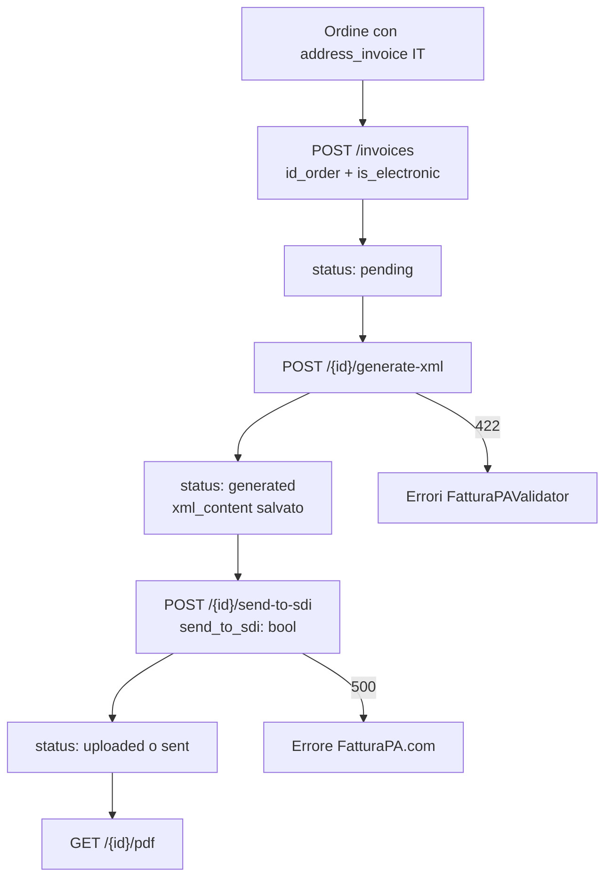

# FatturaPA — Guida operativa (Backend)

Documento unificato end-to-end per **integrazione Frontend**, **operazioni** e **troubleshooting** del ciclo attivo fatturazione elettronica.

**Base URL API:** `/api/v1/fiscal_documents`  
**Autenticazione:** Bearer JWT (`Authorization: Bearer <token>`)  
**Permessi RBAC:** `fiscal_documents:read|create|update|delete`  
**Swagger:** `http://localhost:8000/docs` → tag **Fiscal Documents**

Documenti correlati:

| Documento | Contenuto |
|-----------|-----------|
| [fatturapa_riassunto_piano.md](../.cursor/tasks_claude/fatturaPa/fatturapa_riassunto_piano.md) | Normativa, formato XML, ciclo SDI, piano fasi |
| [fatturapa_backlog_implementazione.md](../.cursor/tasks_claude/fatturaPa/fatturapa_backlog_implementazione.md) | Gap analysis P0–P3, checklist go-live |
| [prompt_FE_fatture_V3_ALIGN.md](../.cursor/tasks_claude/fatturazione/prompt_FE_fatture_V3_ALIGN.md) | Handoff FE — contratto `InvoiceDetail` v3 |
| [FE_HANDOFF_TAX_ELECTRONIC_CODE.md](./FE_HANDOFF_TAX_ELECTRONIC_CODE.md) | Mapping `Tax.electronic_code` → tag `<Natura>` |

**Aggiornato:** 2026-07-20

---

## Quick start

```text
1. Configurare company_info + electronic_invoicing + fatturapa in app_configurations (o .env)
2. POST /api/v1/fiscal_documents/invoices          { "id_order": 123, "is_electronic": true }
3. POST /api/v1/fiscal_documents/{id}/generate-xml
4. POST /api/v1/fiscal_documents/{id}/send-to-sdi   { "send_to_sdi": false }  ← upload sandbox
5. GET  /api/v1/fiscal_documents/{id}/pdf          ← PDF di cortesia
```

Per ordini intra-UE B2B con esenzione VIES, applicare **prima** `PATCH /api/v1/orders/{id}/apply-vies-exemption`.

---

## 1. Panoramica

Elettronew genera fatture elettroniche **FatturaPA** (formato **FPR12**, B2B/B2C) a partire dagli ordini, le valida, produce XML e le carica su **FatturaPA.com** (intermediario REST). L'invio allo **SDI** e le notifiche di esito sono parzialmente implementati — vedi [§10 Gap noti](#10-gap-noti-e-backlog).

### Differenza rispetto ad altri documenti fiscali

| Documento | SDI | Snapshot righe | Endpoint base |
|-----------|-----|----------------|---------------|
| **Fattura** (`invoice`) | Sì (se elettronica) | Sì (`fiscal_document_details`) | `/api/v1/fiscal_documents` |
| **Nota di credito** (`credit_note`, TD04) | Sì (se elettronica) | Sì | `/api/v1/fiscal_documents` |
| **Ricevuta estero** | No | No (live ordine) | `/api/v1/ricevute` |
| **Corrispettivi** | No | No (report live) | `/api/v1/corrispettivi` |

Un ordine **fatturato** esce dai corrispettivi vendite (`has_invoice=true`). La fattura è uno **snapshot**: modifiche ordine post-emissione non aggiornano il documento.

### Flusso operativo



---

## 2. Prerequisiti e configurazione

### 2.1 Configurazione azienda (DB)

Tabella `app_configurations`:

| Chiave | Campi richiesti per XML |
|--------|-------------------------|
| `company_info` | `vat_number`, `company_name`, `address`, `civic_number`, `postal_code`, `city`, `province`, `phone`, `email`, `iban`, `bank_name` |
| `electronic_invoicing` | `tax_regime` (es. `RF01`) |
| `fatturapa` | `api_key`, `base_url` (default `https://api.fatturapa.com/ws/V10.svc/rest`) |
| `invoice_pdf` | `pre_invoice_disclaimer` (dicitura NOTE PDF), `append_tax_normative` (`true`/`false`) |

Variabili env di fallback (se non in DB) — vedi anche `env.example`:

| Variabile | Descrizione | Default |
|-----------|-------------|---------|
| `FATTURAPA_API_KEY` | API key intermediario FatturaPA.com | — |
| `FATTURAPA_BASE_URL` | Base URL REST intermediario | `https://api.fatturapa.com/ws/V10.svc/rest` |
| `COMPANY_VAT_NUMBER` | P.IVA cedente (se assente in DB) | — |

Le chiavi in `app_configurations` hanno priorità sulle variabili env.

### 2.2 Dati ordine obbligatori (derivati, non nel POST)

Per fattura elettronica (`is_electronic=true`):

| Requisito | Fonte |
|-----------|-------|
| Indirizzo fatturazione presente | `orders.id_address_invoice` → `addresses` (IT **o** UE estero per VIES) |
| Cliente IT: P.IVA **oppure** CF | `addresses.vat` o `addresses.dni` |
| Cliente UE B2B (VIES): P.IVA estera | `addresses.vat` con prefisso paese; `CodiceDestinatario=XXXXXXX` |
| Denominazione **oppure** Nome+Cognome | `addresses.company` o `firstname`/`lastname` |
| Sede completa | `address1`, `city`, `postcode`; `state` obbligatoria 2 char solo per IT |
| Codice destinatario (solo IT) | `addresses.sdi` (7 char) o `0000000` B2C; estero → `XXXXXXX` automatico |
| Righe ordine con prezzi/IVA | `order_details` → snapshot in `fiscal_document_details` |
| Aliquota / natura IVA | `taxes` per riga (`order_detail.id_tax`) + spedizione; VIES → N3.2 (vedi [§7](#7-vies-e-natura-iva)) |

### 2.3 Account intermediario

- **Sandbox:** account demo FatturaPA.com attivo prima dei test e2e (OPS-PA-01 nel backlog).
- **Produzione:** API key produzione solo dopo checklist go-live.

---

## 3. Autenticazione e permessi

| Operazione | Permesso RBAC |
|------------|---------------|
| GET lista / dettaglio fattura | `fiscal_documents:read` |
| POST creazione fattura / NC | `fiscal_documents:create` |
| POST generate-xml, send-to-sdi, PATCH status | `fiscal_documents:update` |
| DELETE documento (solo `pending`) | `fiscal_documents:delete` |
| GET PDF | `fiscal_documents:read` |

---

## 4. API — Creazione fattura

### POST `/api/v1/fiscal_documents/invoices`

Crea uno snapshot fiscale dell'ordine. **Non genera XML** né invia allo SDI.

#### Body (unici campi accettati)

| Campo | Obbligatorio | Default | Validazione |
|-------|--------------|---------|-------------|
| `id_order` | **Sì** | — | `int > 0` |
| `is_electronic` | No | `true` | `bool` |

```json
{ "id_order": 12345, "is_electronic": true }
```

```json
{ "id_order": 12345, "is_electronic": false }
```

#### Regole business

- L'ordine deve esistere.
- È consentito creare **più fatture** sullo stesso ordine (re-emissione / integrazioni).
- Se `is_electronic=true`: `address_invoice` deve essere **IT**.
- Auto-impostati: `document_type=invoice`, `tipo_documento_fe=TD01`, `includes_shipping=true`, numerazione sequenziale elettronica, `status=pending` (elettronica) o `issued` (non elettronica).
- Righe: copia da tutti gli `order_details` in `fiscal_document_details` con ricalcolo totali.

#### Response

`InvoiceResponseSchema` **v3 arricchito** (stesso shape del GET dettaglio): documento fiscale + embed ordine (`customer`, `address_invoice`, `payment`, `shipping`, `order_details[]` snapshot). **Non refetchare l'ordine** dopo il POST.

Handoff FE: [prompt_FE_fatture_V3_ALIGN.md](../.cursor/tasks_claude/fatturazione/prompt_FE_fatture_V3_ALIGN.md)

---

## 5. API — Consultazione

| Metodo | Path | Response | Note |
|--------|------|----------|------|
| GET | `/invoices/order/{id_order}` | `InvoiceResponseSchema[]` | Tutte le fatture dell'ordine |
| GET | `/{id_fiscal_document}` | `InvoiceResponseSchema` se `invoice`, altrimenti generico | Dettaglio arricchito per fatture |
| GET | `/` | `FiscalDocumentListResponseSchema` | Lista **minimal** (senza embed) |

Query lista: `page`, `limit`, `document_type`, `is_electronic`, `status`.

Filtro ordini fatturati: `GET /api/v1/orders?has_invoice=true` — vedi [has_invoice_filter.md](./has_invoice_filter.md).

---

## 6. API — Ciclo XML e invio SDI

### POST `/{id_fiscal_document}/generate-xml`

**Permesso:** `fiscal_documents:update`

1. Verifica `is_electronic=true`
2. Valida dati con `FatturaPAValidator` (regole business FatturaPA)
3. Genera XML FPR12
4. Salva `filename`, `xml_content` in DB
5. Imposta `status=generated`

**Errori validazione:** HTTP **422** con elenco strutturato `{ field, message, rule, value }`.

Campi XML principali generati:

| Blocco XML | Fonte dati |
|------------|------------|
| CedentePrestatore | `company_info` + `electronic_invoicing.tax_regime` |
| CessionarioCommittente | `address_invoice` ordine |
| TipoDocumento | `TD01` (fattura) o `TD04` (NC) |
| DettaglioLinee | `fiscal_document_details` (+ riga spedizione se `includes_shipping`) |
| DatiRiepilogo | Un blocco per coppia `(AliquotaIVA, Natura)` — es. prodotti VIES 0% + spedizione 22% |
| DatiPagamento | Metodo pagamento ordine; `DataScadenzaPagamento` da `payment_due_date` o `date_add + 30 gg` |

### POST `/{id_fiscal_document}/send-to-sdi`

**Permesso:** `fiscal_documents:update`  
**Prerequisito:** XML generato (`status=generated`, `xml_content` presente)

#### Body

| Campo | Obbligatorio | Default | Descrizione |
|-------|--------------|---------|-------------|
| `send_to_sdi` | No | `false` | `false` = solo upload su FatturaPA.com; `true` = upload + invio SDI |

Processo: `UploadStart1` → upload blob Azure → `UploadStop1`.

| `send_to_sdi` | Status atteso | Note |
|---------------|---------------|------|
| `false` | `uploaded` | Documento caricato su intermediario |
| `true` | `sent` | **Bug aperto P0-01:** `upload_stop()` ignora ancora il flag e chiama sempre `UploadStop1` senza variante SDI dedicata |

Risposta intermediario salvata in `upload_result` (JSON string).

### GET `/{id_fiscal_document}/pdf`

**Permesso:** `fiscal_documents:read`

Genera/scarica il **PDF pre-fattura** (o nota di credito) in layout elettronew B/N.

| Aspetto | Comportamento |
|---------|---------------|
| Motore | fpdf2 (`FiscalDocumentPDFService` → `FiscalDocumentPDFLayout`) |
| Lingue etichette | IT, FR, DE, ES, EN — da `country.iso_code` dell'indirizzo di fatturazione |
| NOTE | Testo fisso da `invoice_pdf.pre_invoice_disclaimer` (+ eventuali `tax.note` se `append_tax_normative=true`). **Non** include `order.general_note` |
| Multipagina | Header ripetuto (logo, anagrafica, titoli, intestazione tabella); footer `Pagina X di Y` |
| Data PDF | `gg/mm/aaaa` dal `date_add` del documento |
| XML SDI | Resta con sola data (requisito SDI); il PDF è un documento di cortesia / pre-invio |

Il PDF **non** sostituisce l'originale elettronico trasmesso allo SDI (dicitura art. 21 DPR 633/72).

File: `src/services/pdf/fiscal_document_pdf_service.py`, `src/services/pdf/fiscal_document_pdf_layout.py`, `src/services/pdf/i18n/`.

### PATCH `/{id_fiscal_document}/status`

Aggiornamento manuale status / `upload_result` (uso amministrativo).

---

## 7. VIES e Natura IVA

### VIES su ordini (completato)

Prima di fatturare un ordine intra-UE B2B:

```
PATCH /api/v1/orders/{id}/apply-vies-exemption
```

- Imposta `vies_status=eligible`
- Ricalcola righe e spedizione a IVA 0% (`id_tax` esenzione da `reverse_charge_id_tax` o fallback)
- Bulk: `POST /api/v1/orders/bulk-apply-vies-exemption` con `{ "order_ids": [...] }`

Guida FE: [FE_VIES_APPLY_EXEMPTION_BUTTON.md](./FE_VIES_APPLY_EXEMPTION_BUTTON.md)

### VIES nel XML FatturaPA (completato — BE-PA-P0-05)

| Comportamento | Dettaglio |
|---------------|-----------|
| `vies_status=eligible` su righe **prodotto** | `AliquotaIVA=0.00` + `Natura=N3.2` (+ `RiferimentoNormativo`) |
| Tax per riga | Da `order_detail.id_tax` → `Tax.electronic_code` / `Tax.note` |
| Spedizione | Aliquota propria (`shipping_id_tax`); **non** forzata a N3.2 |
| `DatiRiepilogo` | Un blocco per coppia `(AliquotaIVA, Natura)` — es. prodotti 0% + spedizione 22% |

Helper: `src/services/external/fatturapa_tax_line.py`  
Test: `tests/unit/services/external/test_fatturapa_tax_line.py`

Prerequisito operativo: applicare esenzione VIES sull'ordine (`PATCH .../apply-vies-exemption`) **prima** di creare la fattura.

Handoff Tax: [FE_HANDOFF_TAX_ELECTRONIC_CODE.md](./FE_HANDOFF_TAX_ELECTRONIC_CODE.md)

---

## 8. Note di credito (TD04)

### POST `/api/v1/fiscal_documents/credit-notes`

| Campo | Obbligatorio | Default | Note |
|-------|--------------|---------|------|
| `id_invoice` | **Sì** | — | Fattura di riferimento |
| `reason` | **Sì** | — | 1–500 caratteri |
| `is_partial` | No | `false` | |
| `is_electronic` | No | `true` | |
| `include_shipping` | No | `true` | Solo NC totali o se spedizione non già stornata |
| `items` | Se `is_partial=true` | — | `[{ id_order_detail, quantity }]` |

Response: `CreditNoteResponseSchema` (schema generico, non v3 arricchito come fattura).

**Gap P0-06:** blocco XML `DatiFattureCollegate` (riferimento fattura originale) **non ancora generato**.

---

## 9. Macchina a stati documento

```
pending → generated → uploaded → sent
                              ↘ error
```

| Status | Significato |
|--------|-------------|
| `pending` | Fattura elettronica creata, XML non generato |
| `issued` | Fattura non elettronica emessa |
| `generated` | XML salvato in DB |
| `uploaded` | Caricata su FatturaPA.com (senza invio SDI) |
| `sent` | Marcata come inviata a SDI (verificare bug P0-01) |
| `error` | Errore upload/invio |
| `cancelled` | Annullata |

Stati SDI avanzati (`consegnata`, `scartata`, `protocollo_sdi`, storico notifiche) — **non ancora implementati** (P0-03, P0-04).

Eliminazione: solo se `status=pending` (fatture/NC); non eliminabile se esistono NC collegate.

---

## 10. Gap noti e backlog

Stato al **2026-07-17**. Dettaglio completo: [fatturapa_backlog_implementazione.md](../.cursor/tasks_claude/fatturaPa/fatturapa_backlog_implementazione.md)

| ID | Area | Stato |
|----|------|-------|
| P0-01 | Fix propagazione `send_to_sdi` fino a HTTP intermediario | Parziale (bug) |
| P0-02 | Validazione XSD ufficiale pre-invio | Assente |
| P0-03 | Webhook / polling notifiche SDI | Assente |
| P0-04 | Campi `protocollo_sdi`, storico notifiche | Assente |
| P0-05 | VIES eligible → N3.2 in XML + natura per riga | Completato |
| P0-06 | `DatiFattureCollegate` per NC TD04 | Assente |
| P0-07 | Test suite generazione XML completa | Parziale |
| P1-01 | `GET .../sdi-status` dedicato | Assente |
| P1-02 | `GET .../xml` download attachment | Assente |
| P1-05 | `DatiRiepilogo` multi-aliquota | Completato |

---

## 11. Troubleshooting

### HTTP 400 — "Indirizzo di fatturazione mancante/non trovato"

Documento elettronico senza `id_address_invoice` valido. Verificare l'ordine collegato.

### HTTP 400 — "La fattura elettronica può essere emessa solo per indirizzi italiani"

**Rimosso (2026-07-20):** le fatture elettroniche supportano clienti UE esteri (VIES). Se compare ancora, aggiornare il backend.

### HTTP 422 — Validazione XML FatturaPA fallita

Controllare il payload `details.errors[]`:

| Campo tipico | Causa |
|--------------|-------|
| `CessionarioCommittente/.../CodiceFiscale` | Manca P.IVA e CF cliente |
| `CodiceDestinatario` | SDI mancante o formato errato (7 char) |
| `CedentePrestatore/Sede/CAP` | CAP azienda non valido |
| `DettaglioLinee/AliquotaIVA` | Aliquota mancante o incoerente |

### HTTP 400 — "XML non ancora generato"

Chiamare `POST /{id}/generate-xml` prima di `send-to-sdi`.

### HTTP 500 — Upload Stop fallito

Verificare `fatturapa.api_key`, connettività, formato XML. Controllare `upload_result` sul documento e log `FatturaPAService`.

### Totali fattura ≠ totali ordine live

Comportamento **atteso**: la fattura è snapshot al momento dell'emissione. Non usare totali ordine per la UI fattura dopo il load.

### VIES: ordine eligible ma XML senza N3.2

1. Verificare `order.vies_status=eligible` **prima** della creazione fattura (`PATCH .../apply-vies-exemption`).
2. Controllare che il tax di esenzione abbia `electronic_code=N3.2` e `note` con riferimento normativo (art. 41).
3. Rigenerare XML con `POST /{id}/generate-xml` dopo correzione ordine/tax.
4. Test di riferimento: `tests/unit/services/external/test_fatturapa_tax_line.py`.

---

## 12. Ciclo passivo (fatture di acquisto)

Il backend include un servizio per scaricare fatture passive dal **POOL** FatturaPA.com (fatture ricevute da fornitori via SDI).

| Componente | Path | Stato |
|------------|------|-------|
| Sync POOL | `src/services/sync/fatturapa_pool_sync_service.py` | Implementato |
| Repository | `src/repository/purchase_invoice_sync_repository.py` | Implementato |
| API REST esposta | — | **Non ancora** (backlog P2-01) |

**Flusso interno del servizio:**

1. Legge `fatturapa.api_key` da `app_configurations`
2. Chiama feed POOL REST dell'intermediario (formato ATOM/XML)
3. Filtra documenti di tipo ricezione / acquisto
4. Scarica XML (o P7M) in `fatture_download/` (default)
5. Persiste in tabella sync con idempotenza

**Scheduler:** intervallo cache configurabile in `settings.py` → `fatturapa_pool` (60 s). Job periodico automatico **non ancora collegato** a un router pubblico.

Per attivazione manuale oggi: istanziare `FatturaPAPoolSyncService(db)` da script o test interni. Endpoint previsti: `POST /api/v1/fatturapa/sync-pool`, `GET /api/v1/purchase-invoices` (P2-01).

---

## 13. Componenti codice

| Componente | Path |
|------------|------|
| Router API | `src/routers/fiscal_documents.py` |
| Service business | `src/services/routers/fiscal_document_service.py` |
| Repository | `src/repository/fiscal_document_repository.py` |
| XML + upload | `src/services/external/fatturapa_service.py` |
| Validatore business | `src/services/external/fatturapa_validator.py` |
| Normalizzazione Natura | `src/services/external/fatturapa_natura.py` |
| Tax per riga + VIES N3.2 | `src/services/external/fatturapa_tax_line.py` |
| Scadenza pagamento XML | `resolve_payment_due_date()` in `fatturapa_service.py` |
| PDF | `src/services/pdf/fiscal_document_pdf_service.py`, `fiscal_document_pdf_layout.py`, `i18n/` |
| Schemi Pydantic | `src/schemas/fiscal_document_schema.py` |
| Modello ORM | `src/models/fiscal_document.py` |
| VIES ordini | `src/services/vies/`, `src/vies/tax_resolution.py` |
| Sync fatture passive (POOL) | `src/services/sync/fatturapa_pool_sync_service.py` |

---

## 14. Test

```powershell
# Response fattura v3
pytest tests/unit/services/test_fiscal_document_invoice_response.py -v

# Natura IVA / codice elettronico + VIES N3.2
pytest tests/unit/services/external/test_fatturapa_natura.py tests/unit/services/external/test_fatturapa_tax_line.py -v

# Data scadenza pagamento in XML
pytest tests/unit/services/external/test_fatturapa_payment_due_date.py -v
```

Suite generazione XML end-to-end: **da implementare** (P0-07).

---

## 15. Riferimenti ufficiali

- [Formato FatturaPA / XSD](https://www.fatturapa.gov.it/it/norme-e-regole/documentazione-fattura-elettronica/formato-fatturapa/)
- [Documentazione SDI v1.9.1](https://www.fatturapa.gov.it/it/norme-e-regole/DocumentazioneSDI/)
- [Elenco controlli SDI](https://www.fatturapa.gov.it/it/ricerca/index.html)

Intermediario attuale: **FatturaPA.com** REST (`UploadStart1` / Blob / `UploadStop1` / `Pool`).
