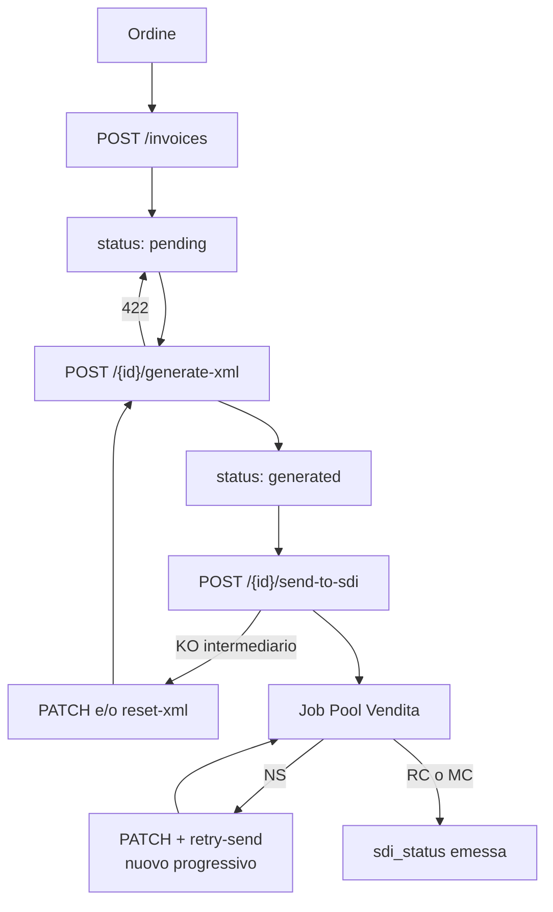

# FatturaPA — Guida operativa (Backend)

Documento unificato end-to-end per **integrazione Frontend**, **operazioni** e **troubleshooting** del ciclo attivo fatturazione elettronica.

**Base URL API:** `/api/v1/fiscal_documents`  
**Autenticazione:** Bearer JWT (`Authorization: Bearer <token>`)  
**Permessi RBAC:** `fiscal_documents:read|create|update|delete`  
**Swagger:** `http://localhost:8000/docs` → tag **Fiscal Documents**

Documenti correlati:

| Documento | Contenuto |
|-----------|-----------|
| [fatturapa_riassunto_piano.md](../.cursor/tasks_claude/fatturaPa/fatturapa_riassunto_piano.md) | Normativa, formato XML, ciclo SDI, piano fasi |
| [fatturapa_backlog_implementazione.md](../.cursor/tasks_claude/fatturaPa/fatturapa_backlog_implementazione.md) | Gap analysis P0–P3, checklist go-live |
| [prompt_FE_fatture_V3_ALIGN.md](../.cursor/tasks_claude/fatturazione/prompt_FE_fatture_V3_ALIGN.md) | Handoff FE — contratto `InvoiceDetail` v3 |
| [`prompt_FE_nota_credito_parziale.md`](../.cursor/tasks_claude/fatturazione/prompt_FE_nota_credito_parziale.md) | Handoff FE — modale NC parziale |
| [FE_HANDOFF_TAX_ELECTRONIC_CODE.md](./FE_HANDOFF_TAX_ELECTRONIC_CODE.md) | Mapping `Tax.electronic_code` → tag `<Natura>` |

**Aggiornato:** 2026-09-10

---

## Quick start

```text
1. Configurare company_info + electronic_invoicing + fatturapa in app_configurations
2. POST /api/v1/fiscal_documents/invoices            → pending
3. POST /api/v1/fiscal_documents/{id}/generate-xml    → generated (o 422: correggere in pending)
4. POST /api/v1/fiscal_documents/{id}/send-to-sdi     → { "send_to_sdi": true } (UploadStop)
5. GET  /api/v1/fiscal_documents/{id}/sdi-status      ← ricevute SdI (RC/NS/MC/…)
6. KO intermediario (sdi_status null): PATCH e/o reset-xml, generate-xml (stesso progressivo), send-to-sdi
   NS AdE: PATCH (stesso numero/data) + POST /{id}/retry-send (nuovo progressivo + UploadStop, 13/E)
7. GET  /api/v1/fiscal_documents/{id}/pdf             ← PDF di cortesia
```

Invio SDI via API (`send-to-sdi=true`, `retry-send`) è **acceso** (`FATTURAPA_SDI_API_SEND_ENABLED=true`).

Per ordini intra-UE B2B con esenzione VIES, applicare **prima** `PATCH /api/v1/orders/{id}/apply-vies-exemption`.

---

## 1. Panoramica

Elettronew genera fatture elettroniche **FatturaPA** (formato **FPR12**, B2B/B2C) a partire dagli ordini, valida l'XML e lo **trasmette via API a FatturaPA.com** (`UploadStop`), che inoltra allo SdI. Le ricevute (RC/MC/NS/NE/DT) arrivano via polling Pool Vendita — vedi [§6](#6-api--xml-pdf-export-e-invio-sdi) e [§9](#9-macchina-a-stati-documento).

### Differenza rispetto ad altri documenti fiscali

| Documento | SDI | Snapshot righe | Endpoint base |
|-----------|-----|----------------|---------------|
| **Fattura** (`invoice`) | Sì (se elettronica) | Sì (`fiscal_document_details`) | `/api/v1/fiscal_documents` |
| **Nota di credito** (`credit_note`, TD04) | Sì (se elettronica) | Sì | `/api/v1/fiscal_documents` |
| **Ricevuta estero** | No | No (live ordine) | `/api/v1/ricevute` |
| **Corrispettivi** | No | No (report live) | `/api/v1/corrispettivi` |

Un ordine **fatturato** esce dai corrispettivi vendite (`has_invoice=true`). La fattura è uno **snapshot** in `fiscal_document_details`; con `PATCH /{id}` si aggiorna lo snapshot se lo SdI non ha ancora accettato il file (`sdi_status` null o `scartata`). Un PATCH su fattura con XML azzera il file e torna `pending`. `POST /{id}/reset-xml` elimina solo l'XML. `sync_order=true` riallinea l'ordine collegato.

### Flusso operativo


```mermaid
flowchart TD
  order[Ordine] --> create["POST /invoices"]
  create --> pending["status: pending"]
  pending --> genXml["POST /{id}/generate-xml"]
  genXml -->|422| pending
  genXml --> generated["status: generated"]
  generated --> send["POST /{id}/send-to-sdi"]
  send -->|KO intermediario| reset["PATCH e/o reset-xml"]
  reset --> genXml
  send --> poll[Job Pool Vendita]
  poll -->|NS| nsFix["PATCH + retry-send\nnuovo progressivo"]
  nsFix --> poll
  poll -->|RC o MC| done[sdi_status emessa]
```

---

## 2. Prerequisiti e configurazione

### 2.1 Configurazione azienda (DB)

Tabella `app_configurations`:

| Chiave | Campi richiesti per XML |
|--------|-------------------------|
| `company_info` | `vat_number`, `company_name`, `address`, `civic_number`, `postal_code`, `city`, `province`, `phone`, `email`, `iban`, `bank_name` |
| `electronic_invoicing` | `tax_regime` (es. `RF01`) |
| `fatturapa` | `api_key`, `base_url` (default `https://api.fatturapa.com/ws/V10.svc/rest`) |
| `invoice_pdf` | `pre_invoice_disclaimer` (dicitura NOTE PDF), `append_tax_normative` (`true`/`false`) |

Variabili env di fallback (se non in DB) — vedi anche `env.example`:

| Variabile | Descrizione | Default |
|-----------|-------------|---------|
| `FATTURAPA_API_KEY` | API key intermediario FatturaPA.com | — |
| `FATTURAPA_BASE_URL` | Base URL REST intermediario | `https://api.fatturapa.com/ws/V10.svc/rest` |
| `FATTURAPA_SDI_EVENTS_SYNC_ENABLED` | Job polling notifiche SDI ciclo attivo | `true` |
| `FATTURAPA_SDI_EVENTS_SYNC_INTERVAL_SECONDS` | Intervallo polling (min 60s) | `300` |
| `FATTURAPA_SDI_EVENTS_SYNC_INITIAL_DELAY_SECONDS` | Delay primo sync | `60` |
| `FATTURAPA_SDI_API_SEND_ENABLED` | `true` = Invia a SDI via API (`UploadStop`) | `true` |
| `COMPANY_VAT_NUMBER` | P.IVA cedente (se assente in DB) | — |

Le chiavi in `app_configurations` hanno priorità sulle variabili env.

### 2.2 Dati ordine obbligatori (derivati, non nel POST)

Per fattura elettronica (`is_electronic=true`):

| Requisito | Fonte |
|-----------|-------|
| Indirizzo fatturazione presente | `orders.id_address_invoice` → `addresses` (IT **o** UE estero per VIES) |
| Cliente IT: P.IVA **oppure** CF | `addresses.vat` o `addresses.dni` |
| Cliente UE B2B (VIES): P.IVA estera | `addresses.vat` con prefisso paese; `CodiceDestinatario=XXXXXXX` |
| Denominazione **oppure** Nome+Cognome | `addresses.company` o `firstname`/`lastname` |
| Sede completa | `address1`, `city`, `postcode`; `state` obbligatoria 2 char **solo per IT**. Per `Nazione != IT`: omettere `Provincia`, `CAP=00000` (FAQ AdE), CAP reale eventualmente in `Indirizzo`; non serializzare `NumeroCivico` vuoto |
| Codice destinatario (solo IT) | `addresses.sdi` (7 char) o `0000000` B2C; estero → `XXXXXXX` automatico |
| Righe ordine con prezzi/IVA | `order_details` → snapshot in `fiscal_document_details` |
| Aliquota / natura IVA | `taxes` per riga (`order_detail.id_tax`) + spedizione; VIES → N3.2 (vedi [§7](#7-vies-e-natura-iva)) |

### 2.3 Account intermediario

- **Sandbox:** account demo FatturaPA.com attivo prima dei test e2e (OPS-PA-01 nel backlog).
- **Produzione:** API key produzione solo dopo checklist go-live.

---

## 3. Autenticazione e permessi

| Operazione | Permesso RBAC |
|------------|---------------|
| GET lista / dettaglio fattura | `fiscal_documents:read` |
| POST creazione fattura / NC | `fiscal_documents:create` |
| POST generate-xml, send-to-sdi, PATCH status / PATCH fattura | `fiscal_documents:update` |
| DELETE documento (solo `pending`) | `fiscal_documents:delete` |
| GET PDF singola | `fiscal_documents:read` |
| GET export bulk (`/invoices/export`) | `fiscal_documents:read` |

---

## 4. API — Creazione fattura

### POST `/api/v1/fiscal_documents/invoices`

Crea uno snapshot fiscale dell'ordine. **Non genera XML** né invia allo SDI.

#### Body (unici campi accettati)

| Campo | Obbligatorio | Default | Validazione |
|-------|--------------|---------|-------------|
| `id_order` | **Sì** | — | `int > 0` |
| `is_electronic` | No | `true` | `bool` |

```json
{ "id_order": 12345, "is_electronic": true }
```

```json
{ "id_order": 12345, "is_electronic": false }
```

#### Regole business

- L'ordine deve esistere.
- È consentito creare **più fatture** sullo stesso ordine (re-emissione / integrazioni).
- Se `is_electronic=true`: `address_invoice` deve essere **IT**.
- Auto-impostati: `document_type=invoice`, `tipo_documento_fe=TD01`, `includes_shipping=true`, numerazione sequenziale elettronica, `status=pending` (elettronica) o `issued` (non elettronica).
- Righe: copia da tutti gli `order_details` in `fiscal_document_details` con ricalcolo totali.

#### Response

`InvoiceResponseSchema` **v3 arricchito** (stesso shape del GET dettaglio): documento fiscale + embed ordine (`customer`, `address_invoice`, `payment`, `shipping`, `order_details[]` snapshot). **Non refetchare l'ordine** dopo il POST.

Handoff FE: [prompt_FE_fatture_V3_ALIGN.md](../.cursor/tasks_claude/fatturazione/prompt_FE_fatture_V3_ALIGN.md)

---

## 4bis. API — Aggiornamento fattura + sync ordine

### PATCH `/api/v1/fiscal_documents/{id_fiscal_document}`

Aggiorna una fattura in stato **`pending`** (header commerciale + righe snapshot). Opzionalmente sincronizza l'ordine collegato nella stessa transazione.

#### Body (`InvoiceUpdateSchema`)

| Campo | Obbligatorio | Note |
|-------|--------------|------|
| `note`, `id_payment`, `is_payed`, `payment_due_date` | No | Persistiti su **Order** (il GET li legge dall'ordine) |
| `shipping_total_price_*`, `id_carrier_api`, `id_tax`, `shipping_message`, `total_weight` | No | Persistiti su **Shipping** / Order |
| `default_note` | No | Accettato per compat FE; **ignorato** (nessuna colonna BE) |
| `sync_order` | No | Default `false`. Se `true` + `order_details`, aggiorna anche `order_details` |
| `order_details[]` | No | Match per `id_order_detail`; aggiorna `fiscal_document_details` |
| `header` | No | Se presente, i campi vengono flattenati in root (root vince sui conflitti) |

```json
{
  "note": "Aggiornamento condizioni",
  "id_payment": 3,
  "shipping_total_price_net": 50.0,
  "shipping_total_price_with_tax": 61.0,
  "sync_order": true,
  "order_details": [
    {
      "id_order_detail": 5012,
      "product_qty": 1,
      "id_tax": 7,
      "unit_price_net": 2244.24,
      "unit_price_with_tax": 2737.97,
      "total_price_net": 2000.24,
      "total_price_with_tax": 2440.29,
      "reduction_percent": 0,
      "reduction_amount": 244.0
    }
  ]
}
```

#### Regole business

- Solo `document_type=invoice` e `status=pending`.
- Bloccato se esistono note di credito collegate.
- Atomicità: update fattura + sync ordine in un'unica transazione (rollback completo se fallisce il sync).
- Prezzi: `resolve_price_fields` (payload completo = persist arrotondato).
- Response: stesso shape GET v3 + `sync_order_result` opzionale (`enabled`, `order_id`, `updated_lines`, `status`).

#### Errori

| HTTP | Caso |
|------|------|
| 404 | Documento o `id_order_detail` non nel documento |
| 409 | Tipo/stato non ammesso, NC collegate |
| 422 | Validazione payload / sconti |

---

## 5. API — Consultazione

| Metodo | Path | Response | Note |
|--------|------|----------|------|
| GET | `/invoices/order/{id_order}` | `InvoiceResponseSchema[]` | Tutte le fatture dell'ordine |
| GET | `/credit-notes/invoice/{id_invoice}` | `InvoiceResponseSchema[]` | Note di credito di una fattura (v3 arricchito) |
| GET | `/{id_fiscal_document}` | `InvoiceResponseSchema` se `invoice` o `credit_note` | Dettaglio arricchito v3 |
| GET | `/{id_fiscal_document}/details-with-products` | `CreditNoteEligibleLinesResponseSchema` | Modale NC parziale (qty residue, spedizione) |
| GET | `/` | `FiscalDocumentListResponseSchema` | Lista **minimal** (senza embed). Include `sdi_status`, `order_payment_name` |

Query lista: `page`, `limit`, `document_type`, `is_electronic`, `status`.

Campi lista per badge FE (batch, no N+1): `order_payment_name` / `id_order_payment` da `orders.id_payment` (fallback ultimo `order_payments` pagato); `sdi_status` + `identificativo_sdi` dal documento; `id_customer`, `customer_name`, `is_payed`, `order_shipped` (`id_shipping` valorizzato), `mail_status` (oggi quasi sempre `null`). Preferire `lifecycle` (flat deprecati).

Esempio 2 righe (`status=sent`, una in attesa AdE e una NS):

```json
{
  "documents": [
    {
      "id_fiscal_document": 10,
      "id_order": 456,
      "status": "sent",
      "fatturapa_status": "sent",
      "sdi_status": null,
      "identificativo_sdi": null,
      "order_payment_name": "Bonifico",
      "id_order_payment": 3,
      "id_customer": 89,
      "customer_name": "Rossi Mario",
      "is_payed": true,
      "order_shipped": false,
      "mail_status": null
    },
    {
      "id_fiscal_document": 11,
      "id_order": 457,
      "status": "sent",
      "fatturapa_status": "error",
      "sdi_status": "scartata",
      "identificativo_sdi": "1234567890",
      "order_payment_name": "PayPal",
      "id_order_payment": 5,
      "id_customer": 90,
      "customer_name": "Bianchi Srl",
      "is_payed": true,
      "order_shipped": true,
      "mail_status": null
    }
  ],
  "total": 2,
  "page": 1,
  "limit": 25
}
```

Filtro ordini fatturati: `GET /api/v1/orders?has_invoice=true` — vedi [has_invoice_filter.md](./has_invoice_filter.md).

---

## 6. API — XML, PDF, export e invio SDI

**Fonte canonica** per tutti gli endpoint di output fiscale. Non esistono route HTTP duplicate: ogni path ha uno scopo distinto.

### Matrice — quale endpoint usare

| Obiettivo | Metodo | Path | Note |
|-----------|--------|------|------|
| Generare XML FatturaPA (**singolo** doc) | `POST` | `/{id}/generate-xml` | `status=generated`, errori **422**. Dopo NS usare `retry-send` |
| Eliminare XML (loop KO) | `POST` | `/{id}/reset-xml` | Torna `pending`; vieta se SdI già evaso |
| Caricare / inviare a SDI via API | `POST` | `/{id}/send-to-sdi` | `{ "send_to_sdi": true }` = upload + SdI (`UploadStop`) |
| Reinvio API dopo NS | `POST` | `/{id}/retry-send` | Nuovo `progressivo_invio` + XML + `UploadStop` |
| Esito SDI + storico notifiche | `GET` | `/{id}/sdi-status` | RC/MC/NS/NE/DT — distinto da `status` workflow |
| Sync manuale notifiche SDI | `POST` | `/sdi-events/sync` | Oltre al job di polling |
| PDF di cortesia (**singolo** doc) | `GET` | `/{id}/pdf` | Layout elettronew; **non** c’è export PDF bulk |
| Export **bulk** CSV legacy | `GET` | `/invoices/export?fmt=csv&document_type=invoice\|credit_note` | Max 5000 doc; formato EXPORT-nc (righe articolo) |
| Export **bulk** Excel lista | `GET` | `/invoices/export?fmt=xlsx&document_type=invoice\|credit_note` | Max 5000 righe; colonna `document_type` |
| Export **bulk** XML (ZIP) | `GET` | `/invoices/export?fmt=xml&document_type=invoice\|credit_note` | Max 5000; soft: ZIP parziale + `export-scarti.json` |
| Leggere XML già in DB (debug/admin) | `GET` | `/{id}?include_xml=true` | Transitorio: `xml_content` nel JSON. Default: campo omesso |
| Download XML singolo come file | `GET` | `/{id}/xml` | Attachment `application/xml` (P1-02) |

**Non confondere:** `POST /{id}/generate-xml` (passo esplicito del ciclo SDI) e `GET /invoices/export?fmt=xml` (export contabilità multi-documento) usano lo stesso generatore ma **contesti diversi** — vedi sotto.

### POST `/{id_fiscal_document}/generate-xml`

**Permesso:** `fiscal_documents:update`

1. Verifica `is_electronic=true`
2. Valida dati con `FatturaPAValidator` (regole business FatturaPA)
3. Genera XML FPR12
4. Valida XML contro XSD ufficiale v1.2 (`fatturapa_xsd_validator`)
5. Salva `filename`, `xml_content` in DB
6. Imposta `status=generated`

**Errori validazione (business o XSD):** HTTP **422** con elenco strutturato `{ field, message, rule, value }`.  
Se `sdi_status` è evaso (RC/MC/NE/DT) → **400**.  
Se `sdi_status=scartata` → **400**: usare `POST /{id}/retry-send` (nuovo progressivo + invio). Numero e data fattura restano.

Campi XML principali generati:

| Blocco XML | Fonte dati |
|------------|------------|
| CedentePrestatore | `company_info` + `electronic_invoicing.tax_regime`; `CodiceFiscale` cedente IT = `IdCodice` P.IVA (`normalize_id_codice`) |
| CessionarioCommittente | `address_invoice` ordine (CF/P.IVA cliente) |
| TipoDocumento | `TD01` (fattura) o `TD04` (NC) |
| Data documento | `fiscal_documents.date_add` (non la data di generazione XML) |
| Arrotondamento | Sempre presente in `DatiGeneraliDocumento` (anche `0.00`): `ImportoTotaleDocumento − Σ(Imponibile+Imposta)` |
| DatiFattureCollegate | Solo TD04: `IdDocumento` + `Data` della fattura in `id_fiscal_document_ref` (mai usata per la scadenza) |
| DettaglioLinee | `fiscal_document_details` (+ riga spedizione se `includes_shipping`) |
| DatiRiepilogo | Un blocco per coppia `(AliquotaIVA, Natura)` — es. prodotti VIES 0% + spedizione 22% |
| DatiPagamento | Metodo ordine; IBAN/`IstitutoFinanziario` solo se `ModalitaPagamento=MP05`. `DataScadenzaPagamento`: base = Data documento (+ `payment_term_days`, default 30) se `payment_due_date` assente o &lt; Data; **TD04 di default omette** la scadenza (Opzione B). Flag `electronic_invoicing.td04_include_payment_due_date=true` → Opzione A |
| PECDestinatario | Emesso se PEC nota (anche con `CodiceDestinatario=0000000`); obbligatorio solo con `XXXXXXX` |

### POST `/{id_fiscal_document}/send-to-sdi`

**Permesso:** `fiscal_documents:update`  
**Prerequisito:** XML generato (`status` in `generated|uploaded|error`, `xml_content` presente).  
Non consentito se `sdi_status=scartata` (usare `retry-send`) o se il documento è già evaso/in attesa SDI.

#### Body

| Campo | Obbligatorio | Default | Descrizione |
|-------|--------------|---------|-------------|
| `send_to_sdi` | No | `false` | `false` = solo upload su FatturaPA.com; `true` = upload + invio SDI |

Processo: `UploadStart1` → upload blob Azure → **`UploadStop1`** (`send_to_sdi=false`) oppure **`UploadStop`** (`send_to_sdi=true`, invio SDI).

| `send_to_sdi` | Endpoint intermediario | Status atteso |
|---------------|------------------------|---------------|
| `false` | `UploadStop1` | `uploaded` — solo upload |
| `true` | `UploadStop` | `sent` — upload + trasmissione SDI |

Body: oggetto `{ "send_to_sdi": true }` (contratto ufficiale) oppure boolean grezzo `true`/`false` (retrocompat).  
Risposta intermediario salvata in `upload_result` (JSON string, **non** esposta in lista/dettaglio; errori in `fatturapa_error_message`).

`ProgressivoInvio` XML e filename usano `fiscal_documents.progressivo_invio` (serie unica SDI). `Numero` commerciale resta `document_number` (serie separate fattura/NC).

Con `send_to_sdi=true`, gate PEC: `CodiceDestinatario=XXXXXXX` senza `PECDestinatario` valida → **422**. B2C `0000000` senza PEC è consentito.  
Le chiamate HTTP verso FatturaPA.com ritentano fino a 3 volte su timeout/rete/429/5xx.

**Operativo attuale:** `FATTURAPA_SDI_API_SEND_ENABLED=true` (default).  
`send_to_sdi=true` chiama `UploadStop` (FatturaPA.com inoltra allo SdI). `send_to_sdi=false` = solo deposito (`UploadStop1`).  
Per spegnere l’invio API: `FATTURAPA_SDI_API_SEND_ENABLED=false`.

### POST `/{id_fiscal_document}/retry-send`

**Permesso:** `fiscal_documents:update`  
**Prerequisito:** `sdi_status=scartata` (notifica NS). Body assente.  
Con `FATTURAPA_SDI_API_SEND_ENABLED=false` → **400**.

1. Assegna un nuovo `progressivo_invio` (il precedente resta nello storico notifiche, non viene riusato)
2. Rigenera e valida XML
3. Azzera `sdi_status` e `identificativo_sdi` sul documento (lo storico `fiscal_document_sdi_notifications` resta)
4. Gate PEC + `UploadStop` (invio SDI)

Risposta: stesso `FiscalDocumentResponseSchema` di `send-to-sdi`.  
MC / consegnata / NE **non** si reinviano (sarebbe una seconda fattura).

### GET `/{id_fiscal_document}/sdi-status`

**Permesso:** `fiscal_documents:read`

```json
{
  "id_fiscal_document": 123,
  "sdi_status": "consegnata|scartata|mancata_consegna|accettata|rifiutata|decorrenza_termini|null",
  "identificativo_sdi": "string|null",
  "notifications": [
    {
      "notification_type": "RC|MC|NS|NE|DT",
      "identificativo_sdi": "string|null",
      "nome_file": "string|null",
      "message": "string|null",
      "notified_at": "datetime|null",
      "date_add": "datetime|null"
    }
  ]
}
```

Fonte: polling Pool FatturaPA.com (`Direzione != Acquisto`). Job `fatturapa_sdi_events_sync` + `POST /sdi-events/sync`.  
`status` workflow **non** viene sovrascritto (non è copia di `fatturapa_status`). `fatturapa_status` è overlay calcolato (`uploaded|sent|error|null`); con notifica RC su XML `generated` può essere `sent` mentre `status` resta `generated`.

### GET `/{id_fiscal_document}/pdf`

**Permesso:** `fiscal_documents:read`

Genera/scarica il **PDF pre-fattura** (o nota di credito) in layout elettronew B/N.

| Aspetto | Comportamento |
|---------|---------------|
| Motore | fpdf2 (`FiscalDocumentPDFService` → `FiscalDocumentPDFLayout`) |
| Lingue etichette | IT, FR, DE, ES, EN — da `country.iso_code` dell'indirizzo di fatturazione |
| NOTE | Testo fisso da `invoice_pdf.pre_invoice_disclaimer` (+ eventuali `tax.note` se `append_tax_normative=true`). **Non** include `order.general_note` |
| Multipagina | Header ripetuto (logo, anagrafica, titoli, intestazione tabella); footer `Pagina X di Y` |
| Data PDF | `gg/mm/aaaa` dal `date_add` del documento |
| XML SDI | Resta con sola data (requisito SDI); il PDF è un documento di cortesia / pre-invio |

Il PDF **non** sostituisce l'originale elettronico trasmesso allo SDI (dicitura art. 21 DPR 633/72).

File: `src/services/pdf/fiscal_document_pdf_service.py`, `src/services/pdf/fiscal_document_pdf_layout.py`, `src/services/pdf/i18n/`.

### GET `/invoices/export`

**Permesso:** `fiscal_documents:read`  
**Output:** file binario (`Content-Disposition: attachment`) — **non** JSON.

| Query | Valori | Output |
|-------|--------|--------|
| `fmt` | `xlsx` (default) | Excel riepilogativo |
| `fmt` | `xml` | ZIP con un file `.xml` FatturaPA per documento (flat root) |
| `fmt` | `pdf` | **400** — PDF solo singolo (`GET /{id}/pdf`) |
| `document_type` | `invoice` (default) \| `credit_note` | Filtra fatture o note di credito |

**Filtri export Excel:** `document_type`, `is_electronic`, `status`, `id_order`, `id_customer`, `delivery_country_iso`, `date_add_from`, `date_add_to`.

**Filtri export XML (solo questi; gli altri query param vengono ignorati):** `document_type`, `delivery_country_iso`, `date_add_from`, `date_add_to`.

**Comportamento export XML (soft / parziale):**

- Candidate solo documenti **elettronici** nel set filtrato (`invoice` TD01 o `credit_note` TD04).
- Nessun vincolo di `status` — se `xml_content` manca, il BE tenta generazione automatica (`FatturaPAService.generate_xml_from_fiscal_document`, come `POST /{id}/generate-xml`) e persiste in DB con `status=generated`.
- Documenti **validi** → XML nello ZIP + status aggiornato a `generated`.
- Documenti **non validi** (P.IVA/CF/XSD/…) → **lasciati invariati**, elencati in `export-scarti.json` dentro lo ZIP.
- Header risposta: `X-Export-Success-Count`, `X-Export-Failed-Count`, `X-Export-Total-Candidates`, `X-Export-Partial` (`true`/`false`).
- Se **nessun** documento del set è esportabile → **400** con `details.failure_summary` (nessun ZIP).
- Nome file XML: `[IdPaese][IdCodice]_[ProgressivoInvio].xml` (helper `fatturapa_filename.py`). In lista/dettaglio `filename` è **calcolato** (VAT cedente + `progressivo_invio`); la colonna DB resta fallback.
- Filename download: `fatture-*` se `document_type=invoice`, `note-credito-*` se `credit_note`.

Handoff FE: [prompt_FE_fatture_export_bulk.md](../.cursor/tasks_claude/fatturazione/prompt_FE_fatture_export_bulk.md).

### PATCH `/{id_fiscal_document}/status`

Aggiornamento manuale status / `upload_result` (uso amministrativo).

---

## 7. VIES e Natura IVA

### VIES su ordini (completato)

Prima di fatturare un ordine intra-UE B2B:

```
PATCH /api/v1/orders/{id}/apply-vies-exemption
```

- Imposta `vies_status=eligible`
- Ricalcola righe e spedizione a IVA 0% (`id_tax` esenzione da `reverse_charge_id_tax` o fallback)
- Bulk: `POST /api/v1/orders/bulk-apply-vies-exemption` con `{ "order_ids": [...] }`

Guida FE: [FE_VIES_APPLY_EXEMPTION_BUTTON.md](./FE_VIES_APPLY_EXEMPTION_BUTTON.md)

### VIES nel XML FatturaPA (completato — BE-PA-P0-05)

| Comportamento | Dettaglio |
|---------------|-----------|
| `vies_status=eligible` su righe **prodotto** | `AliquotaIVA=0.00` + `Natura=N3.2` (+ `RiferimentoNormativo`); **senza** `EsigibilitaIVA` |
| Tax per riga | Da `order_detail.id_tax` → `Tax.electronic_code` / `Tax.note` |
| Spedizione | Aliquota propria (`shipping_id_tax`); **non** forzata a N3.2 |
| `DatiRiepilogo` | Un blocco per coppia `(AliquotaIVA, Natura)` — es. prodotti 0% + spedizione 22% |

Helper: `src/services/external/fatturapa_tax_line.py`  
Test: `tests/unit/services/external/test_fatturapa_tax_line.py`

Prerequisito operativo: applicare esenzione VIES sull'ordine (`PATCH .../apply-vies-exemption`) **prima** di creare la fattura.

Handoff Tax: [FE_HANDOFF_TAX_ELECTRONIC_CODE.md](./FE_HANDOFF_TAX_ELECTRONIC_CODE.md)

---

## 8. Note di credito (TD04)

### POST `/api/v1/fiscal_documents/credit-notes`

| Campo | Obbligatorio | Default | Note |
|-------|--------------|---------|------|
| `id_invoice` | **Sì** | — | Fattura di riferimento |
| `reason` | **Sì** | — | 1–500 caratteri |
| `is_partial` | No | `false` | |
| `is_electronic` | No | `true` | |
| `include_shipping` | No | `true` | Solo NC totali o se spedizione non già stornata |
| `items` | Se `is_partial=true` e **non** solo spedizione | — | Lista non vuota. **Eccezione:** NC solo spedizione → `is_partial=true` + `include_shipping=true` + `items` assenti/`[]` |

Response: **`InvoiceResponseSchema` v3 arricchito** — stesso contratto delle fatture (`order_details[]`, `customer`, `address_invoice`, totali, …), con in più:

| Campo NC | Descrizione |
|----------|-------------|
| `document_type` | `"credit_note"` |
| `tipo_documento_fe` | `"TD04"` |
| `id_fiscal_document_ref` | ID fattura stornata |
| `credit_note_reason` | Motivo NC |
| `is_partial` | Storno parziale |

`CreditNoteResponseSchema` è alias di `InvoiceResponseSchema` (retrocompatibilità OpenAPI).

**Consultazione NC:**

| Metodo | Path | Response |
|--------|------|----------|
| GET | `/{id_nc}` | `InvoiceResponseSchema` v3 |
| GET | `/credit-notes/invoice/{id_invoice}` | `InvoiceResponseSchema[]` v3 |

**NC parziale — modale righe eleggibili:**

```
GET /api/v1/fiscal_documents/{id_invoice}/details-with-products
```

Response `CreditNoteEligibleLinesResponseSchema`: righe prodotto con `refunded_qty`, `remaining_qty`, `is_fully_refunded`; metadati `shipping_already_refunded`, `shipping_eligible`, `can_create_credit_note`. Alternativa payload completo: `GET /{id_invoice}` → `order_details[]`.

**Test BE:** `pytest tests/unit/repository/test_fiscal_document_credit_note_eligible_lines.py tests/unit/repository/test_fiscal_document_create_credit_note.py -v`

**Handoff FE:** [prompt_FE_nota_credito_parziale.md](../.cursor/tasks_claude/fatturazione/prompt_FE_nota_credito_parziale.md)

**Gap P0-06:** ~~blocco XML `DatiFattureCollegate`~~ — **completato** (`IdDocumento` + `Data` della fattura `id_fiscal_document_ref`).

**XML TD04 — pagamento (Opzione B):** di default le NC di storno **omettono** `DataScadenzaPagamento`. Per emetterla (Opzione A) impostare `electronic_invoicing.td04_include_payment_due_date=true`; in quel caso la scadenza è calcolata sulla **Data della NC**, mai sulla data della fattura collegata.

**XML TD04 — buoni sconto ordine:** la riga “Buoni Sconto” da `order.total_discounts` **non** viene emessa sulle NC (i totali NC non includono i voucher carrello). Resta attiva sulle fatture TD01.

Config correlate (`app_configurations` / categoria `electronic_invoicing`):

| Chiave | Default | Effetto |
|--------|---------|---------|
| `td04_include_payment_due_date` | `false` | Se `true`, emette `DataScadenzaPagamento` anche su TD04 |
| `payment_term_days` | `30` | Giorni da aggiungere a Data documento se `payment_due_date` assente o antecedente |

---

## 9. Macchina a stati documento

```
pending → generate-xml → generated → send-to-sdi → sent → sdi_status
                              ↘ 422 / reset-xml / PATCH → pending
sdi_status=scartata → PATCH (stesso numero/data) + retry-send (nuovo progressivo)
sdi_status=consegnata|mancata_consegna → emessa (non reinviare)
```

| Status | Significato |
|--------|-------------|
| `pending` | Fattura elettronica creata, XML non generato |
| `issued` | Fattura non elettronica emessa |
| `generated` | XML salvato in DB |
| `uploaded` | Caricata su FatturaPA.com (senza invio SDI) |
| `sent` | Inviata a SDI via `UploadStop` |
| `error` | Errore upload/invio |
| `cancelled` | Annullata |

Esito SDI (colonna `sdi_status`, distinto dal workflow): `consegnata` (RC), `scartata` (NS), `mancata_consegna` (MC), `accettata`/`rifiutata` (NE EC01/EC02), `decorrenza_termini` (DT/AT). Storico in `fiscal_document_sdi_notifications`. Consultazione: `GET /{id}/sdi-status`.  
Dopo NS: `PATCH` (stesso numero/data) + `POST /{id}/retry-send` (nuovo progressivo + UploadStop). MC/consegnata/NE/DT non si reinviano.

Eliminazione: solo se `status=pending` (fatture/NC); non eliminabile se esistono NC collegate.

---

## 10. Gap noti e backlog

Stato al **2026-09-10**. Dettaglio completo: [fatturapa_backlog_implementazione.md](../.cursor/tasks_claude/fatturaPa/fatturapa_backlog_implementazione.md)

| ID | Area | Stato |
|----|------|-------|
| P0-01 | Fix propagazione `send_to_sdi` fino a HTTP intermediario | Completato (`UploadStop` / `UploadStop1`) |
| P0-02 | Validazione XSD ufficiale pre-invio | Completato |
| P0-03 | Polling notifiche SDI (Pool Vendita) | Completato (FatturaPA.com non ha webhook) |
| P0-04 | Storico notifiche + `sdi_status` / `identificativo_sdi` | Completato |
| P0-05 | VIES eligible → N3.2 in XML + natura per riga | Completato |
| P0-06 | `DatiFattureCollegate` per NC TD04 | Completato |
| P0-07 | Test suite generazione XML completa | Parziale |
| P0-08 | NC: `is_partial=true` richiede `items` non vuoti | Completato |
| P0-09 | NC XML: non riusare `order.total_discounts` su TD04 | Completato |
| P1-01 | `GET .../sdi-status` + `POST .../retry-send` | Completato |
| P1-02 | `GET .../xml` download attachment singolo | Completato — `GET /{id}/xml`; lista/dettaglio omettono `xml_content` (`?include_xml=true` transitorio) |
| P1-05 | `DatiRiepilogo` multi-aliquota | Completato |
| P1-09 | Modellare voucher carrello come detail fiscale (TD01/NC proporzionale) | Aperto (TD04 ora skippa i buoni ordine) |

---

## 11. Troubleshooting

### HTTP 400 — "Indirizzo di fatturazione mancante/non trovato"

Documento elettronico senza `id_address_invoice` valido. Verificare l'ordine collegato.

### HTTP 400 — "La fattura elettronica può essere emessa solo per indirizzi italiani"

**Rimosso (2026-07-20):** le fatture elettroniche supportano clienti UE esteri (VIES). Se compare ancora, aggiornare il backend.

### HTTP 422 — Validazione XML FatturaPA fallita

Controllare il payload `details.errors[]`:

| Campo tipico | Causa |
|--------------|-------|
| `CessionarioCommittente/.../CodiceFiscale` | Manca P.IVA e CF cliente |
| `CodiceDestinatario` | SDI mancante o formato errato (7 char) |
| `CedentePrestatore/Sede/CAP` | CAP azienda non valido |
| `DettaglioLinee/AliquotaIVA` | Aliquota mancante o incoerente |

### HTTP 400 — "XML non ancora generato"

Chiamare `POST /{id}/generate-xml` prima di `send-to-sdi`.

### HTTP 500 — Upload Stop fallito

Verificare `fatturapa.api_key`, connettività, formato XML. Controllare `fatturapa_error_message` in API, colonna `upload_result` in DB e log `FatturaPAService`.

### Totali fattura ≠ totali ordine live

Comportamento **atteso** se l'ordine è stato modificato **dopo** l'emissione senza `PATCH` fattura: lo snapshot resta fermo. Per riallineare in `pending`: `PATCH /{id}` con `sync_order=true`. Non usare totali ordine live per la UI fattura senza reload del documento.

### VIES: ordine eligible ma XML senza N3.2

1. Verificare `order.vies_status=eligible` **prima** della creazione fattura (`PATCH .../apply-vies-exemption`).
2. Controllare che il tax di esenzione abbia `electronic_code=N3.2` e `note` con riferimento normativo (art. 41).
3. Rigenerare XML con `POST /{id}/generate-xml` dopo correzione ordine/tax.
4. Test di riferimento: `tests/unit/services/external/test_fatturapa_tax_line.py`.

---

## 12. Ciclo passivo (fatture / NC di acquisto)

Documenti **ricevuti dai fornitori** via SDI/POOL (TD01 e TD04). Prefisso API: `/api/v1/purchase-invoices`.  
RBAC modulo: `purchase_invoices` (`read` / `update` / `create` per sync).  
Handoff FE: [`docs/FE_HANDOFF_PURCHASE_INVOICES.md`](./FE_HANDOFF_PURCHASE_INVOICES.md).

| Componente | Path | Stato |
|------------|------|-------|
| Sync POOL | `src/services/sync/fatturapa_pool_sync_service.py` | Implementato + scheduler |
| Parser inbound | `src/services/external/fatturapa_inbound_parser.py` | Implementato |
| Repository | `src/repository/purchase_invoice_sync_repository.py` | Implementato |
| Service / Router | `purchase_invoice_service.py` / `purchase_invoices.py` | Implementato |
| Tabelle | `fatture_acquisto_sync` + `fatture_acquisto_sync_details` | Implementato |

**Flusso sync:**

1. Legge `fatturapa.api_key` da `app_configurations`
2. Chiama feed POOL REST (ATOM/XML)
3. Filtra `Direzione=Acquisto` + tipi ricezione
4. Scarica XML, parse header + `DettaglioLinee`
5. Persiste con idempotenza su `(identificativo_sdi, nome_file)`

**Scheduler (lifespan `main.py`):**

| Env | Default | Descrizione |
|-----|---------|-------------|
| `FATTURAPA_POOL_SYNC_ENABLED` | `true` | Abilita task background |
| `FATTURAPA_POOL_SYNC_INTERVAL_SECONDS` | `900` | Intervallo (15 min) |
| `FATTURAPA_POOL_SYNC_INITIAL_DELAY_SECONDS` | `45` | Delay primo sync dopo startup |

**API:**

| Metodo | Path | Perm | Descrizione |
|--------|------|------|-------------|
| GET | `/api/v1/purchase-invoices/` | read | Lista (senza righe) + filtri |
| GET | `/api/v1/purchase-invoices/{id}` | read | Dettaglio + `details[]` |
| GET | `/api/v1/purchase-invoices/{id}/xml` | read | Download XML |
| PATCH | `/api/v1/purchase-invoices/{id}/payment` | update | `{ is_paid, id_payment? }` |
| POST | `/api/v1/purchase-invoices/sync` | create | Sync manuale |

Migration: `python scripts/migrations/alter_fatture_acquisto_sync_consultation_payment.py`  
Modulo auth: `python scripts/init_auth_data.py` (inserisce `purchase_invoices` se assente).

---

## 13. Componenti codice

| Componente | Path |
|------------|------|
| Router API | `src/routers/fiscal_documents.py` |
| Service business | `src/services/routers/fiscal_document_service.py` |
| Repository | `src/repository/fiscal_document_repository.py` |
| XML + upload | `src/services/external/fatturapa_service.py` |
| Validatore business | `src/services/external/fatturapa_validator.py` |
| Normalizzazione Natura | `src/services/external/fatturapa_natura.py` |
| Tax per riga + VIES N3.2 | `src/services/external/fatturapa_tax_line.py` |
| Scadenza pagamento XML | `resolve_payment_due_date()` ancorata a Data documento; TD04 omette di default |
| PDF | `src/services/pdf/fiscal_document_pdf_service.py`, `fiscal_document_pdf_layout.py`, `i18n/` |
| Export bulk Excel/ZIP | `src/services/export/fiscal_document_export_service.py` |
| Schemi Pydantic | `src/schemas/fiscal_document_schema.py` |
| Modello ORM | `src/models/fiscal_document.py` |
| VIES ordini | `src/services/vies/`, `src/vies/tax_resolution.py` |
| Sync fatture passive (POOL) | `src/services/sync/fatturapa_pool_sync_service.py` |
| Sync notifiche SDI ciclo attivo | `src/services/sync/fatturapa_sdi_events_sync_service.py` |
| Parser notifiche SDI | `src/services/external/fatturapa_sdi_notification_parser.py` |
| ProgressivoInvio unico | `src/services/external/fatturapa_progressivo.py` |
| Gate PEC / regole reinvio / retry HTTP | `fatturapa_pec_gate.py`, `fatturapa_sdi_resend.py`, `fatturapa_http_retry.py` |
| Parser inbound + API acquisti | `fatturapa_inbound_parser.py`, `routers/purchase_invoices.py` |

---

## 14. Test

```powershell
# Response fattura v3
pytest tests/unit/services/test_fiscal_document_invoice_response.py -v

# Natura IVA / codice elettronico + VIES N3.2
pytest tests/unit/services/external/test_fatturapa_natura.py tests/unit/services/external/test_fatturapa_tax_line.py -v

# Data scadenza pagamento / NC XML
pytest tests/unit/services/external/test_fatturapa_payment_due_date.py tests/unit/services/external/test_fatturapa_nc_xml.py -v

# P0 ciclo attivo: UploadStop, ProgressivoInvio, notifiche SDI
pytest tests/unit/services/external/test_fatturapa_upload_stop.py tests/unit/schemas/test_send_to_sdi_schema.py tests/unit/services/external/test_fatturapa_progressivo.py tests/unit/repository/test_fiscal_document_progressivo_invio.py tests/unit/services/external/test_fatturapa_sdi_notification_parser.py tests/unit/services/sync/test_fatturapa_sdi_events_sync.py -v

# P1: PEC gate, retry-send, retry HTTP
pytest tests/unit/services/external/test_fatturapa_pec_gate.py tests/unit/services/external/test_fatturapa_sdi_resend.py tests/unit/services/external/test_fatturapa_http_retry.py -v

# 2026-09-10: PATCH/reset-xml + overlay lista da sdi_status
pytest tests/unit/services/test_fiscal_document_update_invoice.py tests/unit/services/documents/test_quick_status.py -v
```

Suite generazione XML end-to-end: **da implementare** (P0-07).

---

## 15. Riferimenti ufficiali

- [Formato FatturaPA / XSD](https://www.fatturapa.gov.it/it/norme-e-regole/documentazione-fattura-elettronica/formato-fatturapa/)
- [Documentazione SDI v1.9.1](https://www.fatturapa.gov.it/it/norme-e-regole/DocumentazioneSDI/)
- [Elenco controlli SDI](https://www.fatturapa.gov.it/it/ricerca/index.html)

Intermediario attuale: **FatturaPA.com** REST (`UploadStart1` / Blob / `UploadStop1` / `Pool`).
